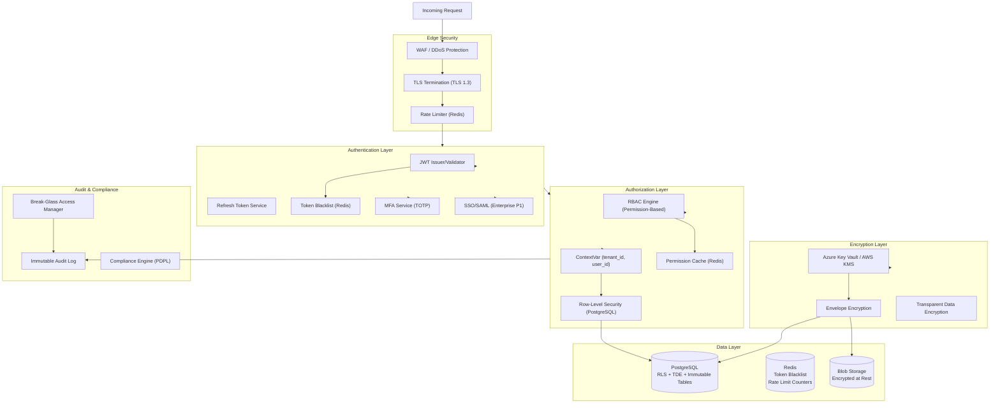
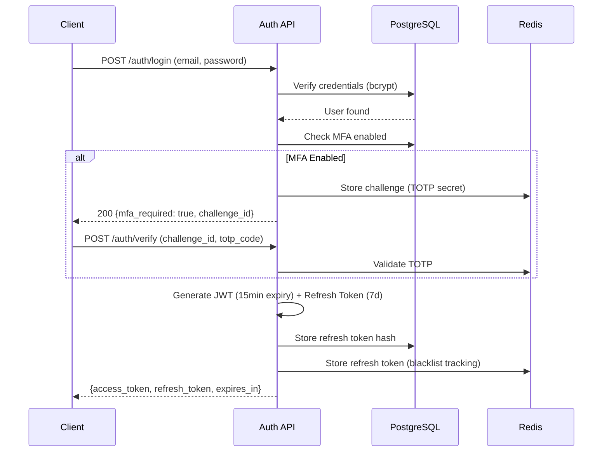
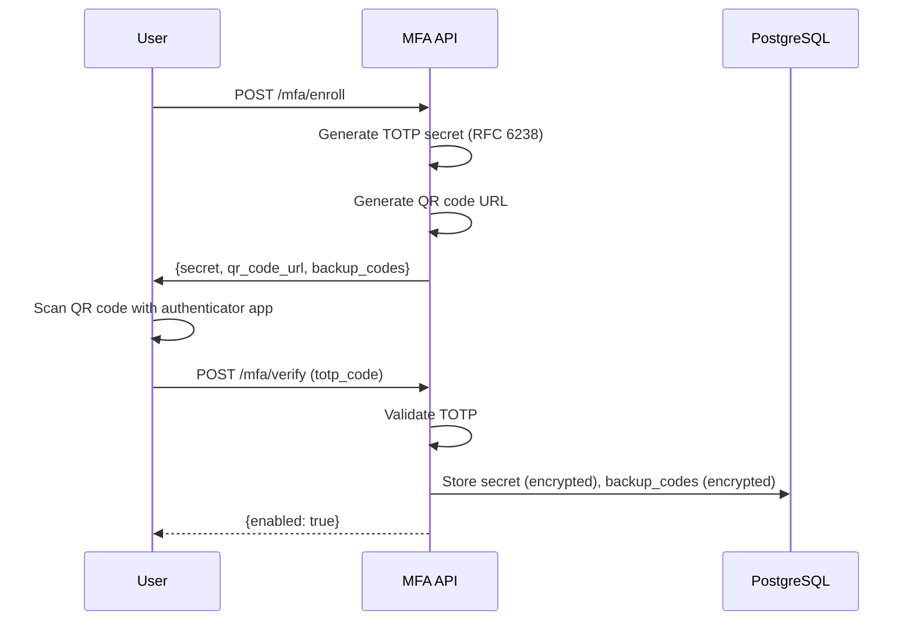
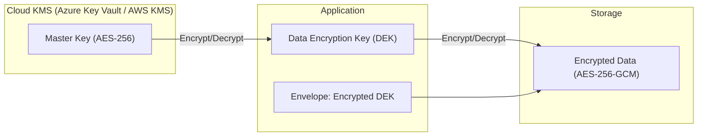
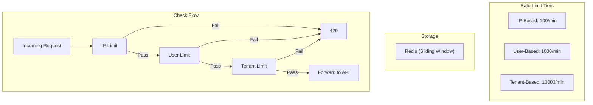
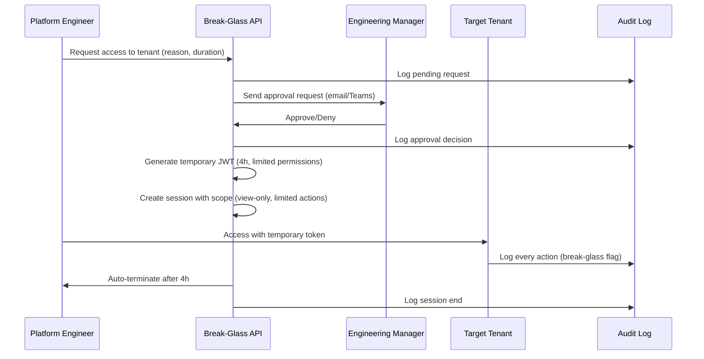
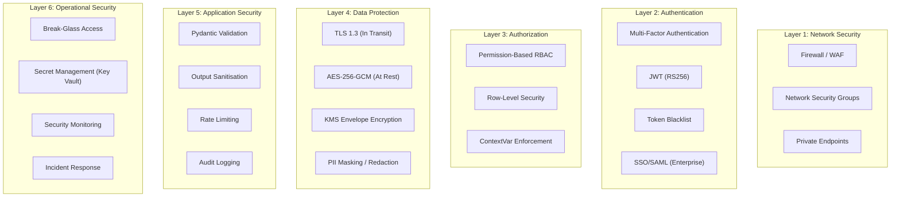

# Software Architecture Document – Volume 11

## Security & Tenant Isolation – Enterprise Production Architecture

| **Document ID** | SAD-11-SECURITY-v1.0 |
| :--- | :--- |
| **Version** | 1.0 |
| **Status** | **Final – Approved for Implementation** |
| **Classification** | Confidential – Omnilinks Internal |
| **Reviewers** | CISO, Principal Architect, Security Lead, SRE Lead, Compliance Officer |

---

## Table of Contents

1. [Executive Summary & NFRs](#1-executive-summary--nfrs)
2. [Logical Architecture – Component View](#2-logical-architecture--component-view)
3. [Physical Architecture – Deployment Topology](#3-physical-architecture--deployment-topology)
4. [Data Architecture – Domain Models](#4-data-architecture--domain-models)
5. [Core Component Deep‑Dive](#5-core-component-deep-dive)
   - 5.1 Authentication Service (JWT + Refresh Tokens)
   - 5.2 Token Blacklist (Redis)
   - 5.3 Multi‑Factor Authentication (MFA)
   - 5.4 SSO/SAML Integration (Enterprise P1)
   - 5.5 Row‑Level Security (RLS) with ContextVar
   - 5.6 Encryption at Rest (AES‑256‑GCM + KMS)
   - 5.7 Encryption in Transit (TLS 1.3)
   - 5.8 Rate Limiting (Multi‑Tier)
   - 5.9 Immutable Audit Logging
   - 5.10 Break‑Glass Access
   - 5.11 Input Validation (Pydantic)
6. [Security Architecture – Defense‑in‑Depth](#6-security-architecture--defense-indepth)
7. [Observability & SRE](#7-observability--sre)
8. [Architecture Decision Records (ADR)](#8-architecture-decision-records-adr)
9. [Open Items & Roadmap](#9-open-items--roadmap)

---

## 1. Executive Summary & NFRs

### 1.1 Strategic Objective
Deliver a **zero‑trust, defense‑in‑depth security architecture** that provides comprehensive authentication, authorization, encryption, and tenant isolation. The system must protect customer data against internal and external threats, maintain compliance with regional regulations (PDPL, GDPR equivalents), and provide full auditability of all security‑relevant events.

### 1.2 Non‑Functional Requirements

| NFR ID | Category | Target | Implementation |
| :--- | :--- | :--- | :--- |
| **NFR-SEC-01** | **Authentication Latency** | < 100ms | JWT validation with cached public keys |
| **NFR-SEC-02** | **Authorization Latency** | < 50ms | Permission cache (Redis) |
| **NFR-SEC-03** | **Token Expiry** | 15 min access, 7 day refresh | Short‑lived tokens with rotation |
| **NFR-SEC-04** | **MFA Enrollment** | 100% of Platform Users | TOTP (RFC 6238) |
| **NFR-SEC-05** | **Data Encryption (At Rest)** | AES‑256‑GCM | KMS envelope encryption |
| **NFR-SEC-06** | **Data Encryption (In Transit)** | TLS 1.3 | Strict enforcement |
| **NFR-SEC-07** | **Audit Retention** | 7 years (immutable) | Immutable audit table with WORM storage |
| **NFR-SEC-08** | **Break‑Glass Access** | Time‑boxed ≤ 4 hours | Approval workflow + audit |
| **NFR-SEC-09** | **Rate Limiting** | Per‑IP: 100/min; Per‑User: 1000/min; Per‑Tenant: 10000/min | Redis token buckets |
| **NFR-SEC-10** | **Compliance** | PDPL (Egypt, Saudi, UAE, Qatar, Morocco) | RLS + data residency + deletion APIs |

---

## 2. Logical Architecture – Component View



---

## 3. Physical Architecture – Deployment Topology

| Node Pool | Instance Type | Components | Scaling Policy |
| :--- | :--- | :--- | :--- |
| **Compute‑Optimised** | Standard_D4s_v3 | Auth Service, RBAC Engine | HPA based on request rate |
| **Memory‑Optimised** | Standard_E8s_v3 | Redis (Token Blacklist, Rate Limit, Cache) | Premium Redis (3 replicas) |
| **PostgreSQL** | Flexible Server (8 vCPU, 32GB) | All data with RLS | Zone‑redundant HA + read replica |
| **Key Vault** | Azure Key Vault / AWS KMS | Encryption keys | Managed service (SLA 99.99%) |
| **WAF** | Azure Front Door / Cloudflare | WAF + DDoS | Managed service |

---

## 4. Data Architecture – Domain Models

### 4.1 Core Tables

#### 4.1.1 Refresh Tokens Table

```sql
CREATE TABLE refresh_tokens (
    id UUID PRIMARY KEY DEFAULT gen_random_uuid(),
    user_id UUID NOT NULL,
    tenant_id UUID NOT NULL,
    token_hash TEXT NOT NULL UNIQUE,     -- SHA‑256 hash of the token
    expires_at TIMESTAMPTZ NOT NULL,
    revoked_at TIMESTAMPTZ,
    user_agent TEXT,
    ip_address INET,
    created_at TIMESTAMPTZ DEFAULT NOW()
);

CREATE INDEX idx_refresh_user ON refresh_tokens(user_id);
CREATE INDEX idx_refresh_expires ON refresh_tokens(expires_at) WHERE revoked_at IS NULL;
```

#### 4.1.2 MFA Configurations Table

```sql
CREATE TABLE mfa_configurations (
    id UUID PRIMARY KEY DEFAULT gen_random_uuid(),
    user_id UUID NOT NULL UNIQUE,
    secret TEXT NOT NULL,                -- TOTP secret (encrypted at rest)
    backup_codes TEXT[],                 -- Encrypted backup codes
    enabled BOOLEAN DEFAULT FALSE,
    verified_at TIMESTAMPTZ,
    created_at TIMESTAMPTZ DEFAULT NOW()
);
```

#### 4.1.3 Break‑Glass Access Log

```sql
CREATE TABLE break_glass_access (
    id UUID PRIMARY KEY DEFAULT gen_random_uuid(),
    requester_id UUID NOT NULL,
    target_tenant_id UUID NOT NULL,
    reason TEXT NOT NULL,
    requested_duration INT NOT NULL,     -- Minutes
    approved_by UUID,
    approved_at TIMESTAMPTZ,
    started_at TIMESTAMPTZ,
    ended_at TIMESTAMPTZ,
    status VARCHAR(20) DEFAULT 'pending', -- pending, approved, active, expired, denied
    access_token_hash TEXT,              -- Hash of the temporary token
    actions_taken TEXT[],
    created_at TIMESTAMPTZ DEFAULT NOW()
);

-- Immutable: once approved, cannot be modified
CREATE TRIGGER break_glass_immutable
    BEFORE UPDATE ON break_glass_access
    FOR EACH ROW
    EXECUTE FUNCTION prevent_modification();
```

#### 4.1.4 Immutable Audit Log Table

```sql
CREATE TABLE audit_logs (
    id UUID PRIMARY KEY DEFAULT gen_random_uuid(),
    tenant_id UUID,
    user_id UUID,
    action VARCHAR(100) NOT NULL,
    resource_type VARCHAR(50),
    resource_id UUID,
    details JSONB,
    ip_address INET,
    user_agent TEXT,
    trace_id TEXT,                       -- For distributed tracing correlation
    created_at TIMESTAMPTZ DEFAULT NOW()
) PARTITION BY RANGE (created_at);

-- Immutable: prevent updates/deletes
CREATE TRIGGER audit_log_immutable
    BEFORE UPDATE ON audit_logs
    FOR EACH ROW
    EXECUTE FUNCTION raise_exception('Audit logs are immutable');

CREATE TRIGGER audit_log_delete_immutable
    BEFORE DELETE ON audit_logs
    FOR EACH ROW
    EXECUTE FUNCTION raise_exception('Audit logs cannot be deleted');
```

### 4.2 Redis Data Structures

| Key Pattern | Type | TTL | Purpose | Security |
| :--- | :--- | :--- | :--- | :--- |
| `blacklist:jti:{token_id}` | String | TTL (until expiry) | Revoked JWT token | None – revocation only |
| `rate:ip:{ip}` | String | 1 min | IP‑based rate limit counter | None |
| `rate:user:{user_id}` | String | 1 min | User‑based rate limit counter | None |
| `rate:tenant:{tenant_id}` | String | 1 min | Tenant‑based rate limit counter | None |
| `mfa:challenge:{user_id}` | String | 5 min | Temporary MFA challenge | None |
| `breakglass:token:{token_hash}` | String | 4 hours | Temporary access token | None |

---

## 5. Core Component Deep‑Dive

### 5.1 Authentication Service – JWT + Refresh Tokens (F-SEC-01)

#### 5.1.1 JWT Token Structure

```json
{
  "sub": "user-uuid",
  "tenant_id": "tenant-uuid",
  "email": "user@example.com",
  "roles": ["TENANT_ADMIN", "SUPERVISOR"],
  "permissions": ["conversation.reply", "kb.manage.team"],
  "jti": "unique-token-id",           // For blacklisting
  "exp": 1752834000,                  // 15 minutes from issue
  "iat": 1752833100,
  "iss": "omnilinks-auth",
  "aud": "omnilinks-api"
}
```

#### 5.1.2 JWT Issuance Flow



#### 5.1.3 Code – JWT Service

```python
import jwt
from datetime import datetime, timedelta
import bcrypt

class AuthService:
    def __init__(self, private_key, public_key, redis_client, db_pool):
        self.private_key = private_key
        self.public_key = public_key
        self.redis = redis_client
        self.db = db_pool
        self.access_token_expiry = 15  # minutes
        self.refresh_token_expiry = 7  # days

    async def issue_tokens(self, user_id: UUID, tenant_id: UUID) -> TokenResponse:
        # 1. Generate JWT (access token)
        token_id = str(uuid.uuid4())
        payload = {
            "sub": str(user_id),
            "tenant_id": str(tenant_id),
            "jti": token_id,
            "exp": datetime.utcnow() + timedelta(minutes=self.access_token_expiry),
            "iat": datetime.utcnow(),
            "iss": "omnilinks-auth",
            "aud": "omnilinks-api"
        }
        access_token = jwt.encode(payload, self.private_key, algorithm="RS256")

        # 2. Generate refresh token (opaque string)
        refresh_token = secrets.token_urlsafe(64)
        refresh_token_hash = hashlib.sha256(refresh_token.encode()).hexdigest()

        # 3. Store refresh token in DB
        async with self.db.acquire() as conn:
            await conn.execute("""
                INSERT INTO refresh_tokens (user_id, tenant_id, token_hash, expires_at)
                VALUES ($1, $2, $3, NOW() + INTERVAL '7 days')
            """, user_id, tenant_id, refresh_token_hash)

        return TokenResponse(
            access_token=access_token,
            refresh_token=refresh_token,
            expires_in=self.access_token_expiry * 60
        )

    async def validate_token(self, token: str) -> Optional[JWTClaims]:
        try:
            # 1. Decode and verify signature
            claims = jwt.decode(token, self.public_key, algorithms=["RS256"], audience="omnilinks-api")
            # 2. Check blacklist
            jti = claims.get("jti")
            if await self.redis.exists(f"blacklist:jti:{jti}"):
                raise TokenRevokedError("Token has been revoked")
            # 3. Check expiry (jwt already does this)
            return claims
        except jwt.ExpiredSignatureError:
            raise TokenExpiredError("Token expired")
        except jwt.InvalidTokenError as e:
            raise InvalidTokenError(str(e))

    async def refresh_access_token(self, refresh_token: str) -> TokenResponse:
        # 1. Hash the refresh token
        token_hash = hashlib.sha256(refresh_token.encode()).hexdigest()

        # 2. Look up in DB
        async with self.db.acquire() as conn:
            row = await conn.fetchrow("""
                SELECT user_id, tenant_id, expires_at
                FROM refresh_tokens
                WHERE token_hash = $1 AND revoked_at IS NULL
            """, token_hash)

        if not row:
            raise InvalidRefreshTokenError("Invalid refresh token")

        if row['expires_at'] < datetime.utcnow():
            raise TokenExpiredError("Refresh token expired")

        # 3. Revoke old refresh token (optional: rotate)
        await self.db.execute(
            "UPDATE refresh_tokens SET revoked_at = NOW() WHERE token_hash = $1",
            token_hash
        )

        # 4. Issue new tokens
        return await self.issue_tokens(row['user_id'], row['tenant_id'])
```

### 5.2 Token Blacklist – Redis (F-SEC-02)

**Purpose:** Immediately revoke access tokens on logout or security incidents.

```python
class TokenBlacklist:
    def __init__(self, redis_client):
        self.redis = redis_client

    async def revoke(self, jti: str, ttl_seconds: int = 900):
        """Revoke a token by JTI (unique token ID)."""
        # Set blacklist entry with TTL matching the token's remaining lifetime
        await self.redis.setex(f"blacklist:jti:{jti}", ttl_seconds, "1")

    async def is_revoked(self, jti: str) -> bool:
        """Check if a token has been revoked."""
        return await self.redis.exists(f"blacklist:jti:{jti}") > 0

    async def revoke_all_user_tokens(self, user_id: UUID):
        """Revoke all tokens for a user (used for password change or security breach)."""
        # We can't enumerate all JWT token IDs; use a user‑based blacklist for this case
        # Store a "version" counter and check it during validation
        await self.redis.incr(f"blacklist:user_version:{user_id}")
```

**Token Validation Enhancement:**

```python
async def validate_token_with_user_version(token: str):
    claims = decode_token(token)
    user_version = await redis.get(f"blacklist:user_version:{claims['sub']}")
    if user_version and claims.get('token_version', 0) < int(user_version):
        raise TokenRevokedError("Token revoked due to user version change")
    return claims
```

### 5.3 Multi‑Factor Authentication – TOTP (F-SEC-03)

#### 5.3.1 MFA Enrollment Flow



#### 5.3.2 Code – TOTP Service

```python
import pyotp
import qrcode
from io import BytesIO
import base64

class MFAService:
    def __init__(self, encryption_service):
        self.encryption = encryption_service

    def generate_secret(self) -> tuple[str, str]:
        """Generate TOTP secret and backup codes."""
        secret = pyotp.random_base32()
        backup_codes = [secrets.token_hex(4) for _ in range(10)]
        return secret, backup_codes

    def generate_qr_code(self, secret: str, email: str, issuer: str = "Omnilinks") -> str:
        """Generate QR code as base64 image for display."""
        totp = pyotp.TOTP(secret)
        provisioning_uri = totp.provisioning_uri(email, issuer_name=issuer)
        qr = qrcode.QRCode(box_size=4, border=1)
        qr.add_data(provisioning_uri)
        qr.make(fit=True)
        img = qr.make_image(fill_color="black", back_color="white")
        buffered = BytesIO()
        img.save(buffered, format="PNG")
        return base64.b64encode(buffered.getvalue()).decode()

    def verify_totp(self, secret: str, code: str) -> bool:
        """Verify TOTP code with a 2‑step window (30s each)."""
        totp = pyotp.TOTP(secret)
        return totp.verify(code, valid_window=1)  # Allow 1 step either side

    async def enroll_user(self, user_id: UUID) -> MFAEnrollmentResponse:
        secret, backup_codes = self.generate_secret()
        encrypted_secret = await self.encryption.encrypt(secret)
        encrypted_backup_codes = await self.encryption.encrypt(backup_codes)

        await db.execute("""
            INSERT INTO mfa_configurations (user_id, secret, backup_codes)
            VALUES ($1, $2, $3)
            ON CONFLICT (user_id) DO UPDATE
            SET secret = EXCLUDED.secret, backup_codes = EXCLUDED.backup_codes,
                enabled = FALSE, verified_at = NULL
        """, user_id, encrypted_secret, encrypted_backup_codes)

        return MFAEnrollmentResponse(
            secret=secret,
            qr_code=self.generate_qr_code(secret, user_id),
            backup_codes=backup_codes
        )
```

### 5.4 SSO/SAML Integration – Enterprise (F-SEC-04, P1)

**Architecture:** Use a third‑party identity provider (Azure Entra ID, Okta, Auth0) with SAML 2.0 or OIDC.

```python
class SSOService:
    def __init__(self):
        self.saml_client = onelogin.saml2.auth.OneLogin_Saml2_Auth()
        self.oidc_client = authlib.integrations.requests_client.OAuth2Session()

    async def initiate_sso(self, tenant_id: UUID, idp_type: str):
        """Initiate SAML/OIDC login flow."""
        if idp_type == "saml":
            auth = self.saml_client.prepare_request()
            return auth.login()
        elif idp_type == "oidc":
            return await self.oidc_client.authorize_redirect(
                redirect_uri=f"{BASE_URL}/auth/sso/callback",
                tenant_id=tenant_id
            )

    async def handle_sso_callback(self, request: Request) -> User:
        """Handle SAML/OIDC callback and map to Omnilinks user."""
        if request.query_params.get("SAMLResponse"):
            # SAML response processing
            auth = self.saml_client.process_response()
            if not auth.is_authenticated():
                raise AuthenticationError("SAML authentication failed")
            attributes = auth.get_attributes()
            email = attributes.get('email', [None])[0]
        else:
            # OIDC callback
            token = await self.oidc_client.authorize_access_token()
            userinfo = await self.oidc_client.get('userinfo')
            email = userinfo.json().get('email')

        # Map to Omnilinks user
        user = await self.user_service.get_or_create_by_email(email)
        return user
```

### 5.5 Row‑Level Security with ContextVar (F-SEC-05, F-SEC-06)

#### 5.5.1 ContextVar Setup (FastAPI Middleware)

```python
import contextvars

tenant_id_ctx = contextvars.ContextVar('tenant_id', default=None)
user_id_ctx = contextvars.ContextVar('user_id', default=None)
user_team_ids_ctx = contextvars.ContextVar('user_team_ids', default=[])

class TenantContextMiddleware:
    async def __call__(self, request: Request, call_next):
        # Extract tenant_id from JWT (already validated)
        user = request.state.user
        tenant_id = user.get('tenant_id')
        user_id = user.get('sub')
        team_ids = await self.get_user_teams(user_id, tenant_id)

        # Set context variables
        token = tenant_id_ctx.set(tenant_id)
        user_token = user_id_ctx.set(user_id)
        team_token = user_team_ids_ctx.set(team_ids)

        # Set PostgreSQL session variable
        async with self.db_pool.acquire() as conn:
            await conn.execute("SELECT set_config('app.current_tenant_id', $1, false)", str(tenant_id))
            await conn.execute("SELECT set_config('app.current_user_id', $1, false)", str(user_id))
            await conn.execute("SELECT set_config('app.user_team_ids', $1, false)", ','.join(map(str, team_ids)))

        try:
            response = await call_next(request)
        finally:
            tenant_id_ctx.reset(token)
            user_id_ctx.reset(user_token)
            team_id_ctx.reset(team_token)

        return response
```

#### 5.5.2 RLS Policies (PostgreSQL)

```sql
-- Enable RLS on all tenant‑scoped tables
ALTER TABLE tenants ENABLE ROW LEVEL SECURITY;
ALTER TABLE teams ENABLE ROW LEVEL SECURITY;
ALTER TABLE users ENABLE ROW LEVEL SECURITY;
ALTER TABLE team_memberships ENABLE ROW LEVEL SECURITY;
ALTER TABLE tenant_role_assignments ENABLE ROW LEVEL SECURITY;
ALTER TABLE conversations ENABLE ROW LEVEL SECURITY;
ALTER TABLE messages ENABLE ROW LEVEL SECURITY;
ALTER TABLE documents ENABLE ROW LEVEL SECURITY;
ALTER TABLE analytics_events ENABLE ROW LEVEL SECURITY;

-- Core tenant isolation policy (applies to all tables with tenant_id)
CREATE POLICY tenant_isolation ON tenants
    USING (id::text = current_setting('app.current_tenant_id'));

CREATE POLICY tenant_isolation_teams ON teams
    USING (tenant_id::text = current_setting('app.current_tenant_id'));

CREATE POLICY tenant_isolation_users ON users
    USING (tenant_id::text = current_setting('app.current_tenant_id'));

-- Team‑scoped data (conversations, messages)
-- Agents can only see their team's conversations
CREATE POLICY team_isolation_conversations ON conversations
    USING (
        tenant_id::text = current_setting('app.current_tenant_id')
        AND (
            current_setting('app.is_tenant_admin') = 'true'
            OR team_id = ANY(string_to_array(current_setting('app.user_team_ids'), ',')::UUID[])
            OR assigned_user_id::text = current_setting('app.current_user_id')
        )
    );

-- Platform Admin override (for break‑glass)
CREATE POLICY platform_admin_override ON tenants
    USING (
        current_setting('app.is_platform_admin') = 'true'
    );
```

### 5.6 Encryption at Rest – AES‑256‑GCM + KMS (F-SEC-07)

#### 5.6.1 Envelope Encryption Architecture



#### 5.6.2 Code – Encryption Service

```python
from cryptography.hazmat.primitives.ciphers.aead import AESGCM
import os

class EncryptionService:
    def __init__(self, kms_client, key_id: str):
        self.kms = kms_client
        self.key_id = key_id
        self.dek_cache = {}  # Cache DEKs per tenant (TTL 1 hour)

    async def get_dek(self, tenant_id: UUID) -> bytes:
        """Get or generate a Data Encryption Key (DEK) for a tenant."""
        cache_key = f"dek:{tenant_id}"
        if cache_key in self.dek_cache:
            return self.dek_cache[cache_key]

        # Check if DEK already exists in DB
        async with db.acquire() as conn:
            row = await conn.fetchrow(
                "SELECT encrypted_dek FROM tenant_encryption_keys WHERE tenant_id = $1",
                tenant_id
            )

        if row:
            # Decrypt the DEK using KMS
            dek = await self.kms.decrypt(
                KeyId=self.key_id,
                CiphertextBlob=row['encrypted_dek']
            )
            self.dek_cache[cache_key] = dek
            return dek

        # Generate new DEK
        dek = os.urandom(32)  # 256-bit
        encrypted_dek = await self.kms.encrypt(
            KeyId=self.key_id,
            Plaintext=dek
        )

        await db.execute("""
            INSERT INTO tenant_encryption_keys (tenant_id, encrypted_dek)
            VALUES ($1, $2)
        """, tenant_id, encrypted_dek)

        self.dek_cache[cache_key] = dek
        return dek

    async def encrypt(self, tenant_id: UUID, data: Union[str, bytes]) -> str:
        """Encrypt data using tenant‑specific DEK."""
        if isinstance(data, str):
            data = data.encode('utf-8')

        dek = await self.get_dek(tenant_id)
        aesgcm = AESGCM(dek)
        nonce = os.urandom(12)  # 96-bit nonce for GCM
        ciphertext = aesgcm.encrypt(nonce, data, b"")

        # Format: base64(nonce) + ':' + base64(ciphertext)
        return f"{base64.b64encode(nonce).decode()}:" \
               f"{base64.b64encode(ciphertext).decode()}"

    async def decrypt(self, tenant_id: UUID, encrypted_data: str) -> str:
        """Decrypt data using tenant‑specific DEK."""
        nonce_b64, ciphertext_b64 = encrypted_data.split(':')
        nonce = base64.b64decode(nonce_b64)
        ciphertext = base64.b64decode(ciphertext_b64)

        dek = await self.get_dek(tenant_id)
        aesgcm = AESGCM(dek)
        plaintext = aesgcm.decrypt(nonce, ciphertext, b"")
        return plaintext.decode('utf-8')
```

#### 5.6.3 Sensitive Fields to Encrypt

| Table | Field | Encryption Type |
| :--- | :--- | :--- |
| `users` | `password_hash` | Already bcrypt‑hashed; no additional encryption needed |
| `users` | `email` | Column‑level encryption |
| `mfa_configurations` | `secret` | Column‑level encryption |
| `mfa_configurations` | `backup_codes` | Column‑level encryption |
| `provider_credentials` | `api_key_encrypted` | Column‑level encryption |
| `refresh_tokens` | `token_hash` | Already SHA‑256‑hashed; no additional encryption needed |
| `conversations` | `content` | Full‑text encrypted (with search index outside) |

### 5.7 Encryption in Transit – TLS 1.3 (F-SEC-08)

**Enforcement:**
- **All external endpoints:** Enforce TLS 1.3 via Azure Front Door / Cloudflare.
- **Internal traffic:** mTLS between microservices (service mesh).
- **Database connections:** TLS 1.2+ (minimum), prefer TLS 1.3.

**Configuration (Azure Application Gateway):**

```yaml
sslPolicy:
  policyType: "Custom"
  minProtocolVersion: "TLSv1_3"
  cipherSuites:
    - "TLS_AES_256_GCM_SHA384"
    - "TLS_AES_128_GCM_SHA256"
```

**PostgreSQL Configuration:**

```sql
-- Force TLS connections
SET ssl = on;
SET ssl_cert_file = '/etc/ssl/certs/server.crt';
SET ssl_key_file = '/etc/ssl/private/server.key';
SET ssl_min_protocol_version = 'TLSv1.3';
SET ssl_prefer_server_ciphers = on;
```

### 5.8 Rate Limiting – Multi‑Tier (F-SEC-09)

#### 5.8.1 Rate Limiting Architecture



#### 5.8.2 Code – Rate Limiter

```python
import time

class RateLimiter:
    def __init__(self, redis_client):
        self.redis = redis_client

    async def check_and_increment(
        self,
        key: str,
        limit: int,
        window: int = 60
    ) -> bool:
        """Check if rate limit is exceeded and increment counter."""
        # Sliding window using Redis sorted set (more accurate than fixed window)
        now = time.time()
        window_start = now - window

        # Remove old entries
        await self.redis.zremrangebyscore(key, 0, window_start)

        # Count current entries
        count = await self.redis.zcard(key)

        if count >= limit:
            return False

        # Add current request
        await self.redis.zadd(key, {str(now): now})
        await self.redis.expire(key, window)
        return True

    async def check_limits(
        self,
        ip: str,
        user_id: Optional[UUID],
        tenant_id: Optional[UUID]
    ) -> bool:
        """Check all three rate limit tiers."""
        # 1. IP‑based (100/min)
        if not await self.check_and_increment(f"rate:ip:{ip}", 100, 60):
            return False

        # 2. User‑based (1000/min)
        if user_id and not await self.check_and_increment(f"rate:user:{user_id}", 1000, 60):
            return False

        # 3. Tenant‑based (10000/min)
        if tenant_id and not await self.check_and_increment(f"rate:tenant:{tenant_id}", 10000, 60):
            return False

        return True
```

### 5.9 Immutable Audit Logging (F-SEC-10)

#### 5.9.1 Audit Event Categories

| Category | Events | Retention |
| :--- | :--- | :--- |
| **Authentication** | Login, logout, failed login, MFA verification, token refresh | 7 years |
| **Authorization** | Permission check, access denied, role assignment change | 7 years |
| **Data Access** | Conversation view, export, report generation | 7 years |
| **Data Mutation** | Message sent, document upload, configuration change | 7 years |
| **Break‑Glass** | Request, approval, activation, actions taken | 7 years |
| **System** | Tenant provisioning, service start/stop, configuration change | 2 years |

#### 5.9.2 Audit Logger

```python
class AuditLogger:
    def __init__(self, db_pool, redis_client):
        self.db = db_pool
        self.redis = redis_client
        self.batch_size = 100
        self.batch_buffer = []

    async def log(self, event: AuditEvent):
        """Log an audit event to both Redis (for fast access) and PG (for long‑term)."""
        # 1. Format event
        log_entry = {
            "tenant_id": str(event.tenant_id),
            "user_id": str(event.user_id),
            "action": event.action,
            "resource_type": event.resource_type,
            "resource_id": str(event.resource_id) if event.resource_id else None,
            "details": event.details,
            "ip_address": event.ip_address,
            "user_agent": event.user_agent,
            "trace_id": event.trace_id,
            "created_at": datetime.utcnow().isoformat()
        }

        # 2. Add to buffer
        self.batch_buffer.append(log_entry)

        # 3. Flush if buffer is full
        if len(self.batch_buffer) >= self.batch_size:
            await self.flush()

        # 4. Also write to Redis for real‑time dashboard
        await self.redis.lpush(f"audit:tenant:{event.tenant_id}", json.dumps(log_entry))
        await self.redis.ltrim(f"audit:tenant:{event.tenant_id}", 0, 999)  # Keep last 1000

    async def flush(self):
        """Flush buffer to PostgreSQL."""
        if not self.batch_buffer:
            return

        async with self.db.acquire() as conn:
            for entry in self.batch_buffer:
                await conn.execute("""
                    INSERT INTO audit_logs (
                        tenant_id, user_id, action, resource_type,
                        resource_id, details, ip_address, user_agent,
                        trace_id, created_at
                    ) VALUES ($1, $2, $3, $4, $5, $6, $7, $8, $9, $10)
                """, entry['tenant_id'], entry['user_id'], entry['action'],
                   entry['resource_type'], entry['resource_id'], entry['details'],
                   entry['ip_address'], entry['user_agent'], entry['trace_id'],
                   entry['created_at'])

        self.batch_buffer = []
```

### 5.10 Break‑Glass Access (F-SEC-11)

#### 5.10.1 Break‑Glass Workflow



#### 5.10.2 Break‑Glass Service

```python
class BreakGlassService:
    def __init__(self, auth_service, audit_logger, email_service):
        self.auth = auth_service
        self.audit = audit_logger
        self.email = email_service
        self.max_duration = 240  # 4 hours

    async def request_access(
        self,
        requester_id: UUID,
        target_tenant_id: UUID,
        reason: str,
        duration_minutes: int = 60
    ) -> UUID:
        if duration_minutes > self.max_duration:
            raise ValueError(f"Duration cannot exceed {self.max_duration} minutes")

        request_id = await db.fetch_val("""
            INSERT INTO break_glass_access (
                requester_id, target_tenant_id, reason,
                requested_duration, status
            ) VALUES ($1, $2, $3, $4, 'pending')
            RETURNING id
        """, requester_id, target_tenant_id, reason, duration_minutes)

        # Log request
        await self.audit.log(AuditEvent(
            tenant_id=target_tenant_id,
            user_id=requester_id,
            action="breakglass.request",
            details={"reason": reason, "duration": duration_minutes}
        ))

        # Notify approvers
        await self.notify_approvers(request_id, target_tenant_id, reason, duration_minutes)

        return request_id

    async def approve(self, request_id: UUID, approver_id: UUID):
        request = await self.get_request(request_id)
        if request.status != 'pending':
            raise InvalidStateError("Request not pending")

        # Generate temporary token
        token = await self.auth.issue_breakglass_token(
            tenant_id=request.target_tenant_id,
            duration_minutes=request.requested_duration,
            scopes=["view_only", "limited_actions"]
        )

        await db.execute("""
            UPDATE break_glass_access
            SET approved_by = $1, approved_at = NOW(),
                status = 'active', access_token_hash = $2,
                started_at = NOW()
            WHERE id = $3
        """, approver_id, hashlib.sha256(token.encode()).hexdigest(), request_id)

        # Schedule auto‑expiry
        await self.schedule_expiry(request_id, request.requested_duration)

        # Log approval
        await self.audit.log(AuditEvent(
            tenant_id=request.target_tenant_id,
            user_id=approver_id,
            action="breakglass.approved",
            details={"request_id": request_id}
        ))

        return token

    async def expire(self, request_id: UUID):
        """Force‑expire a break‑glass session."""
        await db.execute("""
            UPDATE break_glass_access
            SET status = 'expired', ended_at = NOW()
            WHERE id = $1 AND status = 'active'
        """, request_id)

        # Revoke any active tokens (if we tracked them)
        await self.auth.revoke_breakglass_tokens(request_id)
```

### 5.11 Input Validation – Pydantic (F-SEC-12)

All API endpoints use Pydantic models for request validation. This provides:
- Type validation (automatic 400 responses on malformed input).
- SQL injection prevention (via parameterised queries).
- XSS prevention (via string sanitisation).
- Schema documentation (OpenAPI).

```python
from pydantic import BaseModel, EmailStr, UUID4, Field, validator
from typing import Optional

class CreateTenantRequest(BaseModel):
    name: str = Field(..., min_length=1, max_length=100)
    email: EmailStr
    tenant_type: str = Field(..., regex="^(individual|startup|small_business|medium_business|enterprise|nonprofit|government|education)$")

    @validator('name')
    def validate_name(cls, v):
        # Prevent XSS or injection attempts
        if any(char in v for char in ['<', '>', '"', "'", ';']):
            raise ValueError('Name contains invalid characters')
        return v.strip()

class CreateTeamRequest(BaseModel):
    name: str = Field(..., min_length=1, max_length=50)

class InviteUserRequest(BaseModel):
    email: EmailStr
    role: str = Field(..., regex="^(Team Admin|Manager|Supervisor|Human Agent|Analyst)$")
    team_ids: List[UUID4] = Field(..., min_items=1, max_items=10)
```

---

## 6. Security Architecture – Defense‑in‑Depth

### 6.1 The Security Onion



### 6.2 Threat Model Summary

| Threat | Mitigation |
| :--- | :--- |
| **Token Theft** | Short‑lived JWT (15 min), refresh token rotation, blacklist |
| **Cross‑Tenant Data Leakage** | RLS + ContextVar + Application‑layer permission checks |
| **Insider Threat (Employee)** | Least‑privilege access, break‑glass auditing, MFA |
| **Credential Stuffing** | Rate limiting, MFA, account lockout |
| **API Abuse** | Rate limiting (IP, User, Tenant) |
| **Data Breach (Storage)** | AES‑256‑GCM + KMS + TDE |
| **Man‑in‑the‑Middle** | TLS 1.3 (strict enforcement) |
| **SQL Injection** | SQLAlchemy ORM + parameterised queries |
| **XSS/CSRF** | Output sanitisation, SameSite cookies, CSRF tokens |
| **Insider Threat (Platform Admin)** | Break‑glass with approval, audit |

---

## 7. Observability & SRE

### 7.1 Security Metrics

| Metric | Type | Labels | Purpose |
| :--- | :--- | :--- | :--- |
| `security_auth_failures_total` | Counter | `reason` (invalid_token, expired, mfa_fail) | Authentication monitoring |
| `security_rls_denials_total` | Counter | `table`, `user` | RLS policy violations (security incident) |
| `security_breakglass_requests_total` | Counter | `status` (pending, approved, denied) | Break‑glass monitoring |
| `security_token_blacklist_hits` | Counter | – | Token reuse attempt detection |
| `security_rate_limit_blocks_total` | Counter | `tier` (ip, user, tenant) | Rate limit monitoring |
| `security_audit_log_size` | Gauge | – | Audit log volume |

### 7.2 Alerting Rules

| Condition | Severity | Action |
| :--- | :--- | :--- |
| `security_auth_failures_total > 100` in 5 min | **P2** | Potential brute‑force attack |
| `security_rls_denials_total > 10` in 1 min | **P1** | Potential security breach or misconfiguration |
| `security_breakglass_requests_total > 5` in 1 hour | **P2** | Unusual number of break‑glass requests |
| `security_token_blacklist_hits > 0` | **P1** | Token reuse attempt (theft) |
| `security_rate_limit_blocks_total > 1000` in 5 min | **P2** | DDoS or misconfigured client |

### 7.3 Security Dashboard

A dedicated security dashboard displays:
- **Authentication:** Login success/failure rates, MFA enrollment status.
- **Authorization:** Permission check success/failure by action and user.
- **Data Access:** Most accessed resources (for anomaly detection).
- **Break‑Glass:** Active sessions, request count, duration.
- **Compliance:** PDPL data erasure requests, data access logs.

---

## 8. Architecture Decision Records (ADR)

### ADR-035: JWT with Asymmetric Signing (RS256)
- **Context:** Need secure, verifiable tokens without shared secrets.
- **Decision:** Use RS256 (private key signing, public key verification).
- **Rationale:** Private key stays in KMS; public key can be distributed; no shared secret risk.

### ADR-036: Redis for Token Blacklist
- **Context:** Need immediate token revocation without database load.
- **Decision:** Use Redis for blacklist with TTL matching token expiry.
- **Rationale:** Low latency; automatic cleanup via TTL.

### ADR-037: RLS as Primary Isolation Mechanism
- **Context:** Critical to prevent cross‑tenant data leakage.
- **Decision:** Enforce tenant isolation at the database layer using PostgreSQL RLS.
- **Rationale:** Defense‑in‑depth; even if application bypasses filter, DB blocks access.

### ADR-038: Break‑Glass with Approval Workflow
- **Context:** Need platform access for emergencies but must prevent abuse.
- **Decision:** Require manager approval (overrideable in extreme cases) with time‑boxed access.
- **Rationale:** Balances security with operational needs; full audit trail.

### ADR-039: KMS Envelope Encryption for Tenant Keys
- **Context:** Need to encrypt tenant data with tenant‑specific keys.
- **Decision:** Use KMS envelope encryption; one DEK per tenant, encrypted under a master key.
- **Rationale:** Scalable; tenant keys can be rotated independently; KMS never exposes master key.

---

## 9. Open Items & Roadmap

| Item | Owner | Target Date | Risk |
| :--- | :--- | :--- | :--- |
| **SOC 2 Type II compliance** | Security | GA+6 | Full audit readiness |
| **Penetration testing** | Security | GA+1 | Third‑party penetration test |
| **Security incident response playbook** | Security | GA | Documented and rehearsed |
| **GDPR/PDPL data erasure API** | Backend | GA+1 | Right to erasure compliance |
| **RBAC for custom roles (Enterprise)** | Backend | GA+1 | UI and API (P1) |
| **Security awareness training** | HR/Security | GA | All engineers trained |

---

> **Next Steps:**
> 1. **Enable RLS** on all PostgreSQL tables and create policies.
> 2. **Set up ContextVar middleware** and test tenant isolation.
> 3. **Configure Azure Key Vault** with a master key and implement encryption service.
> 4. **Implement JWT service** with RS256 signing (generate keys).
> 5. **Deploy Redis** for token blacklist and rate limiting.
> 6. **Implement rate limiter** middleware with IP/User/Tenant tiers.
> 7. **Implement audit logger** with batch writing to PostgreSQL.
> 8. **Implement break‑glass service** with approval workflow.
> 9. **Implement MFA enrollment** with TOTP.
> 10. **Set up security dashboards** and alerting rules.

