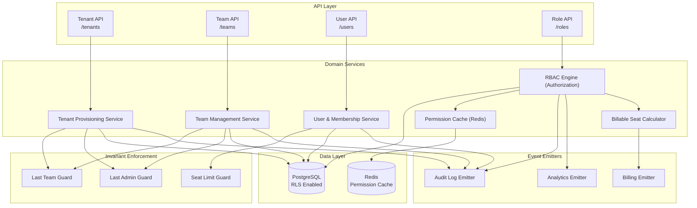
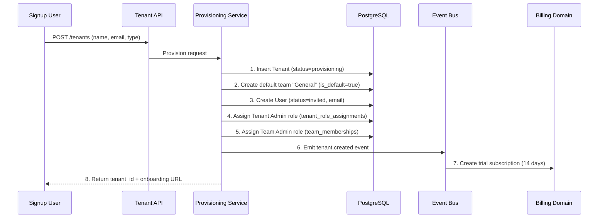
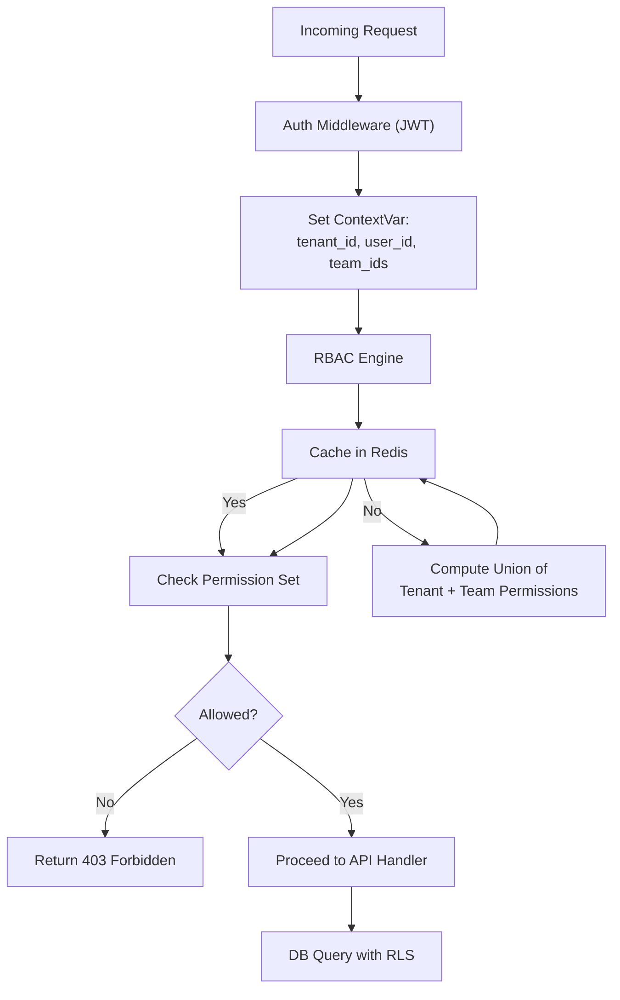

# Software Architecture Document – Volume 10

## Tenant & Team Management – Enterprise Production Architecture

| **Document ID** | SAD-10-TENANT-MGMT-v1.0 |
| :--- | :--- |
| **Version** | 1.0 |
| **Status** | **Final – Approved for Implementation** |
| **Classification** | Confidential – Omnilinks Internal |
| **Reviewers** | Principal Architect, Security Lead, Product Lead, SRE Lead |

---

## Table of Contents

1. [Executive Summary & NFRs](#1-executive-summary--nfrs)
2. [Logical Architecture – Component View](#2-logical-architecture--component-view)
3. [Physical Architecture – Deployment Topology](#3-physical-architecture--deployment-topology)
4. [Data Architecture – Domain Models](#4-data-architecture--domain-models)
5. [Core Component Deep‑Dive](#5-core-component-deep-dive)
   - 5.1 Tenant Provisioning Service
   - 5.2 Team Management Service
   - 5.3 User & Membership Management
   - 5.4 RBAC Engine (Permission‑Based Authorization)
   - 5.5 Permission Cache (Redis)
   - 5.6 Custom Roles (Enterprise P1)
   - 5.7 Billable Seat Calculation
6. [Security Architecture](#6-security-architecture)
   - 6.1 Row‑Level Security (RLS)
   - 6.2 Permission Enforcement Flow
   - 6.3 Audit Logging
7. [Integration with Other Domains](#7-integration-with-other-domains)
8. [Observability & SRE](#8-observability--sre)
9. [Architecture Decision Records (ADR)](#9-architecture-decision-records-adr)
10. [Open Items & Roadmap](#10-open-items--roadmap)

---

## 1. Executive Summary & NFRs

### 1.1 Strategic Objective
Deliver a **secure, scalable, and auditable tenant and team management system** that supports multi‑tenant isolation, hierarchical team structures, granular role‑based access control (RBAC), and automated provisioning. The system must support **1,000+ tenants**, **10,000+ teams** per tenant, **100,000+ users**, and sub‑500ms permission resolution while enforcing strict data isolation at the database level via Row‑Level Security (RLS).

### 1.2 Non‑Functional Requirements

| NFR ID | Category | Target | Implementation |
| :--- | :--- | :--- | :--- |
| **NFR-TM-01** | **Permission Resolution Latency** | < 50ms (p95) | Redis cache with invalidation |
| **NFR-TM-02** | **Tenant Provisioning Time** | < 5 seconds | Asynchronous with event queue |
| **NFR-TM-03** | **Concurrent Tenant Operations** | 100 req/sec | Horizontal scaling of API pods |
| **NFR-TM-04** | **Availability** | 99.99% | Multi‑AZ PostgreSQL; Redis Sentinel |
| **NFR-TM-05** | **Auditability** | 100% of changes | Immutable audit log for all role/membership changes |
| **NFR-TM-06** | **Data Isolation** | Zero leakage | RLS on all tables; ContextVar for tenant ID |

---

## 2. Logical Architecture – Component View



---

## 3. Physical Architecture – Deployment Topology

| Node Pool | Instance Type | Components | Scaling Policy |
| :--- | :--- | :--- | :--- |
| **Compute‑Optimised** | Standard_D4s_v3 (4 vCPU, 16GB) | Tenant/Team/User/Role API Pods | HPA: CPU > 70% |
| **Memory‑Optimised** | Standard_E8s_v3 | Redis Cache (Premium) | Fixed (3 replicas, Sentinel) |
| **PostgreSQL** | Flexible Server (8 vCPU, 32GB) | Tenant/Team/User/Role tables | Zone‑redundant HA |

---

## 4. Data Architecture – Domain Models

### 4.1 Core Tables (PostgreSQL with RLS)

#### 4.1.1 Tenants Table

```sql
CREATE TABLE tenants (
    id UUID PRIMARY KEY DEFAULT gen_random_uuid(),
    name VARCHAR(255) NOT NULL,
    slug VARCHAR(255) UNIQUE NOT NULL,
    type VARCHAR(50) NOT NULL,          -- INDIVIDUAL, STARTUP, SMALL_BUSINESS, MEDIUM_BUSINESS, ENTERPRISE, NONPROFIT, GOVERNMENT, EDUCATION
    industry VARCHAR(50),               -- SaaS, E-Commerce, Healthcare, etc.
    status VARCHAR(20) DEFAULT 'active', -- active, suspended, deleted
    plan_tier VARCHAR(20) DEFAULT 'trial', -- trial, smb, mid, enterprise
    settings JSONB DEFAULT '{}',
    created_at TIMESTAMPTZ DEFAULT NOW(),
    updated_at TIMESTAMPTZ DEFAULT NOW()
);

-- Indexes
CREATE INDEX idx_tenants_type ON tenants(type);
CREATE INDEX idx_tenants_status ON tenants(status);
CREATE INDEX idx_tenants_slug ON tenants(slug);
```

#### 4.1.2 Teams Table

```sql
CREATE TABLE teams (
    id UUID PRIMARY KEY DEFAULT gen_random_uuid(),
    tenant_id UUID NOT NULL REFERENCES tenants(id) ON DELETE CASCADE,
    name VARCHAR(255) NOT NULL,
    is_default BOOLEAN DEFAULT FALSE,
    status VARCHAR(20) DEFAULT 'active', -- active, archived
    settings JSONB DEFAULT '{}',
    created_at TIMESTAMPTZ DEFAULT NOW(),
    updated_at TIMESTAMPTZ DEFAULT NOW(),
    UNIQUE(tenant_id, name)
);

CREATE INDEX idx_teams_tenant ON teams(tenant_id);
CREATE INDEX idx_teams_is_default ON teams(tenant_id, is_default) WHERE is_default = true;
```

#### 4.1.3 Users Table

```sql
CREATE TABLE users (
    id UUID PRIMARY KEY DEFAULT gen_random_uuid(),
    tenant_id UUID NOT NULL REFERENCES tenants(id) ON DELETE CASCADE,
    email VARCHAR(255) NOT NULL,
    password_hash TEXT NOT NULL,
    full_name VARCHAR(255),
    status VARCHAR(20) DEFAULT 'invited', -- invited, active, deactivated, suspended
    mfa_enabled BOOLEAN DEFAULT FALSE,
    last_login_at TIMESTAMPTZ,
    settings JSONB DEFAULT '{}',
    created_at TIMESTAMPTZ DEFAULT NOW(),
    updated_at TIMESTAMPTZ DEFAULT NOW(),
    UNIQUE(tenant_id, email)
);

CREATE INDEX idx_users_tenant ON users(tenant_id);
CREATE INDEX idx_users_status ON users(status);
```

#### 4.1.4 Team Memberships (Team‑Scope Roles)

```sql
CREATE TABLE team_memberships (
    id UUID PRIMARY KEY DEFAULT gen_random_uuid(),
    team_id UUID NOT NULL REFERENCES teams(id) ON DELETE CASCADE,
    user_id UUID NOT NULL REFERENCES users(id) ON DELETE CASCADE,
    role_id UUID,                       -- References roles table
    is_primary BOOLEAN DEFAULT FALSE,   -- Primary team for the user
    created_at TIMESTAMPTZ DEFAULT NOW(),
    updated_at TIMESTAMPTZ DEFAULT NOW(),
    UNIQUE(team_id, user_id)
);

CREATE INDEX idx_memberships_team ON team_memberships(team_id);
CREATE INDEX idx_memberships_user ON team_memberships(user_id);
CREATE INDEX idx_memberships_primary ON team_memberships(user_id) WHERE is_primary = true;
```

#### 4.1.5 Tenant Role Assignments (Tenant‑Scope Roles)

```sql
CREATE TABLE tenant_role_assignments (
    id UUID PRIMARY KEY DEFAULT gen_random_uuid(),
    tenant_id UUID NOT NULL REFERENCES tenants(id) ON DELETE CASCADE,
    user_id UUID NOT NULL REFERENCES users(id) ON DELETE CASCADE,
    role_id UUID NOT NULL REFERENCES roles(id),  -- Tenant Admin role
    created_at TIMESTAMPTZ DEFAULT NOW(),
    UNIQUE(tenant_id, user_id, role_id)
);

CREATE INDEX idx_tenant_roles_tenant ON tenant_role_assignments(tenant_id);
CREATE INDEX idx_tenant_roles_user ON tenant_role_assignments(user_id);
```

#### 4.1.6 Roles & Permissions

```sql
-- System roles (templates) and custom roles
CREATE TABLE roles (
    id UUID PRIMARY KEY DEFAULT gen_random_uuid(),
    tenant_id UUID REFERENCES tenants(id) ON DELETE CASCADE,  -- NULL = system template
    name VARCHAR(100) NOT NULL,
    scope VARCHAR(20) NOT NULL,          -- 'tenant' or 'team'
    is_system BOOLEAN DEFAULT FALSE,      -- System template (immutable)
    is_custom BOOLEAN DEFAULT FALSE,      -- Enterprise custom role (P1)
    description TEXT,
    created_at TIMESTAMPTZ DEFAULT NOW(),
    UNIQUE(tenant_id, name)
);

-- Permission catalog (immutable)
CREATE TABLE permissions (
    code VARCHAR(100) PRIMARY KEY,        -- e.g., 'conversation.reply'
    category VARCHAR(50),
    description TEXT
);

-- Role-Permission mapping
CREATE TABLE role_permissions (
    role_id UUID NOT NULL REFERENCES roles(id) ON DELETE CASCADE,
    permission_code VARCHAR(100) NOT NULL REFERENCES permissions(code) ON DELETE CASCADE,
    PRIMARY KEY(role_id, permission_code)
);

-- System template roles: seeded during migration
INSERT INTO roles (id, tenant_id, name, scope, is_system) VALUES
    ('sys-tenant-admin', NULL, 'Tenant Admin', 'tenant', true),
    ('sys-team-admin', NULL, 'Team Admin', 'team', true),
    ('sys-manager', NULL, 'Manager', 'team', true),
    ('sys-supervisor', NULL, 'Supervisor', 'team', true),
    ('sys-agent', NULL, 'Human Agent', 'team', true),
    ('sys-analyst', NULL, 'Analyst', 'team', true);
```

### 4.2 Redis Data Structures

| Key Pattern | Type | TTL | Purpose | Security |
| :--- | :--- | :--- | :--- | :--- |
| `perms:{user_id}` | JSON | 5 min | Cached permissions (tenant + team) | None – only aggregated permissions |
| `perms:version:{user_id}` | Integer | 5 min | Version for cache invalidation | None |
| `seat:count:{tenant_id}` | Integer | 1 hour | Cached billable seat count | None |
| `team:count:{tenant_id}` | Integer | 1 hour | Team count per tenant | None |

---

## 5. Core Component Deep‑Dive

### 5.1 Tenant Provisioning Service

#### 5.1.1 Provisioning Flow



#### 5.1.2 Tenant Types & Defaults

```python
class TenantType(str, Enum):
    INDIVIDUAL = "individual"
    STARTUP = "startup"
    SMALL_BUSINESS = "small_business"
    MEDIUM_BUSINESS = "medium_business"
    ENTERPRISE = "enterprise"
    NONPROFIT = "nonprofit"
    GOVERNMENT = "government"
    EDUCATION = "education"

TENANT_DEFAULTS = {
    TenantType.INDIVIDUAL: {
        "default_teams": ["General"],
        "max_seats": 1,
        "flags": {"is_single_user": True}
    },
    TenantType.STARTUP: {
        "default_teams": ["Support"],
        "max_seats": 10,
        "flags": {}
    },
    TenantType.SMALL_BUSINESS: {
        "default_teams": ["Support", "Sales"],
        "max_seats": 25,
        "flags": {}
    },
    TenantType.MEDIUM_BUSINESS: {
        "default_teams": ["Support", "Sales", "Technical Support"],
        "max_seats": 100,
        "flags": {}
    },
    TenantType.ENTERPRISE: {
        "default_teams": ["Support", "Sales", "VIP Support", "Technical Support"],
        "max_seats": None,  # unlimited
        "flags": {"sso_enabled": True, "custom_roles": True}
    },
    TenantType.NONPROFIT: {
        "default_teams": ["Support"],
        "max_seats": None,
        "flags": {"discount_eligible": True}
    },
    TenantType.GOVERNMENT: {
        "default_teams": ["Support", "Citizen Services"],
        "max_seats": None,
        "flags": {"audit_immutable": True}
    },
    TenantType.EDUCATION: {
        "default_teams": ["Support", "Admissions"],
        "max_seats": None,
        "flags": {"discount_eligible": True, "pii_redaction_strict": True}
    }
}
```

### 5.2 Team Management Service

#### 5.2.1 CRUD Operations

```python
class TeamService:
    async def create_team(self, tenant_id: UUID, name: str, user_id: UUID) -> Team:
        # 1. Check tenant exists and is active
        tenant = await self.get_tenant(tenant_id)
        if not tenant or tenant.status != 'active':
            raise TenantError("Tenant not active")

        # 2. Check name uniqueness
        existing = await self.db.fetch_one(
            "SELECT id FROM teams WHERE tenant_id = $1 AND name = $2 AND status != 'archived'",
            tenant_id, name
        )
        if existing:
            raise ConflictError("Team name already exists")

        # 3. Create team
        team = await self.db.fetch_one("""
            INSERT INTO teams (tenant_id, name, is_default)
            VALUES ($1, $2, FALSE)
            RETURNING *
        """, tenant_id, name)

        # 4. Add creator as Team Admin
        await self.membership_service.add_member(
            team_id=team['id'],
            user_id=user_id,
            role_name='Team Admin'
        )

        # 5. Emit event
        await self.event_bus.publish("team.created", {
            "tenant_id": tenant_id,
            "team_id": team['id'],
            "name": name,
            "created_by": user_id
        })

        return team

    async def delete_team(self, team_id: UUID, tenant_id: UUID):
        """Delete team with invariant enforcement."""
        # 1. Get team
        team = await self.get_team(team_id)
        if team.tenant_id != tenant_id:
            raise AuthorizationError("Not authorized")

        # 2. Check invariant: cannot delete if it's the default team
        if team.is_default:
            raise InvariantError("Cannot delete the default team")

        # 3. Check invariant: cannot delete if it's the last team
        team_count = await self.db.fetch_val(
            "SELECT COUNT(*) FROM teams WHERE tenant_id = $1 AND status != 'archived'",
            tenant_id
        )
        if team_count <= 1:
            raise InvariantError("Cannot delete the last team")

        # 4. Soft delete (mark as archived)
        await self.db.execute(
            "UPDATE teams SET status = 'archived', updated_at = NOW() WHERE id = $1",
            team_id
        )

        # 5. Remove all memberships (cascade)
        await self.db.execute(
            "DELETE FROM team_memberships WHERE team_id = $1",
            team_id
        )

        # 6. Emit event
        await self.event_bus.publish("team.deleted", {
            "tenant_id": tenant_id,
            "team_id": team_id
        })
```

### 5.3 User & Membership Management

#### 5.3.1 Invitation Flow

```python
class UserService:
    async def invite_user(self, tenant_id: UUID, email: str, role: str, team_ids: List[UUID], invited_by: UUID):
        # 1. Check seat limits
        await self.check_seat_limits(tenant_id)

        # 2. Check if user already exists
        existing = await self.db.fetch_one(
            "SELECT id, status FROM users WHERE tenant_id = $1 AND email = $2",
            tenant_id, email
        )

        if existing:
            if existing['status'] == 'invited':
                # Resend invitation
                return await self.resend_invite(existing['id'])
            elif existing['status'] == 'active':
                # Add to requested teams with new roles
                return await self.add_to_teams(existing['id'], team_ids, role)

        # 3. Create user with invited status
        user = await self.db.fetch_one("""
            INSERT INTO users (tenant_id, email, status)
            VALUES ($1, $2, 'invited')
            RETURNING *
        """, tenant_id, email)

        # 4. Assign to teams
        for team_id in team_ids:
            await self.membership_service.add_member(
                team_id=team_id,
                user_id=user['id'],
                role_name=role
            )

        # 5. Send invitation email
        token = await self.generate_invite_token(user['id'])
        await self.email_service.send_invite(email, token, tenant_id)

        # 6. Audit log
        await self.audit_log.log(
            action="user.invited",
            tenant_id=tenant_id,
            user_id=invited_by,
            metadata={"invited_email": email, "roles": role, "teams": team_ids}
        )

        return user

    async def check_seat_limits(self, tenant_id: UUID):
        """Check if adding a new user would exceed the plan's seat limit."""
        # 1. Get tenant's plan
        tenant = await self.get_tenant(tenant_id)
        plan = await self.plan_service.get_plan(tenant.plan_tier)

        # 2. Count active users with conversation.reply permission
        active_seats = await self.seat_calculator.count(tenant_id)

        if plan.max_seats is not None and active_seats >= plan.max_seats:
            raise SeatLimitExceededError(
                f"Seat limit of {plan.max_seats} exceeded. Current: {active_seats}"
            )

        return True
```

#### 5.3.2 Adding User to Multiple Teams (F-TENANT-05)

```python
class MembershipService:
    async def add_member(self, team_id: UUID, user_id: UUID, role_name: str):
        # 1. Validate role exists
        role = await self.role_service.get_role_by_name(role_name)
        if not role:
            raise RoleNotFoundError(f"Role '{role_name}' not found")

        # 2. Check if user is already in this team
        existing = await self.db.fetch_one(
            "SELECT id FROM team_memberships WHERE team_id = $1 AND user_id = $2",
            team_id, user_id
        )
        if existing:
            # Update role
            await self.db.execute(
                "UPDATE team_memberships SET role_id = $1, updated_at = NOW() WHERE id = $2",
                role['id'], existing['id']
            )
            await self.invalidate_permission_cache(user_id)
            return

        # 3. Add membership
        await self.db.execute("""
            INSERT INTO team_memberships (team_id, user_id, role_id)
            VALUES ($1, $2, $3)
        """, team_id, user_id, role['id'])

        # 4. Invalidate permission cache for this user
        await self.invalidate_permission_cache(user_id)

        # 5. Audit log
        await self.audit_log.log(
            action="user.team_added",
            tenant_id=team.tenant_id,
            user_id=user_id,
            metadata={"team_id": team_id, "role": role_name}
        )

        # 6. Emit event for analytics/seats
        await self.event_bus.publish("user.team_added", {
            "user_id": user_id,
            "team_id": team_id,
            "tenant_id": team.tenant_id,
            "role": role_name
        })
```

### 5.4 RBAC Engine (Permission‑Based Authorization)

#### 5.4.1 Core Concept: Permissions, Not Roles

Authorization checks test permissions, never role names. This enables custom roles (F-TENANT-10) without code changes.

#### 5.4.2 Permission Resolution (Union of Tenant + Team Scopes) – F-TENANT-08

```python
class RBACEngine:
    async def get_permissions(self, user_id: UUID, tenant_id: UUID) -> Set[str]:
        """Resolve effective permissions as union of tenant-scope + all team-scope assignments."""
        cache_key = f"perms:{user_id}"
        cached = await self.redis.get(cache_key)
        if cached:
            return set(json.loads(cached))

        # 1. Get tenant-scope permissions (Tenant Admin role)
        tenant_perms = await self.db.fetch_all("""
            SELECT DISTINCT p.code
            FROM tenant_role_assignments tra
            JOIN roles r ON tra.role_id = r.id
            JOIN role_permissions rp ON r.id = rp.role_id
            JOIN permissions p ON rp.permission_code = p.code
            WHERE tra.user_id = $1 AND tra.tenant_id = $2
        """, user_id, tenant_id)

        # 2. Get team-scope permissions (from all team memberships)
        team_perms = await self.db.fetch_all("""
            SELECT DISTINCT p.code
            FROM team_memberships tm
            JOIN roles r ON tm.role_id = r.id
            JOIN role_permissions rp ON r.id = rp.role_id
            JOIN permissions p ON rp.permission_code = p.code
            JOIN teams t ON tm.team_id = t.id
            WHERE tm.user_id = $1 AND t.tenant_id = $2
        """, user_id, tenant_id)

        # 3. Union of both sets
        all_perms = set([p['code'] for p in tenant_perms]) | set([p['code'] for p in team_perms])

        # 4. Cache for 5 minutes
        await self.redis.setex(cache_key, 300, json.dumps(list(all_perms)))

        return all_perms

    async def check_permission(
        self,
        user_id: UUID,
        tenant_id: UUID,
        permission: str,
        team_id: Optional[UUID] = None
    ) -> bool:
        """Check if a user has a specific permission, with optional team scoping."""
        perms = await self.get_permissions(user_id, tenant_id)

        # Check exact permission
        if permission in perms:
            return True

        # Check wildcard variants (.all permission covers .team)
        if team_id and permission.endswith('.team'):
            # Check if the user has the .all version of this permission
            base = permission.replace('.team', '.all')
            if base in perms:
                return True
            # Check if the user has this permission specifically for this team
            team_perms = await self._get_team_permissions(user_id, team_id)
            if permission in team_perms:
                return True

        return False
```

#### 5.4.3 Team‑Scoped Permission Check (with `.team` vs `.all`)

```python
async def check_team_permission(
    user_id: UUID,
    tenant_id: UUID,
    permission: str,
    team_id: UUID
) -> bool:
    """
    Check permission with team scoping.
    - 'conversation.assign.team' → user must be in the specific team
    - 'conversation.assign.all' → user can assign in any team
    """
    # Get user's team IDs
    user_teams = await get_user_teams(user_id)

    if permission.endswith('.all'):
        # User can act on any team
        return await check_permission(user_id, tenant_id, permission)

    elif permission.endswith('.team'):
        # User can only act if they're in this team
        if team_id not in user_teams:
            return False
        return await check_permission(user_id, tenant_id, permission)

    else:
        # Tenant-scope permission
        return await check_permission(user_id, tenant_id, permission)
```

### 5.5 Permission Cache – Redis (F-TENANT-09)

**Cache Strategy:**
- **Key:** `perms:{user_id}`
- **Value:** JSON array of permission codes
- **TTL:** 5 minutes (default) – short enough to reflect role changes quickly.
- **Instant Invalidation:** On any role/membership change, increment a version counter or delete the cache key.

```python
class PermissionCache:
    async def get(self, user_id: UUID) -> Optional[Set[str]]:
        key = f"perms:{user_id}"
        data = await self.redis.get(key)
        if data:
            return set(json.loads(data))
        return None

    async def set(self, user_id: UUID, permissions: Set[str], ttl: int = 300):
        key = f"perms:{user_id}"
        await self.redis.setex(key, ttl, json.dumps(list(permissions)))

    async def invalidate(self, user_id: UUID):
        # Delete the cache key; next request will recompute
        await self.redis.delete(f"perms:{user_id}")
        # Also invalidate the version if used for distributed invalidation
        await self.redis.publish("cache.invalidate", f"perms:{user_id}")
```

### 5.6 Custom Roles (Enterprise P1 – F-TENANT-10)

**Implementation:**
- Enterprise tenants can clone system roles and modify permission sets.
- Custom roles are stored in the `roles` table with `tenant_id` set (non‑NULL) and `is_custom = true`.
- The RBAC engine treats custom roles identically to system roles – permissions are resolved from the `role_permissions` join.

```python
class CustomRoleService:
    async def create_custom_role(self, tenant_id: UUID, name: str, permissions: List[str], scope: str):
        # 1. Verify tenant is Enterprise tier
        tenant = await self.get_tenant(tenant_id)
        if tenant.plan_tier != 'enterprise':
            raise ForbiddenError("Custom roles only available for Enterprise tier")

        # 2. Check name uniqueness within tenant
        existing = await self.db.fetch_one(
            "SELECT id FROM roles WHERE tenant_id = $1 AND name = $2",
            tenant_id, name
        )
        if existing:
            raise ConflictError("Role name already exists")

        # 3. Create role
        role = await self.db.fetch_one("""
            INSERT INTO roles (tenant_id, name, scope, is_system, is_custom)
            VALUES ($1, $2, $3, FALSE, TRUE)
            RETURNING *
        """, tenant_id, name, scope)

        # 4. Assign permissions
        for perm_code in permissions:
            await self.db.execute(
                "INSERT INTO role_permissions (role_id, permission_code) VALUES ($1, $2)",
                role['id'], perm_code
            )

        # 5. Audit log
        await self.audit_log.log(
            action="role.custom_created",
            tenant_id=tenant_id,
            metadata={"role_name": name, "permissions": permissions}
        )

        return role
```

### 5.7 Billable Seat Calculation (F-TENANT-11)

**Definition:** A billable seat = any active user holding the `conversation.reply` permission in any team.

```python
class SeatCalculator:
    async def count(self, tenant_id: UUID) -> int:
        """Count active users with conversation.reply permission."""
        # Check cache first
        cache_key = f"seat:count:{tenant_id}"
        cached = await self.redis.get(cache_key)
        if cached:
            return int(cached)

        # Query distinct users with conversation.reply permission
        # This includes users with Tenant Admin (has conversation.reply) and agents
        rows = await self.db.fetch_all("""
            SELECT DISTINCT u.id
            FROM users u
            LEFT JOIN tenant_role_assignments tra ON u.id = tra.user_id
            LEFT JOIN team_memberships tm ON u.id = tm.user_id
            LEFT JOIN roles r ON tra.role_id = r.id OR tm.role_id = r.id
            LEFT JOIN role_permissions rp ON r.id = rp.role_id
            WHERE u.tenant_id = $1
              AND u.status = 'active'
              AND rp.permission_code = 'conversation.reply'
        """, tenant_id)

        count = len(rows)
        await self.redis.setex(cache_key, 3600, str(count))  # 1 hour cache
        return count
```

---

## 6. Security Architecture

### 6.1 Row‑Level Security (RLS)

All tables are protected by RLS policies enforcing tenant isolation.

```sql
-- Enable RLS on all tables
ALTER TABLE tenants ENABLE ROW LEVEL SECURITY;
ALTER TABLE teams ENABLE ROW LEVEL SECURITY;
ALTER TABLE users ENABLE ROW LEVEL SECURITY;
ALTER TABLE team_memberships ENABLE ROW LEVEL SECURITY;
ALTER TABLE tenant_role_assignments ENABLE ROW LEVEL SECURITY;
ALTER TABLE roles ENABLE ROW LEVEL SECURITY;

-- Tenant isolation policy for teams
CREATE POLICY tenant_isolation_teams ON teams
    USING (tenant_id = current_setting('app.current_tenant_id')::UUID);

-- Team Admin can see their team's data (additional restriction on top of tenant isolation)
CREATE POLICY team_admin_teams ON teams
    USING (
        tenant_id = current_setting('app.current_tenant_id')::UUID
        AND (
            current_setting('app.is_tenant_admin') = 'true'
            OR team_id = ANY(current_setting('app.user_team_ids')::UUID[])
        )
    );
```

### 6.2 Permission Enforcement Flow



### 6.3 Audit Logging

All sensitive actions are logged to an immutable audit table.

```sql
CREATE TABLE audit_logs (
    id UUID PRIMARY KEY DEFAULT gen_random_uuid(),
    tenant_id UUID,
    user_id UUID,
    action VARCHAR(100) NOT NULL,
    resource_type VARCHAR(50),
    resource_id UUID,
    details JSONB,
    ip_address INET,
    user_agent TEXT,
    created_at TIMESTAMPTZ DEFAULT NOW()
);

-- Immutable: no UPDATE/DELETE
CREATE TRIGGER audit_log_immutable
    BEFORE UPDATE OR DELETE ON audit_logs
    FOR EACH ROW EXECUTE FUNCTION raise_exception();
```

---

## 7. Integration with Other Domains

| Domain | Integration Point | Direction |
| :--- | :--- | :--- |
| **Billing** | Seat count, tenant type | Tenant → Billing |
| **Analytics** | Tenant type, team creation events | Tenant → Analytics |
| **Conversation** | Team assignment, user permissions | Tenant → Conversation |
| **AI Engine** | Tenant‑specific AI config | Tenant → AI |
| **Authentication** | User email, password, MFA | Auth → Tenant |

---

## 8. Observability & SRE

### 8.1 Metrics (Prometheus)

| Metric | Type | Labels | Purpose |
| :--- | :--- | :--- | :--- |
| `tenant_provisioning_total` | Counter | `status` | Tenant creation success/failure |
| `tenant_active_count` | Gauge | `type` | Active tenants by type |
| `team_total` | Gauge | – | Total teams across all tenants |
| `user_total` | Gauge | `status` | Users by status |
| `permission_cache_hit_ratio` | Counter | – | Cache effectiveness |
| `rbac_denial_total` | Counter | `permission` | Authorization failures |

### 8.2 Alerting

| Condition | Severity | Action |
| :--- | :--- | :--- |
| `tenant_provisioning_total{status="failure"} > 5` in 10 min | **P2** | Check DB connectivity or event bus |
| `permission_cache_hit_ratio < 0.8` | **P3** | Investigate cache invalidation issues |
| `rbac_denial_total > 100` in 5 min | **P1** | Potential permission issue or attack |

---

## 9. Architecture Decision Records (ADR)

### ADR-031: Permission‑Based RBAC (Not Role‑Based)
- **Context:** Need flexible authorization that supports custom roles without code changes.
- **Decision:** Test permissions (`conversation.reply`) not role names (`Agent`).
- **Rationale:** Enables custom roles (F-TENANT-10); roles are just bundles of permissions.

### ADR-032: Redis Cache with Invalidation
- **Context:** Permission resolution must be fast (< 50ms) but roles change infrequently.
- **Decision:** Cache permissions in Redis (5 min TTL) and invalidate on any role/membership change.
- **Rationale:** Reduces DB load; acceptable staleness for a system where permissions change rarely.

### ADR-033: Tenant Type as Metadata, Not Hard Restriction
- **Context:** Tenants may change type over time (startup → small business).
- **Decision:** Store `type` as metadata; do not hard‑code type‑based restrictions in business logic.
- **Rationale:** Avoids migrations when types change; allows flexible billing based on plan.

### ADR-034: Soft Delete for Teams
- **Context:** Teams may be archived but data must be retained for compliance.
- **Decision:** Use `status = 'archived'` instead of hard DELETE.
- **Rationale:** Preserves data for audit; prevents accidental data loss.

---

## 10. Open Items & Roadmap

| Item | Owner | Target Date | Risk |
| :--- | :--- | :--- | :--- |
| **Custom roles UI** | Frontend | GA+1 | Enterprise tenants need UI to create/modify roles |
| **Bulk user import (CSV)** | Backend | GA+2 | Invite multiple users at once |
| **SSO/SAML integration** | Auth Team | GA+1 | Enterprise tenants (BRD ch.07) |
| **Advanced role assignment rules** | Product | GA+3 | Automatically assign roles based on user attributes |
| **Team hierarchy (nested teams)** | Product | GA+4 | Sub‑teams for large enterprises |

---

> **Next Steps:**
> 1. **Create PostgreSQL tables** with RLS policies and seed system roles/permissions.
> 2. **Implement the Provisioning Service** with the three‑step transaction (tenant → team → user).
> 3. **Implement the RBAC Engine** with permission resolution and Redis caching.
> 4. **Implement the `check_permission` dependency** for FastAPI endpoints.
> 5. **Implement the Seat Calculator** and integrate with Billing Domain.
> 6. **Set up audit logging** for all sensitive actions.
> 7. **Write integration tests** for invariants (cannot delete last team, last admin).
> 8. **Build UI** for tenant/team/user management.

