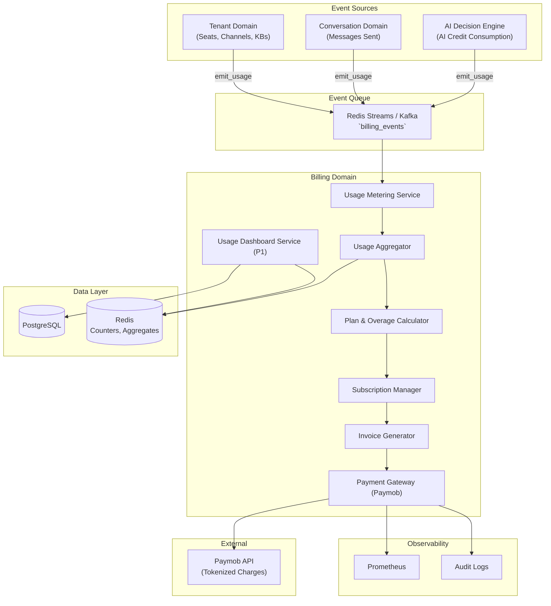
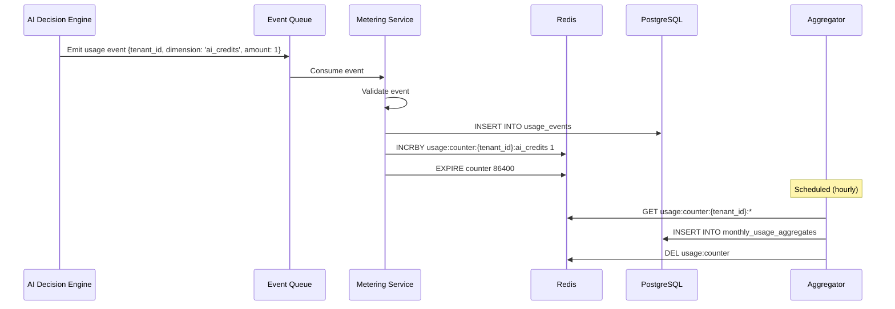
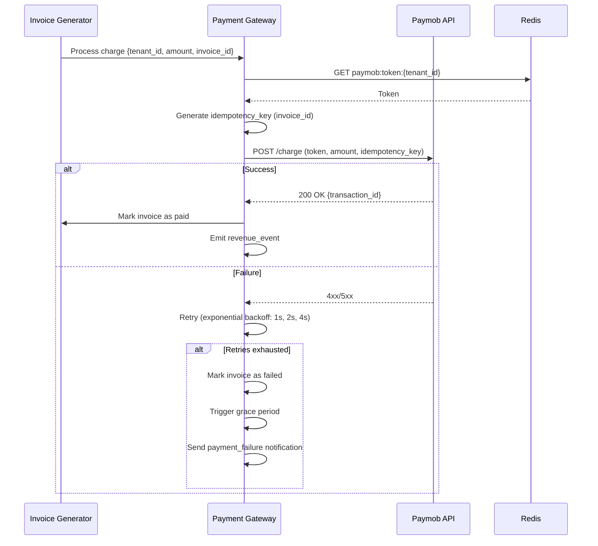
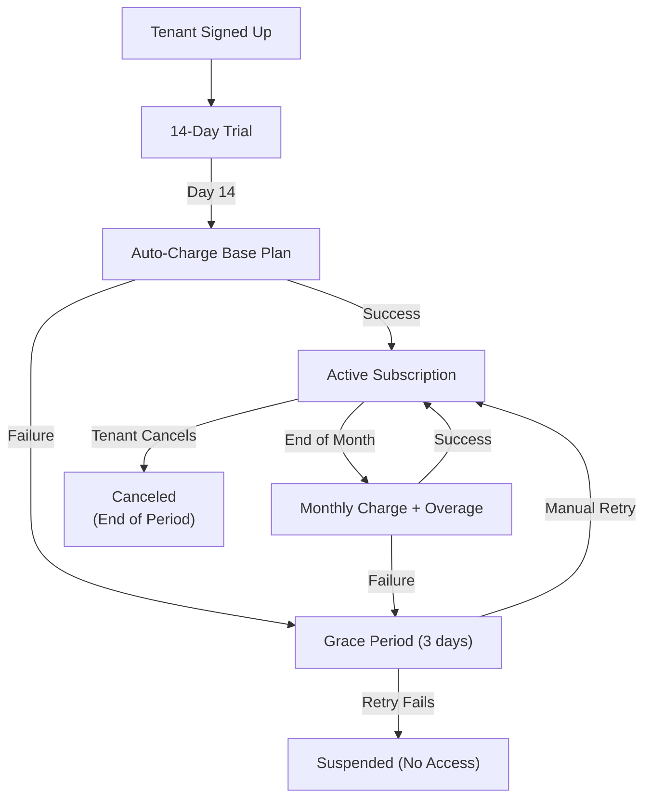

# Software Architecture Document – Volume 8

## Usage-Based Billing – Enterprise Production Architecture

| **Document ID** | SAD-08-BILLING-v1.0 |
| :--- | :--- |
| **Version** | 1.0 |
| **Status** | **Approved for Implementation** |
| **Classification** | Confidential – Omnilinks Internal |
| **Reviewers** | Principal Architect, Finance Lead, Security Lead, SRE Lead |

---

## Table of Contents

1. [Executive Summary & NFRs](#1-executive-summary--nfrs)
2. [Logical Architecture – Component View](#2-logical-architecture--component-view)
3. [Physical Architecture – Deployment Topology](#3-physical-architecture--deployment-topology)
4. [Data Architecture – Domain Models](#4-data-architecture--domain-models)
5. [Core Component Deep‑Dive](#5-core-component-deep-dive)
   - 5.1 Usage Metering & Aggregation
   - 5.2 Plan & Overage Calculation
   - 5.3 Paymob Integration (Tokenized Charges)
   - 5.4 Subscription Lifecycle Management
   - 5.5 Trial & Grace Period Management
   - 5.6 Revenue Event Emission
   - 5.7 Tenant Usage Dashboard (P1)
   - 5.8 Annual Billing (P1)
6. [Integration with Other Domains](#6-integration-with-other-domains)
7. [Security Architecture](#7-security-architecture)
8. [Observability & SRE](#8-observability--sre)
9. [Architecture Decision Records (ADR)](#9-architecture-decision-records-adr)
10. [Open Items & Roadmap](#10-open-items--roadmap)

---

## 1. Executive Summary & NFRs

### 1.1 Strategic Objective
Deliver a **scalable, event‑driven, usage‑based billing system** that meters resource consumption across all platform dimensions (AI Credits, messages, seats, channels, KB documents), calculates charges against plan allocations, and processes payments via **Paymob** tokenized merchant‑initiated charges. The system must support multiple plan tiers, 14‑day trials, grace periods, overage billing, and real‑time usage dashboards – all with audit‑grade accuracy.

### 1.2 Non‑Functional Requirements

| NFR ID | Category | Target | Implementation |
| :--- | :--- | :--- | :--- |
| **NFR-BILL-01** | **Metering Accuracy** | 99.99% | Idempotent event processing; counters in Redis + PG |
| **NFR-BILL-02** | **Billing Latency** | < 1s for monthly cycle | Async event queue; batch processing |
| **NFR-BILL-03** | **Payment Processing** | < 2s per charge | Paymob API with retries & circuit breaker |
| **NFR-BILL-04** | **Availability** | 99.95% | Event‑driven; no blocking of core platform |
| **NFR-BILL-05** | **Auditability** | 100% | Immutable charge logs; reconciliation reports |
| **NFR-BILL-06** | **Resilience** | Payment retries with backoff | Exponential backoff (3 attempts) + manual intervention |

---

## 2. Logical Architecture – Component View



---

## 3. Physical Architecture – Deployment Topology

| Node Pool | Instance Type | Components | Scaling Policy |
| :--- | :--- | :--- | :--- |
| **Compute‑Optimised** | Standard_D4s_v3 | Metering Workers, Aggregator | HPA based on queue depth |
| **Memory‑Optimised** | Standard_E8s_v3 | Redis (counters, aggregates) | Fixed (Premium) |
| **PostgreSQL** | Flexible Server (8 vCPU, 32GB) | Billing tables | Zone‑redundant HA |

---

## 4. Data Architecture – Domain Models

### 4.1 PostgreSQL Tables

```sql
-- Tenants and their current plan
CREATE TABLE tenant_subscriptions (
    id UUID PRIMARY KEY,
    tenant_id UUID NOT NULL REFERENCES tenants(id),
    plan_tier VARCHAR(20) NOT NULL,  -- 'trial', 'smb', 'mid', 'enterprise'
    plan_allocations JSONB NOT NULL,  -- {seats: 5, channels: 3, messages: 10000, ai_credits: 2500, kb_docs: 5}
    trial_start TIMESTAMP,
    trial_end TIMESTAMP,
    billing_cycle_start TIMESTAMP,
    billing_cycle_end TIMESTAMP,
    status VARCHAR(20) DEFAULT 'active',  -- 'active', 'past_due', 'suspended', 'cancelled'
    paymob_token VARCHAR(255),  -- Tokenized payment method
    created_at TIMESTAMP DEFAULT NOW(),
    updated_at TIMESTAMP
);

-- Usage metering (raw events)
CREATE TABLE usage_events (
    id UUID PRIMARY KEY,
    tenant_id UUID NOT NULL,
    dimension VARCHAR(50) NOT NULL,  -- 'ai_credits', 'messages', 'seats', 'channels', 'kb_docs'
    amount DECIMAL(10,2) NOT NULL,
    unit VARCHAR(20),  -- 'credits', 'messages', 'seats'
    event_source VARCHAR(50),  -- 'ai_engine', 'conversation', 'tenant'
    event_id UUID,  -- reference to source event
    created_at TIMESTAMP DEFAULT NOW()
);

-- Monthly aggregates (for billing)
CREATE TABLE monthly_usage_aggregates (
    id UUID PRIMARY KEY,
    tenant_id UUID NOT NULL,
    period_start DATE NOT NULL,
    period_end DATE NOT NULL,
    dimension VARCHAR(50) NOT NULL,
    total_usage DECIMAL(10,2) NOT NULL,
    allocated DECIMAL(10,2) NOT NULL,
    overage DECIMAL(10,2) DEFAULT 0,
    created_at TIMESTAMP DEFAULT NOW()
);

-- Invoices
CREATE TABLE invoices (
    id UUID PRIMARY KEY,
    tenant_id UUID NOT NULL,
    invoice_number VARCHAR(20) UNIQUE NOT NULL,
    period_start DATE NOT NULL,
    period_end DATE NOT NULL,
    base_amount DECIMAL(10,2) NOT NULL,
    overage_amount DECIMAL(10,2) DEFAULT 0,
    discount_amount DECIMAL(10,2) DEFAULT 0,
    total_amount DECIMAL(10,2) NOT NULL,
    paymob_transaction_id VARCHAR(255),
    status VARCHAR(20) DEFAULT 'pending',  -- 'pending', 'paid', 'failed'
    due_date TIMESTAMP,
    paid_at TIMESTAMP,
    created_at TIMESTAMP DEFAULT NOW()
);

-- Payment attempts (audit trail)
CREATE TABLE payment_attempts (
    id UUID PRIMARY KEY,
    tenant_id UUID NOT NULL,
    invoice_id UUID REFERENCES invoices(id),
    amount DECIMAL(10,2) NOT NULL,
    paymob_transaction_id VARCHAR(255),
    status VARCHAR(20),  -- 'success', 'failed'
    error_code VARCHAR(50),
    error_message TEXT,
    attempted_at TIMESTAMP DEFAULT NOW()
);

-- Grace period tracking
CREATE TABLE grace_periods (
    id UUID PRIMARY KEY,
    tenant_id UUID NOT NULL,
    start_date TIMESTAMP NOT NULL,
    end_date TIMESTAMP NOT NULL,
    reason VARCHAR(50),  -- 'payment_failure', 'admin'
    status VARCHAR(20) DEFAULT 'active',  -- 'active', 'expired', 'resolved'
    created_at TIMESTAMP DEFAULT NOW()
);
```

### 4.2 Redis Data Structures

| Key Pattern | Type | TTL | Purpose |
| :--- | :--- | :--- | :--- |
| `usage:counter:{tenant_id}:{dimension}` | Hash | 24h | Hourly/daily counters for fast read |
| `usage:agg:{tenant_id}:{dimension}:{month}` | Hash | 60d | Monthly aggregates (for billing) |
| `plan:cache:{tenant_id}` | JSON | 5min | Cached plan allocations |
| `paymob:token:{tenant_id}` | String | Persistent | Tokenized payment method |

---

## 5. Core Component Deep‑Dive

### 5.1 Usage Metering & Aggregation

**Architecture:** Event‑driven. All usage‑generating components emit events to `billing_events` stream (Kafka/Redis Streams). The Metering Service consumes, validates, and stores raw usage events. The Aggregator periodically rolls up events into hourly/daily/monthly aggregates.

**Flow:**



**Code – Metering Service:**

```python
class UsageMeteringService:
    def __init__(self, db_pool, redis_client, stream_name="billing_events"):
        self.db = db_pool
        self.redis = redis_client
        self.stream = stream_name

    async def consume_events(self):
        consumer_group = "billing_meter"
        await self.redis.xgroup_create(self.stream, consumer_group, id="0", mkstream=True)
        
        while True:
            events = await self.redis.xreadgroup(
                groupname=consumer_group,
                consumername=f"meter_{uuid.uuid4()}",
                streams={self.stream: ">"},
                block=1000,
                count=100
            )
            for stream, stream_events in events:
                for event_id, data in stream_events:
                    try:
                        await self.process_event(data)
                        await self.redis.xack(self.stream, consumer_group, event_id)
                    except Exception as e:
                        # Log and continue (dead-letter queue for persistent failures)
                        logger.error(f"Failed to process event {event_id}: {e}")
                        await self.redis.xadd("billing_dlq", data, maxlen=10000)

    async def process_event(self, data: dict):
        tenant_id = UUID(data['tenant_id'])
        dimension = data['dimension']
        amount = float(data['amount'])
        
        # 1. Validate dimension and amount
        if amount <= 0 or dimension not in self.VALID_DIMENSIONS:
            raise ValueError(f"Invalid event: {data}")
        
        # 2. Store raw event (async)
        async with self.db.acquire() as conn:
            await conn.execute("""
                INSERT INTO usage_events (tenant_id, dimension, amount, event_source, event_id)
                VALUES ($1, $2, $3, $4, $5)
            """, tenant_id, dimension, amount, data.get('source'), data.get('event_id'))
        
        # 3. Update Redis counter (fast path for dashboard)
        counter_key = f"usage:counter:{tenant_id}:{dimension}"
        await self.redis.hincrbyfloat(counter_key, datetime.now().strftime('%Y-%m-%d'), amount)
        await self.redis.expire(counter_key, 86400 * 31)  # 31 days
```

### 5.2 Plan & Overage Calculation

**Logic:** When a billing cycle ends (monthly), the Calculator:
1. Fetches the tenant's plan allocations.
2. Retrieves the month's aggregate usage per dimension.
3. If usage > allocation → overage = usage - allocation.
4. Calculates overage cost using rates from BRD Chapter 09.
5. Generates invoice.

**Overage Rates (Per Unit):**

| Dimension | SMB | Mid-Market |
| :--- | :--- | :--- |
| Extra Agent | $10/mo | $8/mo |
| Extra Channel | $15/mo | $12/mo |
| Extra Message (per 1K) | $2 | $1.50 |
| Extra AI Credit (per 100) | $5 | $4 |
| Extra Knowledge Base | $10/mo | $8/mo |

**Code – Overage Calculator:**

```python
class OverageCalculator:
    OVERAGE_RATES = {
        'seats': {'smb': 10.0, 'mid': 8.0},
        'channels': {'smb': 15.0, 'mid': 12.0},
        'messages': {'smb': 2.0 / 1000, 'mid': 1.5 / 1000},  # per message
        'ai_credits': {'smb': 5.0 / 100, 'mid': 4.0 / 100},
        'kb_docs': {'smb': 10.0, 'mid': 8.0}
    }

    async def calculate(self, tenant_id: UUID, period_start: Date, period_end: Date) -> Invoice:
        # 1. Get tenant plan
        plan = await self.get_tenant_plan(tenant_id)
        plan_tier = plan['tier']  # 'smb', 'mid', 'enterprise'
        
        # 2. Get usage aggregates for the period
        usage = await self.get_usage_aggregates(tenant_id, period_start, period_end)
        
        # 3. Calculate base and overage
        base_amount = await self.get_base_price(plan)
        overage_total = 0.0
        overage_items = []
        
        for dim, used in usage.items():
            allocated = plan['allocations'].get(dim, 0)
            if used > allocated:
                overage_units = used - allocated
                rate = self.OVERAGE_RATES.get(dim, {}).get(plan_tier, 0)
                cost = overage_units * rate
                overage_total += cost
                overage_items.append({
                    'dimension': dim,
                    'used': used,
                    'allocated': allocated,
                    'overage_units': overage_units,
                    'rate': rate,
                    'cost': cost
                })
        
        # 4. Generate invoice
        invoice = await self.create_invoice(
            tenant_id=tenant_id,
            period_start=period_start,
            period_end=period_end,
            base_amount=base_amount,
            overage_total=overage_total,
            overage_items=overage_items
        )
        return invoice
```

### 5.3 Paymob Integration (Tokenized Charges)

**Key Features:**
- **Tokenized merchant‑initiated charges** – no PCI‑DSS scope beyond SAQ‑A.
- **Retry with exponential backoff** – 3 attempts.
- **Idempotency** – every charge has an idempotency key.
- **Webhooks** – for async payment confirmations.



**Code – Payment Gateway:**

```python
class PaymentGateway:
    def __init__(self, redis_client, db_pool, paymob_client):
        self.redis = redis_client
        self.db = db_pool
        self.paymob = paymob_client
        self.max_retries = 3
        self.retry_backoff = [1, 2, 4]  # seconds

    async def process_charge(self, tenant_id: UUID, amount: float, invoice_id: UUID) -> PaymentResult:
        # 1. Get tokenized payment method
        token = await self.redis.get(f"paymob:token:{tenant_id}")
        if not token:
            # Fetch from DB if not cached
            async with self.db.acquire() as conn:
                row = await conn.fetchrow(
                    "SELECT paymob_token FROM tenant_subscriptions WHERE tenant_id = $1",
                    tenant_id
                )
                if row:
                    token = row['paymob_token']
                    await self.redis.setex(f"paymob:token:{tenant_id}", 3600, token)
        
        if not token:
            return PaymentResult(success=False, error="No payment method on file")
        
        # 2. Generate idempotency key
        idempotency_key = f"invoice_{invoice_id}"
        
        # 3. Attempt charge with retries
        for attempt in range(self.max_retries):
            try:
                response = await self.paymob.charge(
                    token=token,
                    amount=round(amount, 2),
                    currency="EGP",
                    idempotency_key=idempotency_key,
                    description=f"Invoice {invoice_id}"
                )
                # Record attempt
                await self.record_payment_attempt(tenant_id, invoice_id, amount, 'success', response)
                return PaymentResult(success=True, transaction_id=response['id'])
            except Exception as e:
                # Log attempt
                await self.record_payment_attempt(tenant_id, invoice_id, amount, 'failed', str(e))
                if attempt < self.max_retries - 1:
                    await asyncio.sleep(self.retry_backoff[attempt])
        
        # All retries exhausted
        return PaymentResult(success=False, error="Payment failed after retries")
```

### 5.4 Subscription Lifecycle Management



### 5.5 Trial & Grace Period Management

**Trial:** On signup, create subscription with `plan_tier = 'trial'`, `trial_end = NOW() + 14 days`. All SMB plan limits apply. At trial_end, the system attempts to charge the base SMB plan. If payment fails, the tenant enters grace period.

**Grace Period:** 3 days after payment failure. During grace, service continues but reminders are sent (daily). If payment succeeds within grace, service continues. If not, the tenant is suspended.

**Code – Grace Period Check:**

```python
@celery.task
def check_grace_periods():
    """Run daily; check if any grace periods are about to expire."""
    expired = db.fetch_all("""
        SELECT tenant_id FROM grace_periods
        WHERE end_date < NOW() AND status = 'active'
    """)
    for row in expired:
        # Suspend tenant
        db.execute("UPDATE tenant_subscriptions SET status = 'suspended' WHERE tenant_id = $1", row['tenant_id'])
        # Notify Tenant Admin
        notify_suspension(row['tenant_id'])
```

### 5.6 Revenue Event Emission

When a charge succeeds, the Billing Domain emits a revenue event to the Analytics Domain (F-BILL-08). This event contains:
- `tenant_id`
- `amount`
- `invoice_id`
- `revenue_type` (base / overage / annual)
- `timestamp`

This feeds into MRR, ARR, and financial dashboards.

### 5.7 Tenant Usage Dashboard (P1)

**API:** `GET /billing/usage/current`

Returns usage vs. allocation for the current billing period. Uses Redis aggregates for fast reads.

```python
async def get_usage_dashboard(tenant_id: UUID):
    plan = await get_tenant_plan(tenant_id)
    usage = await get_current_usage(tenant_id)
    return {
        'plan_tier': plan['tier'],
        'allocations': plan['allocations'],
        'usage': usage,
        'overages': {
            dim: used - plan['allocations'].get(dim, 0)
            for dim, used in usage.items()
            if used > plan['allocations'].get(dim, 0)
        },
        'billing_cycle_end': plan['billing_cycle_end'],
        'estimated_cost': calculate_estimated_cost(usage, plan)
    }
```

### 5.8 Annual Billing (P1)

- **Discount:** 15–20% off monthly rate (exact percentage TBD).
- **Charge:** Paymob charge for the annual amount upfront.
- **Pro‑ration:** If tenant cancels mid‑year, refund the unused portion (pro‑rata).
- **Implementation:** Store `billing_cycle = 'annual'` in `tenant_subscriptions`, and charge once per year.

---

## 6. Integration with Other Domains

| Domain | Integration Point | Direction |
| :--- | :--- | :--- |
| **AI Decision Engine** | Emits `ai_credits` usage on every AI response | AI → Billing |
| **Conversation Domain** | Emits `messages` usage on every outbound message | Conv → Billing |
| **Tenant Domain** | Emits `seats`, `channels`, `kb_docs` on changes | Tenant → Billing |
| **Analytics Domain** | Receives revenue events for MRR/ARR | Billing → Analytics |
| **Notification Service** | Sends payment failure, grace, and suspension emails | Billing → Notify |

---

## 7. Security Architecture

| Control | Implementation |
| :--- | :--- |
| **Tokenization** | Paymob handles card data; Omnilinks only stores tokens |
| **API Key Rotation** | Paymob API keys encrypted in Key Vault, rotated quarterly |
| **Idempotency** | Every charge has a unique idempotency key (invoice_id) |
| **Audit Trail** | All charges, failures, and retries logged to `payment_attempts` |
| **Rate Limiting** | Per‑tenant charge attempts limited (10 per day) to prevent abuse |
| **Data Encryption** | All billing data encrypted at rest (AES‑256) |

---

## 8. Observability & SRE

### 8.1 Metrics (Prometheus)

| Metric | Type | Labels | Purpose |
| :--- | :--- | :--- | :--- |
| `billing_charges_total` | Counter | `status` (success/fail), `type` (base/overage) | Charge success rate |
| `billing_revenue_total` | Counter | `tenant`, `type` | MRR tracking |
| `billing_grace_period_active` | Gauge | `tenant` | Number of tenants in grace |
| `billing_usage_aggregation_latency` | Histogram | – | Aggregation performance |
| `billing_paymob_latency_seconds` | Histogram | – | Paymob API latency |

### 8.2 Alerting

| Condition | Severity | Action |
| :--- | :--- | :--- |
| `billing_charges_total{status="fail"} > 5` per 10 min | **P1** | Paymob outage; check integration |
| `billing_grace_period_active > 10` | **P2** | Many payment failures – investigate |
| `billing_usage_aggregation_latency > 5s` | **P2** | Aggregator worker lagging – scale up |
| `paymob_webhook_failures > 0` | **P1** | Check webhook endpoint |

---

## 9. Architecture Decision Records (ADR)

### ADR-021: Event‑Driven Metering
- **Context:** Need to track usage across multiple domains without blocking core flows.
- **Decision:** Use event queue (Redis Streams/Kafka) for all usage emissions.
- **Rationale:** Decouples billing from business logic; asynchronous; allows replayability.

### ADR-022: Tokenized Merchant‑Initiated Charges
- **Context:** Need to process recurring charges without PCI‑DSS Level 1.
- **Decision:** Use Paymob's hosted checkout + tokenization; store tokens only.
- **Rationale:** Keeps PCI‑DSS scope at SAQ‑A (self‑attestation).

### ADR-023: Redis for Fast Usage Counters
- **Context:** Dashboard needs real‑time usage visibility.
- **Decision:** Maintain counters in Redis; sync to PostgreSQL for audit.
- **Rationale:** Sub‑ms reads for dashboards; PostgreSQL as source of truth.

### ADR-024: Overage Billing at Month End
- **Context:** Overage charges should be batched, not per‑event.
- **Decision:** Calculate overages monthly during billing cycle close.
- **Rationale:** Reduces transaction fees; easier for tenants to understand.

---

## 10. Open Items & Roadmap

| Item | Owner | Target Date | Risk |
| :--- | :--- | :--- | :--- |
| **Annual billing discount %** | Product | GA | Finalise 15% vs 20% |
| **Paymob webhook setup** | DevOps | GA | Need to configure and secure webhook endpoint |
| **Prorated refunds** | Backend | GA+1 | Logic for mid‑cycle cancellations |
| **Manual invoice adjustments** | Finance | GA+2 | Admin UI for credits/refunds |
| **Multi‑currency support** | Backend | GA+3 | EGP, USD, SAR, AED |

---

> **Next Steps:**
> 1. Set up the event stream (`billing_events`) in Redis/Kafka.
> 2. Implement the Usage Metering Service and Aggregator.
> 3. Configure Paymob integration with sandbox keys.
> 4. Implement the subscription lifecycle logic (trial → active → grace → suspended).
> 5. Build the tenant usage dashboard API.
> 6. Write integration tests for billing cycles and overage calculations.
> 7. Set up Payment Gateway webhook handler for async confirmations.
