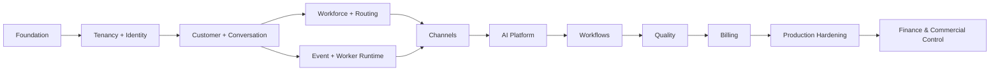

# OmniLinks Ordered Engineering Tickets

> Canonical execution backlog for the OmniLinks engineering simulation. Tickets are ordered by dependency, not by convenience.

## Execution sequence

```text
00 Ticket Governance
01 Engineering Foundation
02 Tenancy and Identity
03 Customer and Conversation Core
04 Channels and Webhooks
05 Workforce and Routing
06 Event and Worker Runtime
07 AI Platform
08 Workflows
09 Quality
10 Billing
11 Production Hardening
12 Finance & Commercial Control
```

> Finance is cross-cutting: the financial gates below must influence launch and scaling decisions even though the track is listed after production hardening.

## Status semantics

- BASELINE: represented by the current implementation/engineering plan; re-validate with executable evidence before treating it as production-ready.
- TARGET: planned and not yet established by implementation/evidence.
- DEFERRED: explicitly deferred until product, scale, or authorization requirements justify it.

## Standard lifecycle

```text
BACKLOG -> READY -> IN PROGRESS -> IN REVIEW -> CI -> QA -> READY TO MERGE -> DONE
                                         \-> BLOCKED
```

## Standard branch naming

```text
feat/OML-T0903-entitlement-resolution
fix/OML-TXXXX-short-description
docs/OML-TXXXX-short-description
```

## Ticket Definition of Done

```text
specification
+ implementation
+ tests + negative tests
+ failure handling
+ observability
+ migration safety
+ recovery
+ PR review
+ CI
+ acceptance evidence
+ engineer explanation
```

## AI ticket rule

```text
dataset version -> baseline -> metric -> regression threshold -> release evidence
```

## Async/event ticket rule

```text
duplicate delivery + retry + timeout + lease loss + dead letter + replay + unknown external outcome
```

## Financial ticket rule

```text
business assumption
 -> source document
 -> domain invariant
 -> implementation
 -> measured financial fact
 -> reconciliation
 -> decision evidence
```

Financial tickets are not complete when a spreadsheet has been created. The evidence must be reproducible from source records.

## Ordered master map

| # | Ticket | Outcome | Status |
|---:|---|---|---|
| 001 | OML-T0000 | Ticket Operating Model | BASELINE |
| 002 | OML-T0001 | Repository module boundaries | BASELINE |
| 003 | OML-T0002 | Configuration and environment validation | BASELINE |
| 004 | OML-T0003 | Database migration system | BASELINE |
| 005 | OML-T0004 | Structured logging and correlation | BASELINE |
| 006 | OML-T0005 | Test harness and CI gates | BASELINE |
| 007 | OML-T0006 | Local development infrastructure | BASELINE |
| 008 | OML-T0101 | Organization aggregate | BASELINE |
| 009 | OML-T0102 | Membership model | BASELINE |
| 010 | OML-T0103 | Roles and permissions | BASELINE |
| 011 | OML-T0104 | Scope bindings and service principals | BASELINE |
| 012 | OML-T0105 | Tenant request context | BASELINE |
| 013 | OML-T0106 | Authorization engine | BASELINE |
| 014 | OML-T0107 | Tenant isolation and escalation tests | BASELINE |
| 015 | OML-T0108 | Security-sensitive audit events | BASELINE |
| 016 | OML-T0201 | Customer aggregate | BASELINE |
| 017 | OML-T0202 | Customer identity mapping | BASELINE |
| 018 | OML-T0203 | Conversation aggregate and control state | BASELINE |
| 019 | OML-T0204 | Message model and delivery state | BASELINE |
| 020 | OML-T0205 | Assignment and takeover transaction | BASELINE |
| 021 | OML-T0206 | Message idempotency | BASELINE |
| 022 | OML-T0207 | Transactional outbox for domain events | BASELINE |
| 023 | OML-T0208 | Conversation core integration tests | BASELINE |
| 024 | OML-T0301 | Channel adapter contract | BASELINE |
| 025 | OML-T0302 | Web Widget tenant configuration | BASELINE |
| 026 | OML-T0303 | Widget public message ingress | BASELINE |
| 027 | OML-T0304 | Provider-event dedupe ledger | BASELINE |
| 028 | OML-T0305 | Retryable webhook ingress lease | BASELINE |
| 029 | OML-T0306 | Outbound delivery boundary | TARGET |
| 030 | OML-T0307 | WhatsApp provider adapter | TARGET |
| 031 | OML-T0308 | Channel adapter contract tests | BASELINE |
| 032 | OML-T0401 | Workforce member aggregate | BASELINE |
| 033 | OML-T0402 | Skills and proficiency | BASELINE |
| 034 | OML-T0403 | Presence with TTL | BASELINE |
| 035 | OML-T0404 | Agent capacity accounting | BASELINE |
| 036 | OML-T0405 | Teams and queues | BASELINE |
| 037 | OML-T0406 | Versioned routing policy | BASELINE |
| 038 | OML-T0407 | Deterministic routing evaluation | BASELINE |
| 039 | OML-T0408 | Routing decision and candidate snapshot | BASELINE |
| 040 | OML-T0409 | Transactional assignment commit | BASELINE |
| 041 | OML-T0410 | Escalation policy engine | TARGET |
| 042 | OML-T0501 | PostgreSQL outbox publisher | BASELINE |
| 043 | OML-T0502 | Per-consumer event inbox | BASELINE |
| 044 | OML-T0503 | Leased work claiming | BASELINE |
| 045 | OML-T0504 | Retry and dead-letter transitions | BASELINE |
| 046 | OML-T0505 | Authorized dead-letter replay | BASELINE |
| 047 | OML-T0506 | Worker-instance leases and heartbeats | BASELINE |
| 048 | OML-T0507 | Per-class concurrency limits | BASELINE |
| 049 | OML-T0508 | Production worker process entrypoint | BASELINE |
| 050 | OML-T0509 | Asynchronous routing worker | BASELINE |
| 051 | OML-T0510 | Event-runtime failure and recovery tests | BASELINE |
| 052 | OML-T0601 | AI model registry | BASELINE |
| 053 | OML-T0602 | Versioned model policy and deterministic failover | BASELINE |
| 054 | OML-T0603 | AI agent identity and governance | BASELINE |
| 055 | OML-T0604 | Agent execution policy | BASELINE |
| 056 | OML-T0605 | AI input/output guardrails | BASELINE |
| 057 | OML-T0606 | Durable AI run traceability and cost attribution | BASELINE |
| 058 | OML-T0607 | AI evaluation kernel and regression evidence | BASELINE |
| 059 | OML-T0608 | Authenticated AI APIs | BASELINE |
| 060 | OML-T0609 | Governed context assembly | BASELINE |
| 061 | OML-T0610 | Tool runtime authorization kernel | BASELINE |
| 062 | OML-T0611 | Embedding provider registry | DEFERRED |
| 063 | OML-T0612 | Advanced quality-based model routing | DEFERRED |
| 064 | OML-T0613 | Multi-agent orchestration | DEFERRED |
| 065 | OML-T0701 | Workflow definition and versioning | BASELINE |
| 066 | OML-T0702 | Durable workflow run and step state | BASELINE |
| 067 | OML-T0703 | Idempotent workflow triggers | BASELINE |
| 068 | OML-T0704 | Workflow run leases and claiming | BASELINE |
| 069 | OML-T0705 | Workflow retries and failure branches | BASELINE |
| 070 | OML-T0706 | Durable WAIT and scheduler resume | BASELINE |
| 071 | OML-T0707 | Durable approval state | BASELINE |
| 072 | OML-T0708 | Workflow cancellation | BASELINE |
| 073 | OML-T0709 | Workflow graph validation | BASELINE |
| 074 | OML-T0710 | Workflow worker and scheduler integration | BASELINE |
| 075 | OML-T0711 | Workflow side-effect and action steps | DEFERRED |
| 076 | OML-T0712 | Workflow compensation execution | DEFERRED |
| 077 | OML-T0713 | Workflow parallel fan-out and fan-in | DEFERRED |
| 078 | OML-T0714 | Distributed cron triggers | DEFERRED |
| 079 | OML-T0801 | Versioned quality scorecards | BASELINE |
| 080 | OML-T0802 | Deterministic quality sampling | BASELINE |
| 081 | OML-T0803 | Quality evaluation state machine | BASELINE |
| 082 | OML-T0804 | Conversation-scoped evaluation evidence | BASELINE |
| 083 | OML-T0805 | Reproducible scoring calculation | BASELINE |
| 084 | OML-T0806 | AI proposal fencing | BASELINE |
| 085 | OML-T0807 | Finding-linked remediation workflow | BASELINE |
| 086 | OML-T0808 | Quality kernel parity and negative tests | BASELINE |
| 087 | OML-T0809 | Quality analytics and calibration | DEFERRED |
| 088 | OML-T0901 | Billing domain model | TARGET |
| 089 | OML-T0902 | Plan catalog and versioning | TARGET |
| 090 | OML-T0903 | Entitlement resolution engine | TARGET |
| 091 | OML-T0904 | Subscription state machine | TARGET |
| 092 | OML-T0905 | Immutable usage event model | TARGET |
| 093 | OML-T0906 | Usage aggregation and metering | TARGET |
| 094 | OML-T0907 | Payment provider abstraction | TARGET |
| 095 | OML-T0908 | Paymob payment creation | TARGET |
| 096 | OML-T0909 | Payment webhook ingestion | TARGET |
| 097 | OML-T0910 | Payment reconciliation | TARGET |
| 098 | OML-T0911 | Invoice and payment history | TARGET |
| 099 | OML-T0912 | Billing API and operator UI | TARGET |
| 100 | OML-T0913 | Billing observability and reconciliation metrics | TARGET |
| 101 | OML-T0914 | Billing end-to-end and failure tests | TARGET |
| 102 | OML-T1001 | Security test plan and threat model refresh | TARGET |
| 103 | OML-T1002 | Load and capacity tests | TARGET |
| 104 | OML-T1003 | Backup and restore drill | TARGET |
| 105 | OML-T1004 | Provider failover and recovery drill | TARGET |
| 106 | OML-T1005 | Production observability dashboards | TARGET |
| 107 | OML-T1006 | Incident response runbooks | TARGET |
| 108 | OML-T1007 | Release gates and change management | TARGET |
| 109 | OML-T1008 | Data retention and purge controls | TARGET |
| 110 | OML-T1009 | Launch-readiness simulation | TARGET |
| 111 | OML-T1101 | Financial Control Operating Model | TARGET |
| 112 | OML-T1102 | Founder Investment and Build Cost Ledger | TARGET |
| 113 | OML-T1103 | Infrastructure and SaaS Cost Inventory | TARGET |
| 114 | OML-T1104 | Engineering Burn and Delivery Economics | TARGET |
| 115 | OML-T1105 | Go-Live Cash Gate | TARGET |
| 116 | OML-T1106 | First Customer Acquisition and Onboarding Economics | TARGET |
| 117 | OML-T1107 | Pricing and Packaging Decision | TARGET |
| 118 | OML-T1108 | Usage and Cost Metering Vertical Slice | TARGET |
| 119 | OML-T1109 | Unit Economics Engine | TARGET |
| 120 | OML-T1110 | Revenue, Churn and Cohort Model | TARGET |
| 121 | OML-T1111 | Cash Flow Forecast and Runway Engine | TARGET |
| 122 | OML-T1112 | Break-Even Engine | TARGET |
| 123 | OML-T1113 | Scenario, Stress and Failure Modeling | TARGET |
| 124 | OML-T1114 | Finance Observability and Forecast-vs-Actual | TARGET |
| 125 | OML-T1115 | Capital and Scale Decision Gate | TARGET |

## Dependency spine



## Cross-cutting financial gates

```text
T1105 Go-Live Cash Gate
  blocks commercial launch budgeting

T1106 First Customer Economics
  blocks scale-up without measured acquisition economics

T1108 Usage & Cost Metering
  required before trusting contribution-margin claims

T1112 Break-Even Engine
  required before claiming operating or investment break-even

T1113..T1115
  required before aggressive scaling / capital allocation
```

Treat this directory as the source of truth for the development queue. Documentation does not prove implementation.