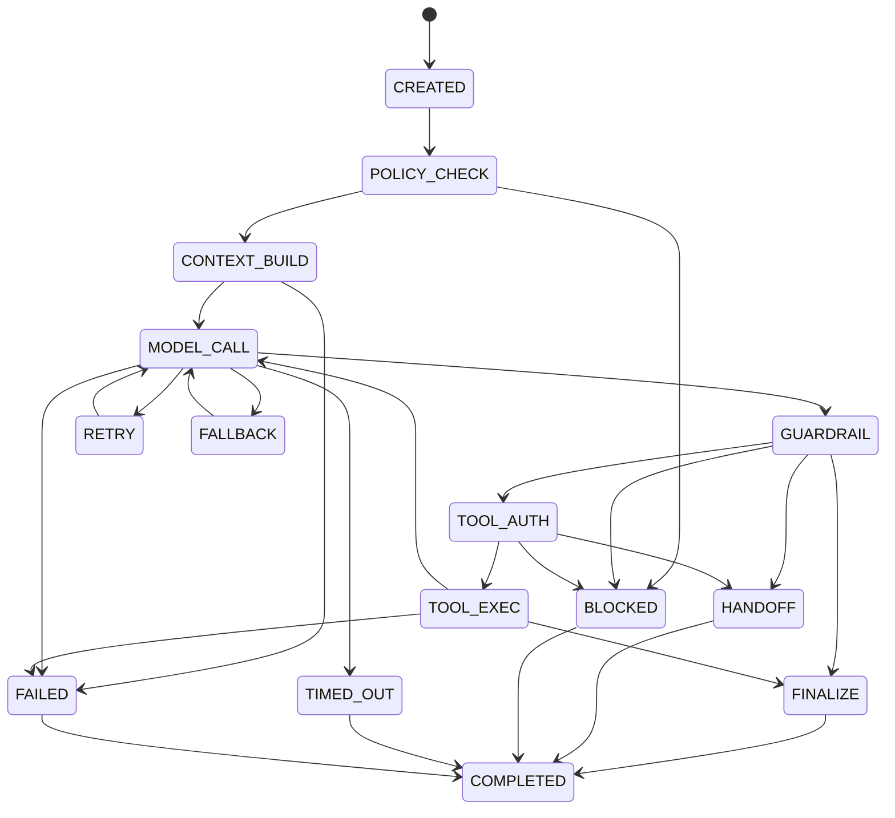
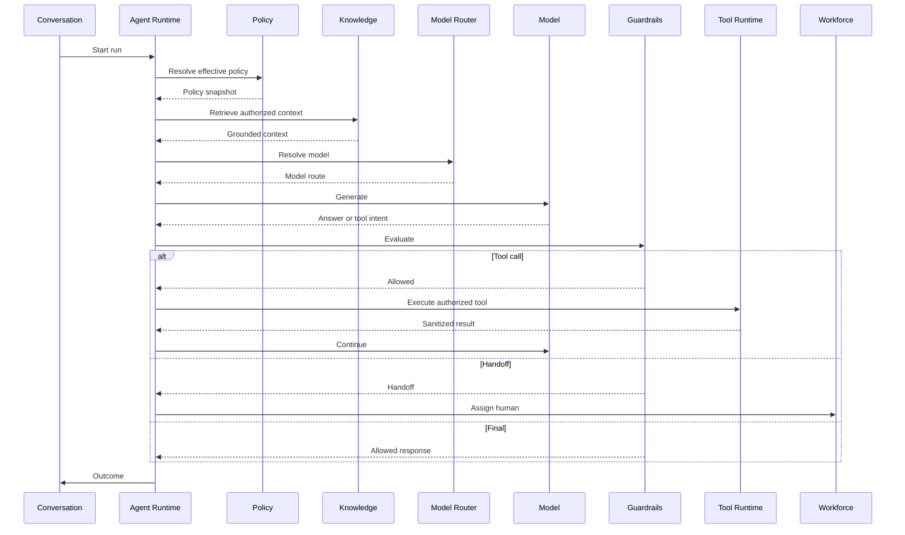
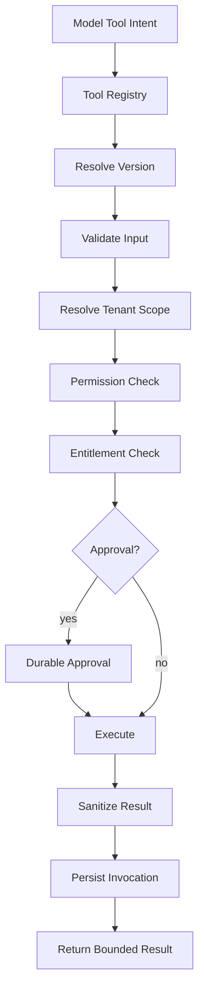

## AI Agent Runtime

> **Status:** Target production architecture

The Agent Runtime is the execution engine for autonomous and semi-autonomous customer operations. It is intentionally separated from domain persistence and authorization: the model can propose work, but the runtime and domain services decide whether that work is legal and safe.

## 1. Responsibilities

The runtime owns:

- run lifecycle and state transitions;
- context assembly;
- model invocation;
- tool-call orchestration;
- budgets, deadlines and cancellation;
- guardrail evaluation;
- human handoff;
- provider fallback;
- AI telemetry.

It does **not** own customer, billing, membership, or arbitrary business-data mutation.

## 2. Execution Context

Every run must carry:

| Field | Purpose |
|---|---|
| `run_id` | immutable execution identity |
| `organization_id` | tenant boundary |
| `conversation_id` | conversation being served |
| `agent_id` | AI workforce identity |
| `agent_policy_version` | exact behavior policy |
| `model_policy_version` | routing policy |
| `prompt_version` | instruction version |
| `principal` | initiating human/system identity |
| `correlation_id` | distributed trace |
| `deadline_at` | hard execution deadline |
| `max_steps` | loop bound |
| `budget` | token/cost/tool constraints |

A run without organization or agent policy context is rejected before model execution.

## 3. Context Trust Model

Context is assembled into explicit classes.

1. Runtime security policy — trusted.
2. Agent policy — trusted configuration, still validated by platform constraints.
3. Conversation facts — customer-originated data.
4. Knowledge retrieval — untrusted externalized content.
5. Tool results — untrusted externalized content.

Customer messages, retrieved documents and tool results can contain instructions, but those instructions must never become system or security policy.

## 4. Run State Machine



A terminal outcome must be persisted exactly once even when multiple internal attempts occurred.

## 5. End-to-End Control Loop



## 6. Loop and Termination Rules

Autonomous execution ends when:

- a final response satisfies the output contract;
- a tool requires approval;
- policy blocks the operation;
- a configured handoff condition fires;
- max steps is reached;
- deadline expires;
- budget expires;
- model/provider fallback is exhausted;
- a human takes control;
- the conversation becomes closed/resolved.

There is no implicit "keep thinking" loop.

## 7. Human Takeover Race Protection

The main race condition is:

```text
AI Run A starts
Human takes control
AI Run A finishes later
AI Run A attempts customer send
```

Use a monotonic `control_version` on the conversation.

Every autonomous continuation carries the version it started with. Before any customer-facing side effect:

```text
if run.control_version != conversation.control_version:
    reject stale continuation
```

A human takeover increments the control version.

## 8. Tool Loop

Every tool invocation follows:



## 9. Persistence Model

Conceptual records:

- `ai_agent`
- `agent_policy_version`
- `prompt_version`
- `ai_run`
- `ai_run_step`
- `guardrail_decision`
- `tool_invocation`
- `ai_handoff`

The run references versions of every policy component that materially affected execution.

## 10. Failure Semantics

### Provider timeout

Retry only if the operation is read-like or the provider operation is demonstrably safe to repeat.

### Tool timeout

A timeout does not prove the external action failed. For write operations, the runtime may need reconciliation before retry.

### Worker crash

The persisted run state determines whether recovery can resume. Never resume an arbitrary state after an unknown external side effect without checking idempotency/reconciliation rules.

### Human takeover

Mark stale autonomous continuations as cancelled before sending further output.

## 11. Observability

Every run should expose:

- run duration;
- model/provider;
- first-token latency;
- input/output tokens;
- estimated/actual cost;
- retrieval source identifiers;
- tool count and latency;
- guardrail decisions;
- handoff reason;
- terminal outcome;
- error classification.

Raw prompts/responses follow retention and privacy policy rather than unlimited logging.

## 12. Security Invariants

- organization scope is mandatory;
- model output never grants permission;
- tool access is independently authorized;
- raw provider credentials never enter model context;
- knowledge retrieval is tenant/scope filtered;
- stale autonomous continuations cannot mutate conversation state;
- AI writes only through application/domain services.

## 13. Acceptance Criteria

- Runs are resumable only from known safe states.
- Human takeover prevents stale sends.
- Tool authorization is checked on every call.
- Every side-effecting operation defines idempotency/reconciliation.
- Every completed run has traceable model/policy/tool versions.
- The runtime cannot access another organization through a valid identifier.
