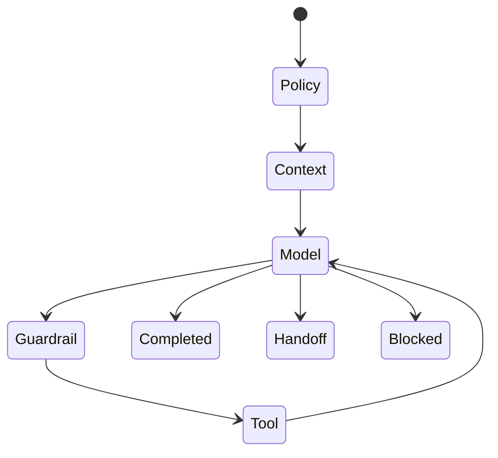

# Agent Runtime

> Status: **Target / normative engineering design**.

An AI agent is a bounded execution loop with explicit identity, policy, context, model, tools, budgets, and termination rules.

## Contract

Execution: policy -> context -> retrieval -> model -> guardrails -> tool authorization -> tool execution -> domain validation -> response/handoff. Store model, prompt, tool, source, latency, token and outcome metadata.

## Mermaid Flow

## Engineering Rule

External inputs are untrusted, tenant scope is mandatory, and side effects require explicit authorization and idempotency where duplicate execution could matter.
