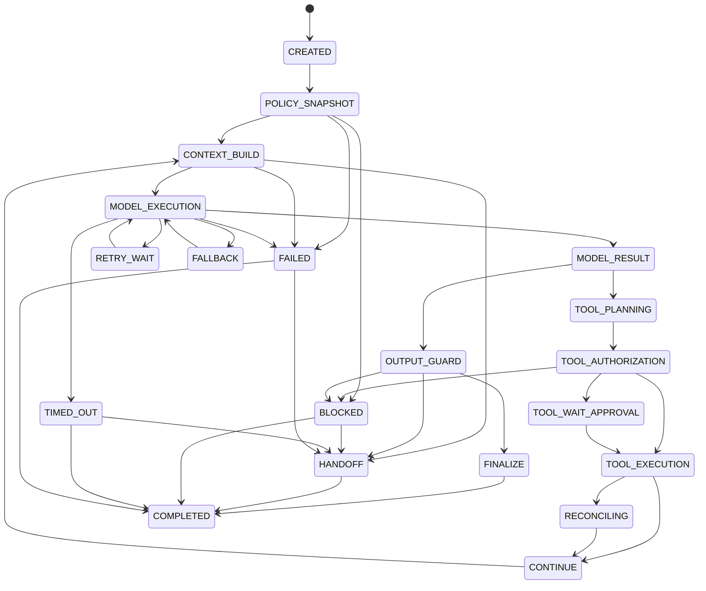
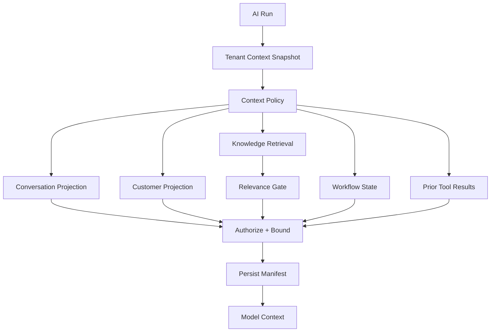

# AI Agent Runtime — Implementation Specification

> Status: **Target implementation blueprint**
>
> Related: context-engine.md (context and memory), human-handoff.md (handoff lifecycle), model-routing.md, tool-runtime.md, guardrails.md, cost-control.md, evaluation.md.
>
> Phase tags: **[MVP]** is needed for the first production tenant. **[Later]** and **[Deferred]** are designed now and built later.

The Agent Runtime is the durable execution engine for autonomous and semi-autonomous operations. It is deliberately separated from customer data ownership, billing, membership and authorization.

## 1. Runtime Boundary

```text
Conversation / Workflow
  -> StartAIRun
    -> snapshot tenant context + policy
      -> build context (context-engine.md)
        -> route model
          -> execute model
            -> guardrail
              -> authorize tool
                -> execute tool
                  -> continue, finalize or hand off

After a terminal outcome (asynchronous, never on the customer's critical path):
  -> post-run memory update
```

The model proposes outputs and actions. The runtime and domain services decide whether anything can actually happen.

Every terminal outcome leaves the triggering customer message either answered or owned by a human (§21).

## 2. Required Run Context

```json
{
  "runId": "uuid",
  "organizationId": "uuid",
  "conversationId": "uuid",
  "agentId": "uuid",
  "agentPolicyVersion": 12,
  "tenantContextVersion": 27,
  "controlVersion": 41,
  "channel": "whatsapp",
  "channelClass": "async",
  "trigger": "conversation.message.received",
  "deadlineAt": "2026-09-28T21:00:00Z",
  "correlationId": "req_123"
}
```

A run is invalid if organization, policy version, tenant context version, conversation control version, or correlation context is missing.

`channelClass` is `async` or `realtime`. Everything in this document describes `async` runs. Realtime runs are **[Deferred]** and need the changes listed in §23.

## 3. Runtime State Machine



All state transitions are persisted. In-memory state is an optimization, not the source of truth.

`BLOCKED`, `TIMED_OUT` and `FAILED` go to `HANDOFF` when the conversation is still AI-owned and the customer message is unanswered. Otherwise they go to `COMPLETED`. §21 defines the rule.

## 4. Transition Preconditions

| Transition | Preconditions |
|---|---|
| CREATED -> POLICY_SNAPSHOT | run exists, organization active |
| POLICY_SNAPSHOT -> CONTEXT_BUILD | policy dependency graph and tenant context snapshot resolve |
| CONTEXT_BUILD -> MODEL_EXECUTION | context is authorized and bounded, and its manifest is persisted |
| CONTEXT_BUILD -> HANDOFF | relevance gate reports no evidence for a request policy says must not be answered ungrounded, or required context exceeds the budget |
| MODEL_RESULT -> TOOL_PLANNING | tool intent matches declared schema |
| TOOL_AUTHORIZATION -> TOOL_EXECUTION | auth + entitlement + risk checks pass |
| TOOL_WAIT_APPROVAL -> TOOL_EXECUTION | approval matches exact action/version |
| CONTINUE -> CONTEXT_BUILD | budget, deadline and control version valid |
| FINALIZE -> COMPLETED | output validated and canonical message persisted |
| HANDOFF -> COMPLETED | handoff request, control owner change and `controlVersion` bump persisted in the same transaction |
| BLOCKED/TIMED_OUT/FAILED -> HANDOFF | conversation still AI-owned and customer message unanswered |

## 5. Durable Persistence Model

| Record | Responsibility |
|---|---|
| ai_run | lifecycle, owner, policy snapshots, terminal outcome |
| ai_run_step | model/tool/guardrail step state |
| ai_handoff | handoff request created at run terminal. Lifecycle is in human-handoff.md |
| ai_context_manifest | per model call: references to what context was included or excluded (context-engine.md §14) |
| ai_memory_job **[Later]** | post-run memory update job state (§22) |
| guardrail_decision | policy decision/evidence |
| ai_budget_reservation | reserved hard budget where required |
| ai_run_event | append-only execution facts where required |

Every record is organization-scoped.

## 6. Step Record

```json
{
  "stepId": "uuid",
  "runId": "uuid",
  "sequence": 7,
  "type": "model|tool|guardrail|handoff|finalize",
  "status": "started|succeeded|failed|unknown",
  "startedAt": "...",
  "completedAt": "...",
  "provider": "...",
  "model": "...",
  "routeDecisionId": "uuid",
  "contextManifestId": "uuid",
  "inputTokens": 1200,
  "outputTokens": 350,
  "latencyMs": 1840,
  "errorClass": null
}
```

Sequence numbers are monotonic inside a run.

Model steps reference the routing decision (model-routing.md §8) and the context manifest (context-engine.md §14), so any model call can be explained and replayed.

## 7. Transaction Boundaries

Never hold a database transaction open across an LLM or external provider call.

Preferred execution:

```text
TX-1: create AI run + initial step + start command
COMMIT
worker invokes provider
TX-2: persist provider result + next state
COMMIT
```

External calls have their own invocation identity so a DB retry cannot automatically repeat a provider side effect.

## 8. Context Assembly

The authoritative specification is context-engine.md. This section keeps the runtime-facing contract.



Never serialize arbitrary database entities directly into prompts.

Runtime obligations:

- Context comes only from the Context Engine.
- Enforcement context (tool allowlist, entitlements, data-handling class, approval rules) is read by the runtime and never rendered into the prompt.
- A manifest is persisted before every model call. If it cannot be persisted, the model is not called.
- A relevance-gate "no evidence" outcome, or required context that cannot fit the budget, can move the run to `HANDOFF`.

## 9. Prompt Layering

```text
platform policy
 -> tenant business context
 -> agent policy
 -> task instructions
 -> authorized authoritative context
 -> untrusted data: customer messages, retrieved documents, tool outputs, derived memory
```

Customer messages, retrieved documents, tool outputs and derived customer memory remain untrusted data even when presented inside the prompt.

Tenant enforcement policy is not a prompt layer. It is enforced outside the model and never rendered (context-engine.md §2).

## 10. Control-Version Race

The conversation contains a monotonic `controlVersion`.

Example:

```text
AI started with controlVersion = 41
human takeover changes controlVersion = 42
AI later attempts send with version 41
runtime rejects as stale
```

The check is repeated immediately before every customer-visible side effect.

Cancellation alone is not sufficient because cancellation and external completion can race.

Handoff transitions also change `controlVersion` (human-handoff.md §5). While a handoff is pending, only restricted holding runs that started after the transition may send, and only holding-class messages.

## 11. Runtime Budgets

Every run can have hard limits:

- maximum steps;
- maximum model calls;
- maximum tool calls;
- maximum duration;
- maximum estimated cost;
- maximum input/context tokens;
- maximum repeated failure count.

Budget state is updated after every completed step.

## 12. Retry Matrix

| Operation | Retry policy |
|---|---|
| model timeout | bounded retry |
| model 429 | provider-aware retry |
| model 5xx | bounded retry |
| tool read timeout | retry if safe |
| tool write timeout | reconcile first |
| authorization denial | no retry |
| validation error | no retry |
| stale control version | stale/cancel |

## 13. Cancellation Sources

- human takeover;
- conversation closure;
- run deadline;
- tenant automation disabled;
- entitlement suspension;
- security incident;
- operator cancellation.

Cancellation is persisted and checked before continuation and before side effects.

## 14. Worker Leases

To prevent two workers executing one run concurrently, use a short lease:

```text
run_id
worker_id
lease_until
heartbeat_at
```

Lease loss prevents the worker from starting new side effects.

## 15. Recovery Algorithm

After a worker crash:

1. acquire the run lease;
2. load the latest persisted state;
3. verify deadline, budget and control version;
4. inspect the last step status;
5. reconcile any unknown external side effect;
6. continue only from a safe state;
7. emit recovery telemetry.

Never blindly replay an unknown payment/message/write operation.

## 16. Tool Continuation

A tool result is returned to the model only after:

```text
authorization
 -> entitlement
 -> execution
 -> output sanitization
 -> audit
```

Tool output is untrusted input for the next reasoning step.

## 17. Finalization

Before customer-visible finalization:

1. verify run is still active;
2. verify conversation control version;
3. validate response contract;
4. apply output guardrails;
5. persist canonical outbound message;
6. enqueue provider delivery;
7. mark run terminal and enqueue the post-run memory update in the same transaction (§22).

This deliberately separates canonical message creation from external delivery.

Handoff finalization is not a customer-visible send. In one transaction:

1. persist the `ai_handoff` request with its reason code;
2. set the conversation control owner to `HUMAN_PENDING` and increment `controlVersion`;
3. persist a holding message if tenant policy requires one;
4. mark the run terminal.

If any part fails, the run is not marked `COMPLETED`. It retries through the outbox.

## 18. Observability Contract

Every run must expose enough telemetry for:

- queue wait;
- model latency;
- first-token latency;
- tool latency;
- guardrail latency;
- retry/fallback counts;
- token usage;
- estimated/actual cost;
- handoff/block rate;
- relevance gate outcomes;
- unanswered-conversation sweeper findings;
- terminal outcome.

Trace identity should include run ID, conversation ID, organization ID, agent policy version, tenant context version, model route and correlation ID.

## 19. Security Invariants

- model output never grants authorization;
- every tool call is independently authorized;
- tenant scope is explicit on repository access;
- provider credentials never enter model context;
- stale control versions cannot send;
- high-risk actions can fail closed;
- enforcement context is never rendered into prompts;
- no terminal outcome leaves a customer message unanswered and unowned.

## 20. Test Vectors

- normal single-response run;
- multi-tool run;
- duplicate worker delivery;
- model timeout;
- model 429;
- provider timeout after external write;
- human takeover during generation;
- conversation closure during tool execution;
- budget exhaustion;
- prompt injection;
- unauthorized resource identifier supplied by model;
- worker crash after side effect but before result persistence;
- run failure, timeout or block with an unanswered customer message;
- relevance gate "no evidence" on a medium-risk request;
- tenant context version changes during a run;
- tenant context snapshot unavailable;
- context manifest persistence failure;
- customer message arriving while a handoff is pending;
- handoff request persistence failure at run terminal;
- memory update job failure after a successful customer reply;
- instruction-like customer text reaching memory extraction.

## 21. Terminal Outcomes and Unanswered Conversations [MVP]

Every terminal state must leave the triggering customer message either answered or owned.

| Terminal state | Rule |
|---|---|
| FINALIZE | answered |
| HANDOFF | owned: handoff request persisted |
| BLOCKED | answered if a refusal message was persisted. Owned if a human already controls the conversation. Otherwise hand off with the guardrail decision's reason |
| TIMED_OUT | owned if a human controls the conversation. Otherwise hand off with `system_failure` |
| FAILED | owned if a human controls the conversation. Otherwise hand off with `system_failure` |
| cancelled by human takeover | owned by that human |
| cancelled by conversation closure | nothing outstanding |

Rules:

- The ownership check, the handoff request and marking the run terminal happen in one transaction.
- A tenant may configure a holding message. A tenant may not configure silence for an unowned conversation.
- If the handoff cannot be created, the run is not `COMPLETED`. It retries through the outbox.
- An **unanswered-conversation sweeper** runs periodically. It finds inbound customer messages older than a threshold that have no answer and no open handoff, and creates a `system_failure` handoff. It is the safety net for bugs in everything above.

## 22. Post-Run Memory Update [Later]

- It is enqueued through the outbox in the same transaction that marks the run terminal.
- It is asynchronous, has its own lease and retry policy, and is idempotent on `run_id + extractor_version`.
- It never delays or fails the customer response. A failure is telemetry, not a run failure.
- It reads canonical messages and persisted tool outcomes, not the model's claims. The rules are in context-engine.md §8 and guardrails.md §13.
- It is the first thing skipped under budget pressure (cost-control §14).
- Runs terminated by a guardrail block on customer-supplied content skip extraction, so hostile content is not distilled into memory.

## 23. Realtime Channels (Voice) [Deferred]

One AI brain with many channel adapters is correct for policy, context, tools and guardrails. The async path in this document does not transfer unchanged to realtime audio. These assumptions break:

| Assumption in this specification | Why it breaks for realtime audio |
|---|---|
| a worker queue sits between inbound and the run (§7) | the hop adds latency. Realtime needs a direct session lane that still persists durable state |
| deadlines are seconds (model-routing §2 uses 5000 ms) | a voice turn budget is a fraction of that. First-audio latency is the metric |
| the full response is validated, persisted, then delivered (§17) | audio streams before the full response exists. Guardrails must validate sentence-sized chunks before synthesis |
| a message is the unit of delivery | after a barge-in the customer heard a partial utterance. The canonical record must hold what was spoken, not what was generated |
| the control-version check precedes each send (§10) | a takeover can happen mid-utterance. Each audio chunk is a customer-visible side effect |
| identity comes from a verified channel link | voice identity is weak. Step-up verification and lower action limits apply |
| cost is preflighted per message | call cost is per minute and unbounded until the call ends. It needs a running meter and a hard cap |

Additional constraints:

- A model fallback is not possible after the first audio is spoken. Routing must decide before the first output.
- A handoff on voice is a warm transfer that carries the handoff packet.
- ASR and TTS quality for Egyptian dialect and code-switching must be certified like any other capability (model-routing §3).
- Do not ship voice as only a new channel adapter. Write a dedicated voice specification first.

## 24. Definition of Done

An execution path is complete only when it has:

`precondition -> transaction -> side effect -> durable outcome -> telemetry -> recovery behavior`.