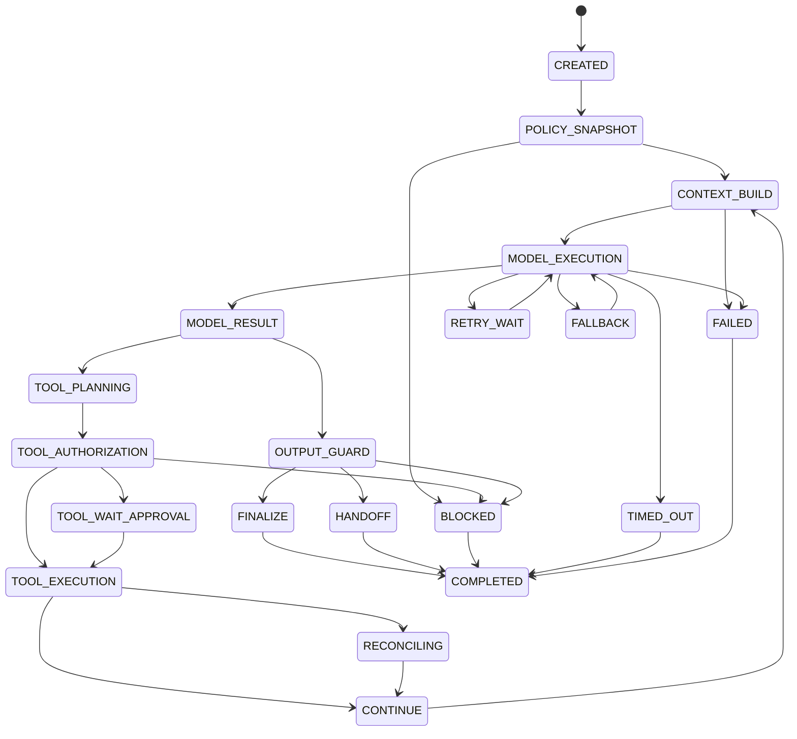
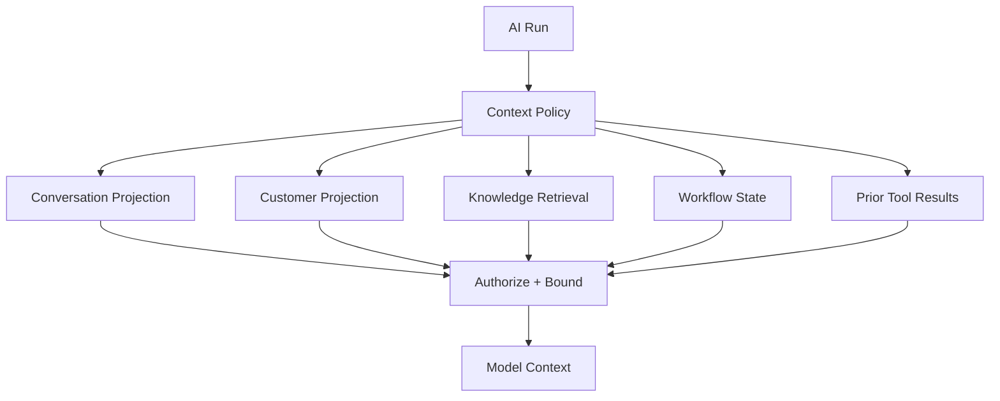

# AI Agent Runtime — Implementation Specification

> Status: **Target implementation blueprint**

The Agent Runtime is the durable execution engine for autonomous and semi-autonomous operations. It is deliberately separated from customer data ownership, billing, membership and authorization.

## 1. Runtime Boundary

```text
Conversation / Workflow
  -> StartAIRun
    -> snapshot policy
      -> build context
        -> route model
          -> execute model
            -> guardrail
              -> authorize tool
                -> execute tool
                  -> continue or finalize
```

The model proposes outputs and actions. The runtime and domain services decide whether anything can actually happen.

## 2. Required Run Context

```json
{
  "runId": "uuid",
  "organizationId": "uuid",
  "conversationId": "uuid",
  "agentId": "uuid",
  "agentPolicyVersion": 12,
  "controlVersion": 41,
  "trigger": "conversation.message.received",
  "deadlineAt": "2026-09-28T21:00:00Z",
  "correlationId": "req_123"
}
```

A run is invalid if organization, policy version, conversation control version, or correlation context is missing.

## 3. Runtime State Machine



All state transitions are persisted. In-memory state is an optimization, not the source of truth.

## 4. Transition Preconditions

| Transition | Preconditions |
|---|---|
| CREATED -> POLICY_SNAPSHOT | run exists, organization active |
| POLICY_SNAPSHOT -> CONTEXT_BUILD | policy dependency graph resolves |
| CONTEXT_BUILD -> MODEL_EXECUTION | context is authorized and bounded |
| MODEL_RESULT -> TOOL_PLANNING | tool intent matches declared schema |
| TOOL_AUTHORIZATION -> TOOL_EXECUTION | auth + entitlement + risk checks pass |
| TOOL_WAIT_APPROVAL -> TOOL_EXECUTION | approval matches exact action/version |
| CONTINUE -> CONTEXT_BUILD | budget, deadline and control version valid |
| FINALIZE -> COMPLETED | output validated and canonical message persisted |

## 5. Durable Persistence Model

| Record | Responsibility |
|---|---|
| ai_run | lifecycle, owner, policy snapshots, terminal outcome |
| ai_run_step | model/tool/guardrail step state |
| ai_handoff | human control transfer |
| guardrail_decision | policy decision/evidence |
| ai_budget_reservation | reserved hard budget where required |
| ai_run_event | append-only execution facts where required |

Every record is organization-scoped.

## 6. Step Record

```json
{
  "stepId": "uuid",
  "runId": "uuid",
  "sequence": 7,
  "type": "model|tool|guardrail|handoff|finalize",
  "status": "started|succeeded|failed|unknown",
  "startedAt": "...",
  "completedAt": "...",
  "provider": "...",
  "model": "...",
  "inputTokens": 1200,
  "outputTokens": 350,
  "latencyMs": 1840,
  "errorClass": null
}
```

Sequence numbers are monotonic inside a run.

## 7. Transaction Boundaries

Never hold a database transaction open across an LLM or external provider call.

Preferred execution:

```text
TX-1: create AI run + initial step + start command
COMMIT
worker invokes provider
TX-2: persist provider result + next state
COMMIT
```

External calls have their own invocation identity so a DB retry cannot automatically repeat a provider side effect.

## 8. Context Assembly



Never serialize arbitrary database entities directly into prompts.

## 9. Prompt Layering

```text
platform policy
 -> tenant policy
 -> agent policy
 -> task instructions
 -> authorized context
 -> untrusted customer/document content
```

Customer messages, retrieved documents and tool outputs remain untrusted data even when presented inside the prompt.

## 10. Control-Version Race

The conversation contains a monotonic `controlVersion`.

Example:

```text
AI started with controlVersion = 41
human takeover changes controlVersion = 42
AI later attempts send with version 41
runtime rejects as stale
```

The check is repeated immediately before every customer-visible side effect.

Cancellation alone is not sufficient because cancellation and external completion can race.

## 11. Runtime Budgets

Every run can have hard limits:

- maximum steps;
- maximum model calls;
- maximum tool calls;
- maximum duration;
- maximum estimated cost;
- maximum input/context tokens;
- maximum repeated failure count.

Budget state is updated after every completed step.

## 12. Retry Matrix

| Operation | Retry policy |
|---|---|
| model timeout | bounded retry |
| model 429 | provider-aware retry |
| model 5xx | bounded retry |
| tool read timeout | retry if safe |
| tool write timeout | reconcile first |
| authorization denial | no retry |
| validation error | no retry |
| stale control version | stale/cancel |

## 13. Cancellation Sources

- human takeover;
- conversation closure;
- run deadline;
- tenant automation disabled;
- entitlement suspension;
- security incident;
- operator cancellation.

Cancellation is persisted and checked before continuation and before side effects.

## 14. Worker Leases

To prevent two workers executing one run concurrently, use a short lease:

```text
run_id
worker_id
lease_until
heartbeat_at
```

Lease loss prevents the worker from starting new side effects.

## 15. Recovery Algorithm

After a worker crash:

1. acquire the run lease;
2. load the latest persisted state;
3. verify deadline, budget and control version;
4. inspect the last step status;
5. reconcile any unknown external side effect;
6. continue only from a safe state;
7. emit recovery telemetry.

Never blindly replay an unknown payment/message/write operation.

## 16. Tool Continuation

A tool result is returned to the model only after:

```text
authorization
 -> entitlement
 -> execution
 -> output sanitization
 -> audit
```

Tool output is untrusted input for the next reasoning step.

## 17. Finalization

Before customer-visible finalization:

1. verify run is still active;
2. verify conversation control version;
3. validate response contract;
4. apply output guardrails;
5. persist canonical outbound message;
6. enqueue provider delivery;
7. mark run terminal.

This deliberately separates canonical message creation from external delivery.

## 18. Observability Contract

Every run must expose enough telemetry for:

- queue wait;
- model latency;
- first-token latency;
- tool latency;
- guardrail latency;
- retry/fallback counts;
- token usage;
- estimated/actual cost;
- handoff/block rate;
- terminal outcome.

Trace identity should include run ID, conversation ID, organization ID, agent policy version, model route and correlation ID.

## 19. Security Invariants

- model output never grants authorization;
- every tool call is independently authorized;
- tenant scope is explicit on repository access;
- provider credentials never enter model context;
- stale control versions cannot send;
- high-risk actions can fail closed.

## 20. Test Vectors

- normal single-response run;
- multi-tool run;
- duplicate worker delivery;
- model timeout;
- model 429;
- provider timeout after external write;
- human takeover during generation;
- conversation closure during tool execution;
- budget exhaustion;
- prompt injection;
- unauthorized resource identifier supplied by model;
- worker crash after side effect but before result persistence.

## 21. Definition of Done

An execution path is complete only when it has:

`precondition -> transaction -> side effect -> durable outcome -> telemetry -> recovery behavior`.