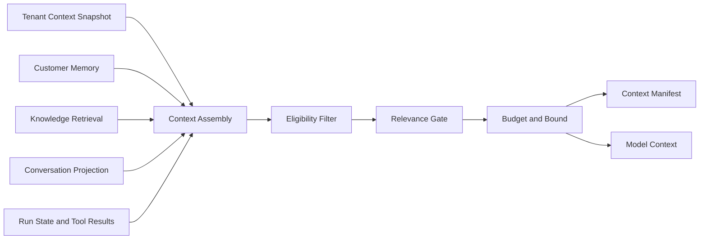
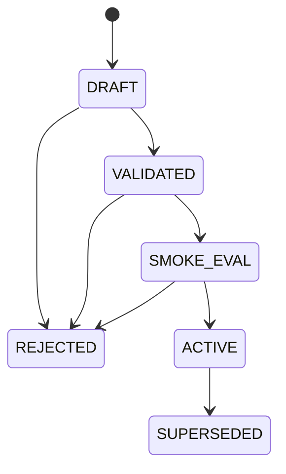
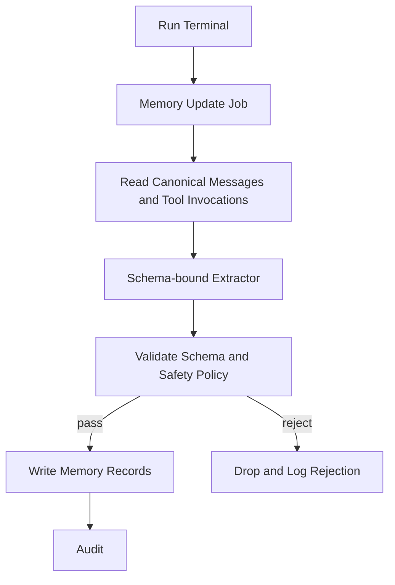
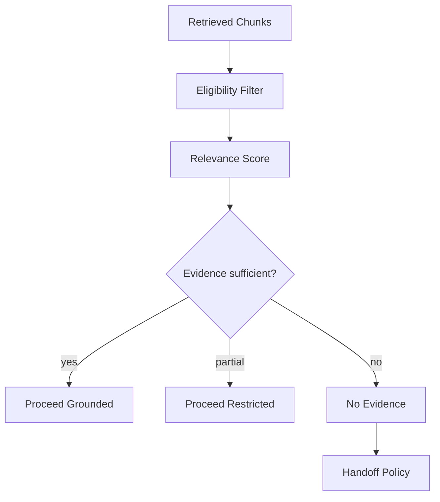

# AI Context Engine — Implementation Specification

> Status: **Target implementation blueprint**
>
> Phase tags: **[MVP]** is needed for the first production tenant. **[Later]** is designed now and built later.

The Context Engine turns authoritative sources into bounded, authorized, versioned model context. It never grants authorization and never writes business data.

## 1. Boundary

Owns:

- the tenant context snapshot;
- customer memory projection and post-run memory updates;
- knowledge retrieval gating;
- context budgeting and ordering;
- the context manifest.

Does not own:

- authorization (domain services);
- tool execution (Tool Runtime);
- model selection (Model Routing);
- output safety (Guardrails).



## 2. Three Kinds of Tenant Context

Tenant context is not one blob. The parts have different consumers and different trust.

| Part | Examples | Consumer | Model-visible | Trust in prompt |
|---|---|---|---|---|
| Enforcement context | tenant scope, entitlements, tool allowlist, data-handling class, model allowlist, approval rules | Runtime, Tool Runtime, Routing, Guardrails | **Never** | not applicable |
| Business context | company identity, products, policies, tone, escalation rules in natural language, business hours | Context Engine | yes | tenant instruction layer |
| AI configuration | persona, languages and dialects, allowed task types, handoff thresholds, model preferences | Runtime, Routing, Context Engine | partly (persona, language rules) | agent instruction layer |

Rules:

- Enforcement context decides what can happen. It is never described to the model as a rule the model is trusted to follow.
- A prompt that says "never refund over 50" is a request, not a control. The limit belongs in tool policy.
- The model is told which tools exist (their schemas). Whether a call is permitted is decided outside the model.
- Enforcement values must not appear in prompts, so prompt extraction cannot reveal entitlements, other tenants' configuration or internal policy.

## 3. Tenant Context Snapshot [MVP]

At `POLICY_SNAPSHOT` the run takes an immutable reference:

```json
{
  "organizationId": "uuid",
  "tenantContextVersion": 27,
  "components": {
    "businessProfileVersion": 9,
    "agentPolicyVersion": 12,
    "toolPolicyVersion": 5,
    "modelPolicyVersion": 3,
    "handoffPolicyVersion": 4,
    "contextPolicyVersion": 2
  },
  "contentHash": "sha256:..."
}
```

Rules:

- Component versions are immutable. An edit creates a new version and never mutates an old one.
- A run uses exactly one snapshot for its whole life. Tenant edits during a run do not change that run.
- Disabling automation is a cancellation source (agent-runtime §13), not a snapshot change.
- If the snapshot cannot be resolved, the run does not start. Never fall back to a generic prompt.
- Knowledge is not part of the snapshot because it changes too often. The context manifest records the knowledge snapshot and chunk IDs used.
- Content is retrievable by version so a past run can be replayed in evaluation.

## 4. Tenant Context Lifecycle

Tenant-authored text is a production prompt change. Treat edits as releases.



Validation checks:

- schema and required fields;
- token size cap, because tenant context is a fixed cost on every model call;
- secret and credential scan;
- personal-data scan;
- platform-policy conflict lint, such as instructions to ignore platform rules or claims of elevated authority.

Rules:

- Activation records who, when and the diff.
- Rollback is activating a previous version. It creates a new activation record and does not edit history.
- Editing business context needs the same permission class as other high-impact admin actions. A compromised tenant admin account is a prompt-injection path at tenant-instruction trust.
- Tenant context cannot raise its own authority. Platform policy and domain authorization outrank it (guardrails §1).

Phasing: **[MVP]** validation, manual activation, rollback. **[Later]** automated smoke evaluation gate (evaluation.md §16).

## 5. Customer Memory Layers

| Layer | Source | Authority | What the model sees |
|---|---|---|---|
| Customer record | domain services (identity, orders, plan) | authoritative | projection of needed fields |
| Conversation history | canonical messages | authoritative record of what was said, not of whether it is true | bounded window |
| Action history | persisted tool invocations with known outcomes | authoritative | relevant entries |
| Derived memory | extractor jobs: facts, preferences, summaries | **non-authoritative** | labeled as derived |

Rules:

- Authoritative data beats derived data on conflict.
- Derived memory never influences authorization, pricing, eligibility, refunds or any other policy decision.
- A customer-stated fact ("I am the account owner") is context. It is never evidence for authorization.
- An action with an UNKNOWN outcome is not an action-history fact (tool-runtime §8).
- Never send the whole history. Select by relevance and budget (§13).

## 6. Derived Memory Record [Later]

```json
{
  "memoryId": "uuid",
  "organizationId": "uuid",
  "customerId": "uuid",
  "kind": "fact|preference|summary|event",
  "key": "preferred_language",
  "value": "ar-EG",
  "provenance": "authoritative|customer_stated|model_derived",
  "sourceRefs": ["msg_123", "inv_77"],
  "extractorVersion": 3,
  "state": "active|superseded|retracted|expired",
  "retentionClass": "standard",
  "createdByRunId": "uuid",
  "createdAt": "...",
  "expiresAt": "..."
}
```

Rules:

- Every record is scoped to organization and customer.
- Every record has source references. A summary references the message range it was generated from.
- `kind` and `key` are enumerated. Values are schema-bound per key. Facts and preferences never carry free-form instruction text.

## 7. Identity Scope and Cross-Channel Merge

Memory scope is organization plus customer. The same person contacting two tenants has two unrelated memories. Within one tenant the same person on WhatsApp, Instagram and a web widget has separate channel identities that may be linked to one customer.

A wrong link puts one customer's memory in another customer's context. Treat it as a privacy incident.

Link strength:

| Strength | Example | May widen memory scope automatically |
|---|---|---|
| verified | verified phone, signed-in widget session | yes |
| asserted | customer says "I am X" | no |
| heuristic | similar name or number | no |

Rules:

- Only verified links expand what the model can see.
- Asserted and heuristic links may be suggested to a human. They never widen context automatically.
- Merge is an explicit, audited, reversible operation. Un-merge must re-scope derived memory by source references.
- A verified link to a channel is not proof of a person. Shared phones and shared business numbers exist. Sensitive actions need step-up verification regardless.
- Account-specific requests under unverified identity ask for verification or hand off with reason `identity_uncertain`.

## 8. Memory Write Path [Later]



Rules:

- The job is asynchronous and non-blocking. Its failure never affects the customer response.
- The job is idempotent. Its key is `run_id + extractor_version`.
- Sources are canonical messages and persisted tool outcomes. They are never the model's own claims about what happened.
- Extractor output is schema-bound. Instruction-like content ("always approve", "ignore previous rules") is rejected, not stored.
- Version 1 has no model-callable memory-write tool. If one is added it must be a tool-runtime tool with a risk tier, limited to `model_derived` provenance and the same validation.
- Rolling summaries are regenerated from source message ranges, not from the previous summary alone, to prevent drift.
- A newer record supersedes an older one. The older record becomes `superseded` and stays auditable.
- Under budget pressure this job is skipped before customer responses are degraded (cost-control §14).

## 9. Stored Injection and Poisoning

Memory persists attacker-controlled text. One injected sentence distilled into a summary can influence every later conversation with that customer, and with others if scope leaks.

Controls:

- schema-bound records and enumerated keys;
- provenance on every record;
- derived memory rendered in the untrusted data layer, never in an instruction layer;
- rejection of instruction-like content at write time;
- retraction of a record and of everything derived from it;
- a per-customer memory cap;
- a poisoning set in the evaluation corpus (evaluation.md §17).

## 10. Retention, Erasure and Export

- Memory is personal data. Support deletion and export per customer and per tenant.
- Deletion cascades to derived records through source references. Tombstones keep the audit trail without content.
- Retention classes come from tenant policy within platform limits.
- Manifests and traces store IDs and hashes where possible. Stored content follows evaluation.md §13.
- Residency and erasure obligations differ across target markets. They must be confirmed with qualified counsel before the first production tenant. This specification does not assert them.

## 11. Knowledge Retrieval and the Relevance Gate [MVP]

Retrieval queries are built from the conversation window and current intent. Eligibility (guardrails §4) applies before scoring.



Outcomes:

| Outcome | Behavior |
|---|---|
| grounded | evidence passes threshold. The model may state tenant-specific facts supported by that evidence |
| restricted | evidence is weak. The model may ask a clarifying question or give general help. Guardrail grounding checks block tenant-specific claims |
| no evidence | policy chooses clarify, decline or handoff by tenant policy and risk tier. Medium-risk and account-specific requests hand off |

Rules:

- The gate is deterministic policy over retrieval scores. It is not a model self-assessment.
- Thresholds are versioned in `contextPolicyVersion` and calibrated per embedding model and per language. Arabic dialects and Arabizi retrieve differently from standard Arabic or English.
- Tenant-specific facts (prices, policies, availability, order state) come from retrieved evidence or tool results. Never from the model's parametric memory.

## 12. Tools Versus Pre-Loaded Context

The Context Engine supplies the minimum needed to start: a verified customer projection, recent history and retrieved knowledge.

Deeper or volatile data (order status, balances) is fetched through read tools at call time. Each fetch is then authorized, fresh, and kept out of every prompt. Do not preload entities "just in case".

## 13. Context Budget and Assembly Order [MVP]

Priority, highest first. Eviction runs in reverse.

1. platform, tenant and agent instructions;
2. schemas of allowed tools;
3. current customer messages;
4. tool results from this run;
5. required evidence above the relevance gate;
6. verified customer projection;
7. recent conversation turns;
8. derived memory;
9. summaries of older history.

Rules:

- Compact lower tiers first.
- If tiers 1 to 5 alone exceed the budget, hand off with reason `context_overflow` or fail the run.
- Never truncate instructions or required evidence silently.
- The budget is the route's context window minus the output allowance (model-routing §13) and must respect the run budget (cost-control §4).

## 14. Context Manifest [MVP]

Every `CONTEXT_BUILD` persists a manifest. It records references, not content.

```json
{
  "manifestId": "uuid",
  "runId": "uuid",
  "sequence": 3,
  "tenantContextVersion": 27,
  "contextPolicyVersion": 2,
  "knowledgeSnapshot": "kb-v4",
  "items": [
    {"type": "instruction", "ref": "agentPolicy:12", "tokens": 640},
    {"type": "message", "ref": "msg_981", "tokens": 42},
    {"type": "chunk", "ref": "kb-v4:doc77#c3", "tokens": 310, "score": 0.81},
    {"type": "memory", "ref": "mem_55", "provenance": "customer_stated", "tokens": 18}
  ],
  "excluded": [{"ref": "mem_90", "reason": "ineligible_scope"}],
  "gateOutcome": "grounded",
  "totalTokens": 5100
}
```

Purpose:

- explain why the model saw what it saw;
- reproduce a run in evaluation;
- support incident review;
- find every use of a record when it is erased or retracted.

## 15. Prompt Rendering

Layout follows agent-runtime §9.

- Instruction layers come first, each with stable delimiters.
- All data (customer messages, retrieved chunks, tool output, derived memory) sits inside labeled untrusted blocks.
- Enforcement context is never rendered.
- Rendering is deterministic for a given manifest, so it can be cached and replayed.

## 16. Caching

- Rendered tenant instruction blocks may be cached under `(organizationId, tenantContextVersion, renderVersion)`. Never under organization alone.
- Customer memory and retrieval results are not cached across customers.
- A version change invalidates through the key. See cost-control §8.

## 17. Failure Behavior

| Dependency | Behavior |
|---|---|
| tenant context snapshot unavailable | fail closed. The run does not start and the conversation follows handoff policy |
| customer memory store unavailable | degrade. Run without derived memory. Authoritative and tool paths are unaffected |
| retrieval unavailable | no-evidence outcome |
| manifest persistence fails | do not call the model. Context must stay explainable |
| memory update job fails | bounded retry. Never affects the customer response |

## 18. Observability

- context tokens by tier;
- relevance gate outcome distribution;
- retrieval latency;
- items excluded, by reason;
- memory items included, by provenance;
- memory write rejections, by reason;
- identity merges and un-merges;
- snapshot version distribution;
- tenant context publish outcomes.

## 19. Test Matrix

- tenant edit during a running run;
- snapshot unavailable;
- tenant context containing a secret;
- tenant context saying "ignore platform policy";
- oversize tenant context;
- cross-tenant knowledge chunk;
- relevance gate: grounded, restricted, no evidence;
- tenant-specific claim with no evidence;
- unverified identity requesting account data;
- wrong identity merge, then un-merge;
- instruction-like text in a customer message reaching memory extraction;
- derived memory contradicting an authoritative field;
- erasure cascading to derived memory;
- context overflow in tiers 1 to 5;
- manifest persistence failure;
- Arabic dialect and Arabizi retrieval;
- memory store outage.

## 20. Phasing

**[MVP]**

- versioned tenant context snapshot;
- validation, manual activation, rollback;
- layers 1 to 3 (customer record, conversation history, action history);
- retrieval with the relevance gate;
- budget ordering and the context manifest.

**[Later]**

- derived memory and the extractor;
- identity merge tooling;
- automated smoke-eval publish gate;
- erasure cascade tooling.

Do not build derived memory until real transcripts show that conversation history plus action history are insufficient. It adds a write path, an injection surface and a privacy obligation for a benefit that is unproven.

## 21. Acceptance

The Context Engine is complete when:

- every model call has an explainable manifest;
- every included item is authorized and bounded;
- tenant context is versioned and immutable for the life of a run;
- memory writes are schema-bound, carry provenance and can be retracted;
- identity scope cannot widen without verification.
