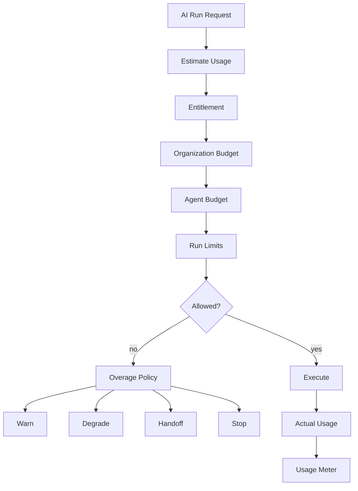

# AI Cost Control — Implementation Specification

> Status: **Target production economics blueprint**

Cost control optimizes total business cost under correctness, safety, latency and outcome constraints.

## 1. Cost Components

```text
model inference
+ embedding
+ media processing
+ tool/provider usage
+ workflow execution
```

Measured values and estimates must remain separate.

## 2. Budget Hierarchy

Budgets may apply at:

- platform;
- organization;
- client/program;
- agent;
- conversation;
- run;
- tool/action class.

The most restrictive applicable policy wins.

## 3. Preflight Admission



## 4. Run Budget Contract

```json
{
  "maxSteps": 12,
  "maxToolCalls": 5,
  "maxDurationMs": 30000,
  "maxEstimatedCostUsd": 0.20
}
```

These are architectural examples, not final commercial defaults.

## 5. Estimate vs Actual

Preflight produces an estimate.

Provider/runtime metadata produces measured usage where available.

```text
estimated_cost != actual_cost
```

Where actual provider billing is unavailable, store actual cost as unknown and preserve the estimate separately.

## 6. Model Tiering

| Tier | Typical use |
|---|---|
| economy | repetitive low-risk tasks |
| standard | normal operations |
| premium | complex reasoning |
| specialized | modality/domain requirements |

Tier selection remains subject to capability, risk and tenant policy.

## 7. Context Cost Engineering

Controls:

- bounded history;
- compact summaries;
- deduplicated context;
- selective retrieval;
- compact tool schemas;
- reusable static instructions where safe.

Do not reduce token count by removing evidence required for correctness.

## 8. Cache Safety

Potentially cache:

- model profiles;
- immutable prompt fragments;
- tool schemas;
- tenant-safe retrieval artifacts.

Tenant-sensitive data requires tenant-aware keys and invalidation.

## 9. Concurrency Control

Bound:

- concurrent runs per organization;
- concurrent model calls;
- provider concurrency;
- workflow fan-out;
- expensive tool calls.

Concurrency spikes are simultaneously cost and reliability incidents.

## 10. Cost Attribution

Every usage record should identify:

- organization;
- client/program where applicable;
- agent;
- conversation;
- run;
- provider;
- model;
- operation;
- quantity;
- price version;
- timestamp.

## 11. Pricing Versioning

Provider pricing is versioned data.

Historical usage retains the pricing context used to calculate its cost.

Do not recompute old financial records from today's model price.

## 12. Unit Economics

Track:

- cost per conversation;
- cost per resolved conversation;
- cost per tool action;
- cost per handoff;
- cost per workflow outcome.

Token efficiency alone is not business efficiency.

## 13. Runaway Protection

Protect against:

- infinite tool loops;
- recursive workflows;
- context explosion;
- repeated provider failures;
- malicious expensive prompts;
- batch fan-out explosions.

## 14. Overage Policy

Tenant policy may choose:

- warn;
- degrade;
- queue;
- handoff;
- hard stop.

Platform safety/capacity limits may force hard stop.

## 15. Observability

Track:

- spend by tenant/day;
- cost per run;
- tokens per run;
- model distribution;
- fallback rate;
- budget denials;
- concurrency saturation;
- cost per resolution;
- estimate-to-actual divergence.

## 16. Test Matrix

- budget exactly at limit;
- budget just below limit;
- concurrent budget consumption;
- duplicate usage record;
- expensive fallback;
- cross-tenant cache attempt;
- runaway loop;
- pricing-version change.

## 17. Acceptance

Cost control is complete when every expensive path has admission control, attribution, bounded execution and an explicit outcome when budget is exhausted.