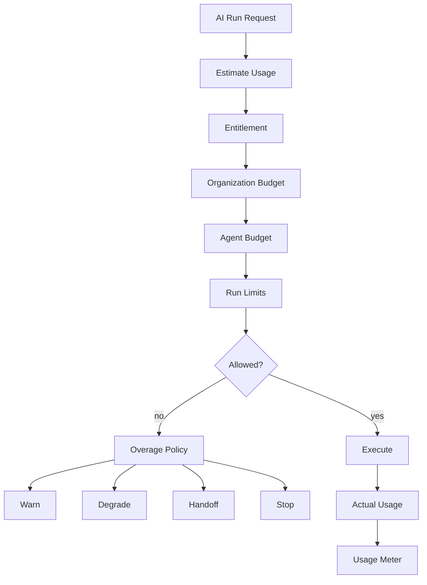

# AI Cost Control — Implementation Specification

> Status: **Target production economics blueprint**
>
> Related: model-routing.md, agent-runtime.md, context-engine.md, human-handoff.md, evaluation.md.
>
> Phase tags: **[MVP]** is needed for the first production tenant. **[Later]** and **[Deferred]** are designed now and built later.

Cost control optimizes total business cost under correctness, safety, latency and outcome constraints.

## 1. Cost Components

```text
model inference (per token)
+ self-hosted inference (capacity)
+ embedding
+ media processing
+ background jobs (memory extraction, summarization)
+ shadow and evaluation traffic
+ tool/provider usage
+ workflow execution
```

Measured values and estimates must remain separate.

## 2. Budget Hierarchy

Budgets may apply at:

- platform;
- organization;
- client/program;
- agent;
- conversation;
- run;
- tool/action class.

The most restrictive applicable policy wins.

## 3. Preflight Admission



## 4. Run Budget Contract

```json
{
  "maxSteps": 12,
  "maxToolCalls": 5,
  "maxDurationMs": 30000,
  "maxEstimatedCostUsd": 0.20
}
```

These are architectural examples, not final commercial defaults.

## 5. Estimate vs Actual

Preflight produces an estimate.

Provider/runtime metadata produces measured usage where available.

```text
estimated_cost != actual_cost
```

Where actual provider billing is unavailable, store actual cost as unknown and preserve the estimate separately.

## 6. Model Tiering

| Tier | Typical use |
|---|---|
| economy | repetitive low-risk tasks |
| standard | normal operations |
| premium | complex reasoning |
| specialized | modality/domain requirements |
| self-hosted | capacity-priced models. Cost model in §17 |

Tier selection remains subject to capability, risk and tenant policy.

## 7. Context Cost Engineering

Controls:

- bounded history;
- compact summaries;
- deduplicated context;
- selective retrieval;
- compact tool schemas;
- reusable static instructions where safe;
- a size cap on tenant business context, which is a fixed cost on every model call;
- the relevance gate, which can skip the model call when evidence is absent and policy says hand off.

Do not reduce token count by removing evidence required for correctness.

## 8. Cache Safety

Potentially cache:

- model profiles;
- immutable prompt fragments;
- tool schemas;
- tenant-safe retrieval artifacts;
- rendered tenant instruction blocks, keyed by organization and tenant context version (context-engine.md §16).

Tenant-sensitive data requires tenant-aware keys and invalidation.

Customer memory and retrieval results are never cached across customers.

## 9. Concurrency Control

Bound:

- concurrent runs per organization;
- concurrent model calls;
- provider concurrency;
- workflow fan-out;
- expensive tool calls.

Concurrency spikes are simultaneously cost and reliability incidents.

## 10. Cost Attribution

Every usage record should identify:

- organization;
- client/program where applicable;
- agent;
- conversation;
- run;
- provider;
- model;
- operation (response, memory_extract, summarize, shadow, eval);
- hosting (self_hosted or third_party);
- quantity;
- price version;
- timestamp.

## 11. Pricing Versioning

Provider pricing is versioned data.

Historical usage retains the pricing context used to calculate its cost.

Do not recompute old financial records from today's model price.

Self-hosted capacity price records are versioned the same way, together with their assumed utilization (§17).

## 12. Unit Economics

Track:

- cost per conversation;
- cost per resolved conversation;
- cost per tool action;
- cost per handoff, including human handling time where the tenant supplies a rate;
- cost per workflow outcome;
- background cost per conversation (memory extraction, summarization).

A conversation the AI closes and the customer re-contacts within the tenant's window is not a resolution. Count it as a deflection failure.

Token efficiency alone is not business efficiency.

## 13. Runaway Protection

Protect against:

- infinite tool loops;
- recursive workflows;
- context explosion;
- repeated provider failures;
- malicious expensive prompts;
- batch fan-out explosions;
- handoff and return-to-AI loops;
- background job retry storms.

## 14. Overage Policy

Tenant policy may choose:

- warn;
- degrade;
- queue;
- handoff;
- hard stop.

Platform safety/capacity limits may force hard stop.

Under budget pressure, shed work in this order:

1. shadow and evaluation traffic;
2. memory extraction and summarization;
3. optional enrichment;
4. degrade the response path.

Cost pressure may trigger a handoff. It may never suppress a required one. Budget exhaustion is itself a handoff reason (`budget_exhausted`).

## 15. Observability

Track:

- spend by tenant/day;
- cost per run;
- tokens per run;
- model distribution;
- fallback rate;
- budget denials;
- concurrency saturation;
- cost per resolution;
- estimate-to-actual divergence;
- background and shadow cost by operation;
- self-hosted utilization and effective unit cost.

## 16. Test Matrix

- budget exactly at limit;
- budget just below limit;
- concurrent budget consumption;
- duplicate usage record;
- expensive fallback;
- cross-tenant cache attempt;
- runaway loop;
- pricing-version change;
- self-hosted utilization drop changing effective cost;
- shadow traffic cap reached;
- background job retry storm;
- budget exhaustion with a required handoff;
- memory extraction skipped under budget pressure.

## 17. Self-Hosted Inference Economics

A self-hosted model has no per-token vendor price, but it is not free. Its cost is capacity: accelerator hours, storage, operations and idle time.

Rules:

- Model it as a versioned price record: unit (for example accelerator-hour), assumed utilization and throughput profile. Derive an amortized per-token estimate from it. Keep estimate and actual separate (§5).
- Low utilization raises effective unit cost. Report utilization next to cost.
- Admission control for self-hosted models is capacity-based (concurrency, queue depth) as well as dollar-based (§9).
- Compare against third-party models at effective cost under realistic utilization, not peak-throughput cost.
- At low volume an always-on instance can cost more than the third-party tokens it replaces. Check this with real numbers before making a self-hosted model the default for cost reasons. Data control or language quality may justify it instead. Say which.
- A fallback to a third-party provider is costed at that provider's prices and is subject to the egress rule (model-routing §10).
- Usage records for self-hosted inference carry the price record version and a utilization snapshot (§10, §11).

## 18. Background and Shadow Work

- Memory extraction, summarization, evaluation and shadow traffic are attributed by operation to the organization they serve, or to the platform for platform-owned evaluation.
- They have budgets separate from the customer response path, so they cannot starve it. They are shed first under pressure (§14).
- Shadow traffic has its own cap, as a share of live traffic and in dollars.
- Memory extraction cost is part of cost per conversation (§12). Leaving it out understates unit economics.

## 19. Realtime Sessions [Deferred]

- Voice cost is per minute and is not known until the call ends. It cannot be fully preflighted.
- Use a running meter with a hard cap that ends the session gracefully, for example with a handoff, instead of cutting the call.
- Speech recognition, synthesis and telephony are separate cost lines.
- See agent-runtime §23 and model-routing §18.

## 20. Acceptance

Cost control is complete when every expensive path has admission control, attribution, bounded execution and an explicit outcome when budget is exhausted.

This includes self-hosted capacity, background jobs and shadow traffic.