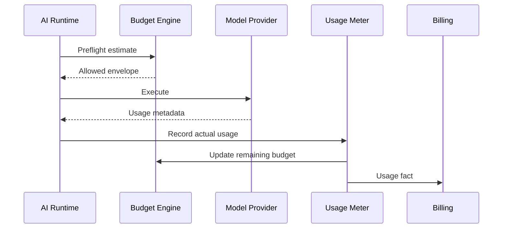
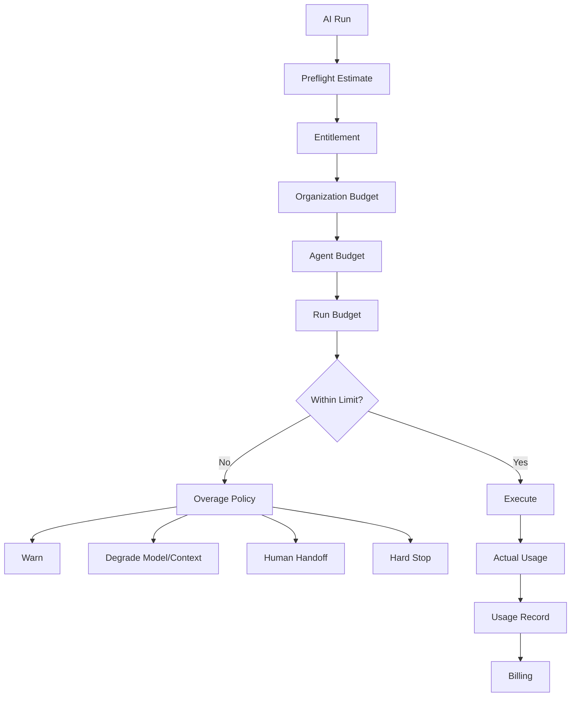

## AI Cost Control

> **Status:** Target production architecture

AI cost control protects both tenant budgets and OMILINKS unit economics. It must not reduce cost by silently degrading correctness or safety.

The objective is:

```text
minimize AI cost
subject to
quality + safety + latency + business-outcome constraints
```

## 1. Cost Dimensions

Track, where measurable:

| Dimension | Example |
|---|---|
| input tokens | prompt + context |
| output tokens | generated response |
| model calls | number of provider requests |
| embeddings | document/query embeddings |
| retrieval | billable retrieval/search operations |
| tool calls | external action executions |
| workflow executions | AI-triggered workflow work |
| media processing | audio/vision processing |
| provider-specific charges | provider extras |

Measured and estimated values must be distinguished.

## 2. Budget Hierarchy

Budgets can be applied at:

- platform;
- organization;
- client/program;
- AI agent;
- conversation;
- run;
- tool/action class.

The effective budget is the most restrictive applicable limit.

## 3. Preflight and Actual Usage



Preflight is predictive. Actual metering uses runtime/provider facts where available.

## 4. Run Budget

A run can have:

```json
{
  "maxSteps": 12,
  "maxToolCalls": 5,
  "maxDurationMs": 30000,
  "maxEstimatedCostUsd": 0.20
}
```

These are policy examples, not final commercial defaults.

## 5. Budget Decision



## 6. Overage Behavior

Possible tenant policies:

- warn;
- degrade;
- pause;
- handoff;
- hard stop.

The platform may force a hard stop for safety/platform-level limits.

## 7. Model Tiering

| Tier | Typical purpose |
|---|---|
| Economy | routine low-risk work |
| Standard | normal customer operations |
| Premium | complex reasoning |
| Specialized | vision/audio/structured domain tasks |

Routing decides tier based on task requirements, not UI preference alone.

## 8. Context Cost

Repeated context can dominate cost.

Controls:

- bounded conversation history;
- compact summaries;
- retrieval only when necessary;
- deduplicated context;
- reusable static instruction fragments;
- compact tool schemas;
- selective message inclusion.

Do not optimize tokens by deleting information required for correctness.

## 9. Caching

Safe candidates:

- embeddings;
- stable tool definitions;
- static policy fragments;
- short-lived retrieval artifacts where privacy permits.

Tenant-scoped data must use tenant-safe cache keys.

Never reuse a private customer result across organizations.

## 10. Concurrency

Cost spikes can come from parallel execution.

Limit:

- concurrent runs per tenant;
- concurrent model calls/provider;
- concurrent tool calls;
- workflow fan-out.

Use queues/semaphores rather than unbounded asynchronous fan-out.

## 11. Cost Attribution

Every usage record should identify:

- organization;
- client/program where applicable;
- agent;
- conversation;
- run;
- provider;
- model;
- task;
- usage amount;
- estimated cost;
- actual cost;
- pricing version;
- timestamp.

This creates the chain:

```text
tenant
 -> program/client
   -> agent
     -> conversation
       -> run
```

## 12. Pricing Versioning

Provider prices can change independently of application deployment.

Store:

```text
provider
model
effective_from
input_price
output_price
currency
pricing_version
```

Historical usage must retain its pricing version.

## 13. Unknown Cost

When a provider does not expose authoritative billing data:

```text
actual_cost = unknown
estimated_cost = measured estimate
```

Never silently convert estimates into billing facts.

## 14. Cost and Outcomes

Raw token efficiency is not enough.

Track:

- cost per resolved conversation;
- cost per successful tool action;
- cost per handoff;
- cost per qualified business outcome.

A cheaper model that doubles human workload may worsen real operating cost.

## 15. Abuse and Runaway Protection

Protect against:

- infinite model/tool loops;
- repeated failed tool calls;
- adversarial context expansion;
- workflow fan-out explosions;
- oversized document ingestion;
- API replay;
- customer-triggered expensive prompts.

These limits must exist before high-scale deployment.

## 16. Observability

Monitor:

- AI spend by tenant/day;
- tokens per run;
- cost per conversation;
- model distribution;
- fallback rate;
- budget denials;
- concurrency saturation;
- cost per resolution;
- estimated vs actual cost divergence.

Alert on abnormal rate-of-change as well as absolute spend.

## 17. Acceptance Criteria

- Every billable AI operation is attributable.
- Budget checks happen before expensive execution.
- Estimates are distinct from actual billing facts.
- Tenant isolation applies to cost records.
- Cache keys prevent cross-tenant reuse.
- AI and workflow execution are bounded.
- Overage behavior is deterministic.
- Operators can identify what agent/model/conversation created spend.
