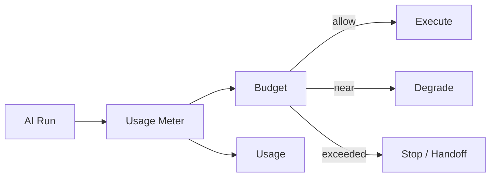

# AI Cost Control

> Status: **Target / normative engineering design**.

Control AI spend per run, tenant, task and provider without degrading business correctness silently.

## Contract

Meter tokens, calls, embeddings, retrieval and tools where measurable. Enforce per-run and tenant budgets, concurrency limits and model tiers. Overages follow explicit warn/degrade/pause/handoff policy.

## Mermaid Flow

## Engineering Rule

External inputs are untrusted, tenant scope is mandatory, and side effects require explicit authorization and idempotency where duplicate execution could matter.
