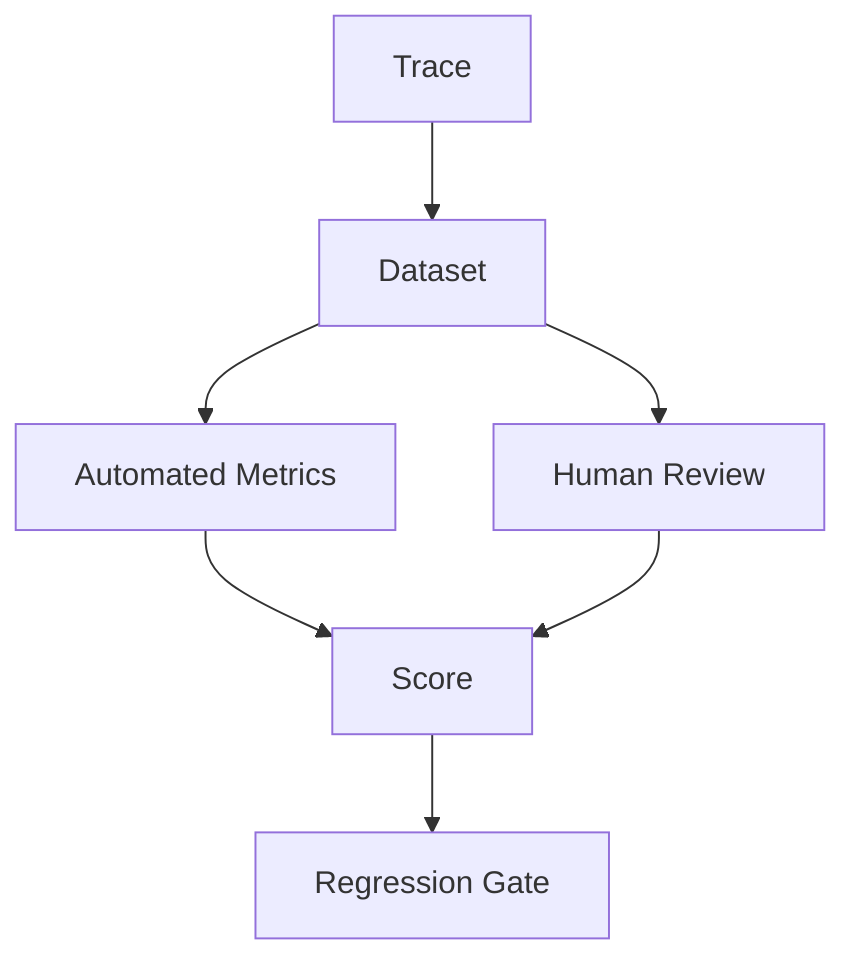

# AI Evaluation

> Status: **Target / normative engineering design**.

Evaluate AI on correctness, grounding, tool correctness, safety, conversation quality, and operational outcome.

## Contract

Use versioned datasets and traces. Combine automated scoring with human evaluation for high-impact dimensions. Production corrections can become evaluation examples only after classification; they are not automatically ground truth.

## Mermaid Flow

## Engineering Rule

External inputs are untrusted, tenant scope is mandatory, and side effects require explicit authorization and idempotency where duplicate execution could matter.
