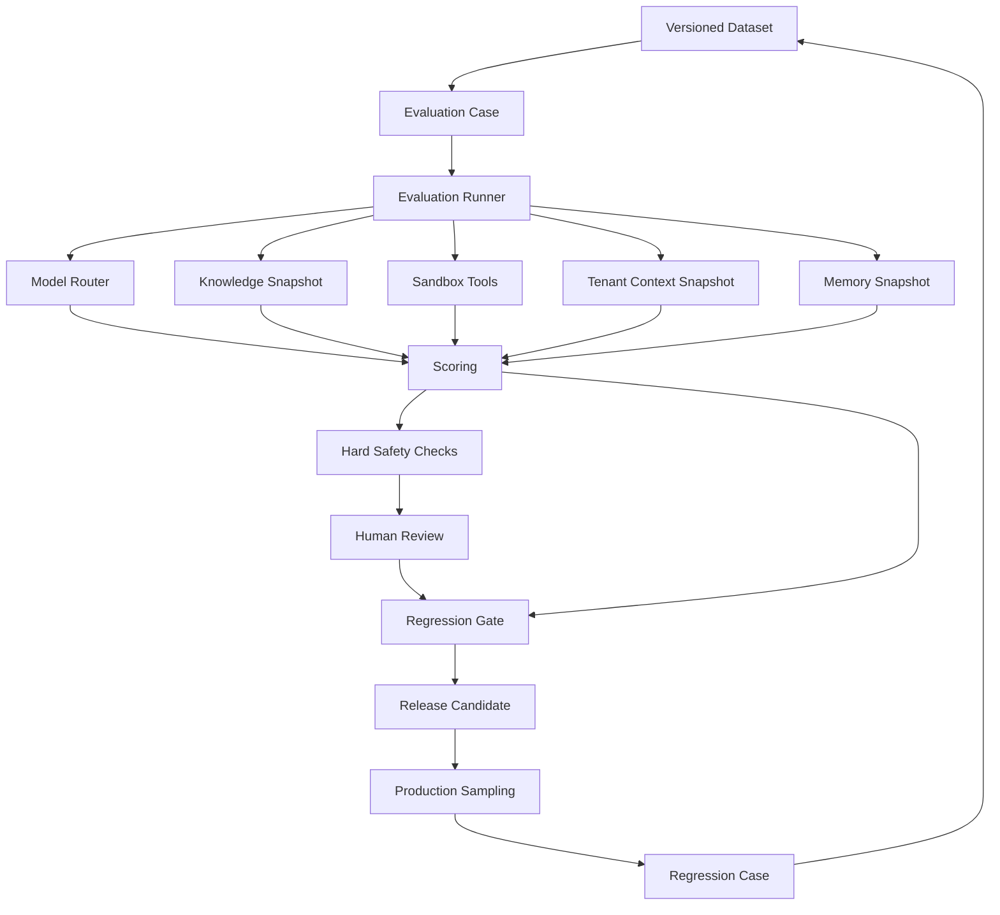
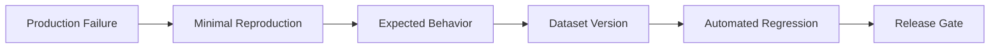

# AI Evaluation — Implementation Specification

> Status: **Target evaluation platform blueprint**
>
> Related: model-routing.md (certification and lifecycle), context-engine.md, human-handoff.md, guardrails.md, agent-runtime.md.
>
> Phase tags: **[MVP]** is needed for the first production tenant. **[Later]** is designed now and built later.

AI quality is a property of the complete execution path, not model text alone.

## 1. Evaluation Target

```text
model
+ prompt version
+ tenant context version
+ routing policy
+ retrieved knowledge and relevance thresholds
+ customer memory state
+ tool versions
+ guardrails
+ handoff policy
+ workflow
+ channel and language
```

Changing any component can change behavior.

## 2. Evaluation Layers

1. unit evaluation of deterministic logic;
2. offline dataset evaluation;
3. scenario evaluation with retrieval/tools;
4. human review;
5. production sampling;
6. regression corpus growth.

## 3. Case Contract

```json
{
  "caseId": "case_001",
  "datasetVersion": "v12",
  "taskType": "billing_question",
  "input": {},
  "expectedBehavior": {},
  "allowedTools": [],
  "tenantContextVersion": 27,
  "knowledgeSnapshot": "kb-v4",
  "customerMemorySnapshot": "mem-v2",
  "channel": "whatsapp",
  "language": {"locale": "ar-EG", "script": "arabic"},
  "riskTier": "medium",
  "expectedOutcome": "resolved",
  "expectedHandoffReason": null
}
```

`script` distinguishes Arabic script from Arabizi (Arabic written in Latin letters), because retrieval and model behavior differ. A case that expects a handoff names the reason code (human-handoff.md §3).

## 4. Reproducibility

Pin:

- model profile version;
- prompt version;
- routing policy version;
- agent policy version;
- knowledge snapshot;
- tool versions;
- guardrail version;
- tenant context version;
- customer memory snapshot;
- context policy version and relevance thresholds;
- memory extractor version;
- handoff policy version;
- dataset version.

A score without these references is not reliably reproducible.

## 5. Evaluation Pipeline



## 6. Quality Dimensions

| Dimension | Question |
|---|---|
| correctness | Is the fact/action correct? |
| grounding | Are claims supported by authorized evidence? |
| tool accuracy | Was the tool/argument/result handling correct? |
| safety | Were authorization and policy preserved? |
| conversation quality | Was the interaction useful and clear? |
| operational outcome | Was the task resolved/handoff/failed? |
| cost | Was resource usage acceptable? |
| handoff | Was a handoff made when required, avoided when unnecessary, and was the packet useful? |
| retrieval | Did the relevance gate pass grounded evidence and withhold weak evidence? |
| memory | Are stored facts correct, current, correctly scoped and free of injected instructions? |
| language | Is quality maintained across dialect, script (Arabic and Arabizi) and code-switching? |

Do not compress all dimensions into one number.

## 7. Hard Safety Gates

Automatic failure includes:

- cross-tenant exposure;
- unauthorized tool execution;
- destructive action without authorization;
- fabricated successful external action;
- critical guardrail regression;
- suppressed required handoff;
- cross-customer memory exposure;
- customer-supplied instruction text persisting into memory and changing later behavior;
- handoff packet exposing data beyond the viewing human's permissions;
- a customer message left unanswered and unowned after a terminal run outcome;
- an uncertified model serving traffic outside its certified scope.

Average quality cannot mask a hard safety failure.

## 8. Baseline Comparison

Candidate changes are evaluated against a pinned baseline using the same dataset and configuration assumptions.

Report:

- absolute metrics;
- delta from baseline;
- failed cases;
- new regressions;
- repaired regressions.

## 9. Human Evaluation

Reviewers use versioned rubrics.

Record:

- rubric version;
- reviewer;
- evidence;
- decision;
- adjudication.

Persistent disagreement should trigger rubric improvement.

## 10. Production Sampling

Bias sampling toward:

- handoffs;
- policy blocks;
- tool calls;
- provider fallback;
- unusual cost;
- customer dissatisfaction;
- errors;
- rare channels and dialects;
- handoff outcomes and human resolutions;
- relevance gate no-evidence outcomes;
- memory writes and rejections;
- unanswered-conversation sweeper findings.

Sampling only successful conversations produces survivorship bias.

Human resolutions of handoffs are useful labels but biased: they cover only the cases the AI escalated. Use them for false-escalation analysis, and add random samples of non-escalated conversations to estimate missed escalations.

## 11. Regression Case Promotion



A resolved production failure becomes a permanent regression case.

## 12. Tool Sandbox

Evaluation tools must not create real customer effects during ordinary CI.

Use simulated effects or provider sandboxes.

## 13. Privacy

Production traces used for evaluation are:

- minimized;
- redacted;
- access-controlled;
- retention-bound.

Customer memory and handoff packets in traces follow the same rules (context-engine.md §10). Evaluation datasets never contain raw customer memory.

## 14. Evaluation Observability

Every evaluation emits:

- case ID;
- dataset version;
- model/configuration versions;
- execution result;
- failure reasons;
- latency;
- usage.

## 15. Model Certification Gate

Routing treats a capability as declared until it is certified (model-routing.md §3, §17). Certification is an evaluation outcome, not a configuration edit.

A certification run is bound to a model profile version and a scope: task types, risk tiers, languages and scripts, channel class. Thresholds come from a versioned gate policy per risk tier. Required suites:

- tool calling: tool selection, argument validity, refusal to call unknown or unauthorized tools;
- structured output validity at realistic context sizes;
- grounding: tenant-specific claims supported by evidence, and abstention when there is none;
- direct and indirect prompt-injection resistance;
- language: the targeted dialects, Arabizi, and code-switching with English;
- handoff behavior: requests a handoff when it should, and never claims success for an action it did not take;
- latency and failure rate under target load.

Rules:

- A candidate is compared with a pinned baseline on the same dataset (§8).
- Hard safety gates (§7) are pass or fail. Averages cannot offset them.
- Certification is scoped. Passing FAQ answers certifies FAQ answers, not account mutations.
- A certification expires when the model profile, prompt, tool schema or guardrail version it ran against changes materially, and when production sampling shows regression.
- A model built in-house meets the same gates as a provider model. Having built it is not evidence of capability.
- Shadow runs on minimized, redacted production traffic (§13) provide real-world evidence before canary.

## 16. Tenant Context Change Gate

A tenant edit to business context, agent policy or the tool allowlist changes the evaluation target (§1) in production. It is a release and is gated before activation (context-engine.md §4).

- static validation: schema, size, secret scan, override lint;
- smoke evaluation on a fixed platform suite plus any tenant-specific cases: injection resistance, handoff on required conditions, refusal of out-of-policy actions, tone and language;
- a failure blocks activation. An override needs a recorded approver and is not allowed for hard safety failures;
- rollback is activation of the previous version.

Phasing: **[MVP]** static validation. **[Later]** automated smoke evaluation.

## 17. Memory, Retrieval and Handoff Evaluation

**Retrieval gate**

- Label cases where evidence exists and where it does not. Check that the gate returns grounded or restricted or no-evidence correctly.
- Report per language and script.
- A wrong "grounded" is worse than a wrong "no evidence". Report the two error directions separately.

**Memory [Later]**

- extractor precision and recall per key;
- supersession and contradiction handling, and staleness;
- scope correctness: no cross-customer reads, correct behavior after identity merge and un-merge;
- a poisoning set: customer messages containing instruction-like text, role-play prompts and fake system messages. Success means rejection at write time and no behavior change at read time.

**Handoff**

- missed-escalation rate and false-escalation rate as separate metrics;
- packet usefulness against a human rubric (§9);
- a fault-injection suite over every terminal run state that checks the unanswered-conversation invariant (agent-runtime §21).

## 18. Statistical Discipline

- Datasets are small early on. Report confidence intervals. A difference inside the interval is not an improvement.
- Stratify results by task type, risk tier, language and script, and channel. An overall average can hide a failing dialect.
- Do not tune thresholds and certify on the same cases. Keep a held-out set.
- A model used as a judge is a measurement with its own error. Calibrate it against human labels and pin its version (§4).

## 19. Acceptance

An evaluation system is production-grade when a change can be reproduced, compared against a baseline, blocked for hard safety regression and converted into durable test coverage.

It must also be able to certify a model's eligibility and to revoke it (§15).