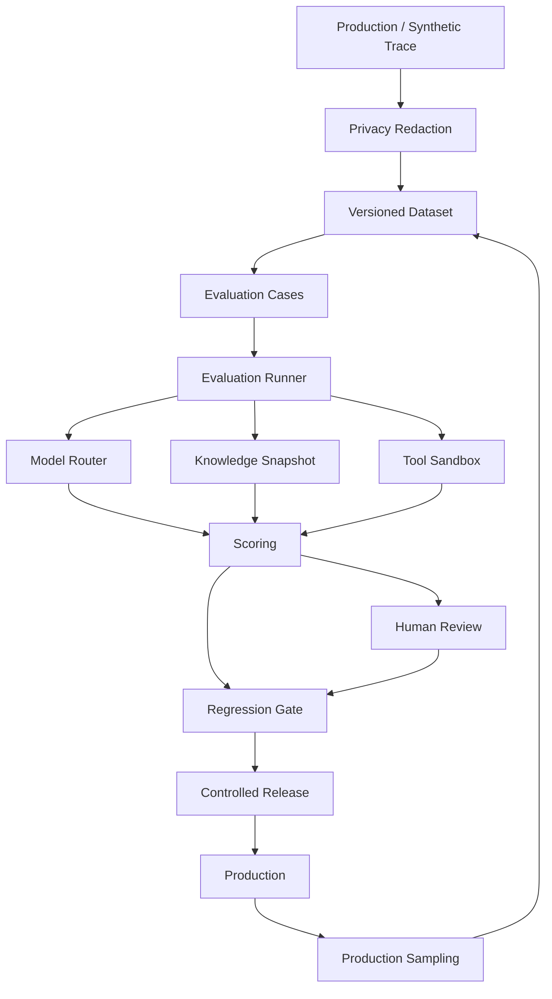
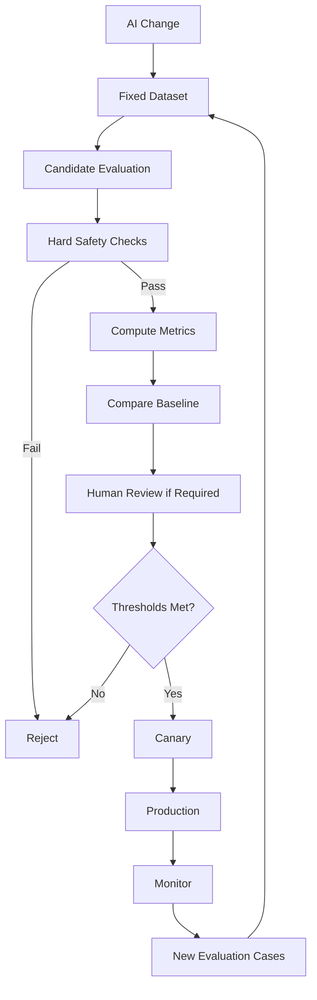

## AI Evaluation

> **Status:** Target production architecture

AI evaluation measures the complete operational system, not model text quality in isolation.

A useful evaluation target is:

```text
model
+ prompt
+ context
+ retrieval
+ tools
+ guardrails
+ routing
+ workflow
```

Changing any one of these can change customer outcome.

## 1. Evaluation Layers

1. **Unit tests** — parsers, routing rules, schemas, guardrails, state transitions.
2. **Offline task evaluation** — fixed representative cases.
3. **Scenario evaluation** — multi-step conversations with retrieval/tools/handoff.
4. **Human evaluation** — correctness, grounding, safety and operational quality.
5. **Production sampling** — detect regressions after deployment.

## 2. Evaluation Architecture



## 3. Dataset Contract

Every case should identify:

| Field | Purpose |
|---|---|
| case_id | stable test identity |
| dataset_version | frozen dataset |
| task_type | task class |
| input | conversation/request |
| expected_behavior | expected output/action |
| allowed_tools | tool policy |
| knowledge_snapshot | evidence version |
| risk_tier | safety class |
| expected_outcome | resolve/handoff/block/etc. |

Sensitive production cases must be minimized, redacted and access-controlled.

## 4. Quality Dimensions

### Correctness

Does the response/action match verified business truth?

### Grounding

Are factual claims supported by authorized evidence?

### Tool correctness

Was the correct tool chosen and were arguments valid?

### Safety

Did the run preserve authorization, privacy and risk policy?

### Conversation quality

Was the interaction clear, relevant and context-aware?

### Operational outcome

Did the conversation achieve the intended outcome?

Possible outcome labels:

```text
resolved
partially_resolved
handoff
abandoned
failed
policy_blocked
```

## 5. Multi-Dimensional Score

Do not hide all quality dimensions in one number.

Represent:

```json
{
  "correctness": 0.0,
  "grounding": 0.0,
  "toolAccuracy": 0.0,
  "safety": 0.0,
  "conversationQuality": 0.0,
  "operationalOutcome": 0.0
}
```

Hard safety failures override aggregate quality.

## 6. Regression Method

Candidate changes are compared against a baseline under the same:

- dataset version;
- knowledge snapshot;
- tool versions;
- guardrail policy;
- routing policy.

This isolates whether a new model/prompt actually caused a behavior change.

## 7. Release Gate



## 8. Hard Failure Conditions

A candidate fails regardless of average quality when it causes:

- cross-tenant data exposure;
- unauthorized tool execution;
- fabricated successful action;
- destructive action without authorization;
- critical grounding failure for a high-risk task;
- required handoff suppression;
- severe output schema break;
- guardrail regression.

## 9. Human Evaluation

Reviewers should score evidence using a versioned rubric.

| Criterion | Review question |
|---|---|
| Correctness | Is the answer/action factually correct? |
| Grounding | Is it supported by allowed evidence? |
| Safety | Did it obey policy? |
| Tool use | Was action selection/argumentation correct? |
| Quality | Was it operationally useful? |
| Escalation | Was handoff appropriate? |

When disagreement is persistent, improve the rubric before treating labels as ground truth.

## 10. Inter-Rater Reliability

For important datasets, measure agreement between reviewers. Store:

- reviewer identity;
- rubric version;
- case version;
- evidence;
- adjudication result.

Do not average away systematic disagreement.

## 11. Production Sampling

Bias sampling toward risk:

- handoffs;
- tool calls;
- low satisfaction;
- errors;
- unusual cost;
- provider fallback;
- policy blocks;
- rare channels.

Sampling only successful conversations creates a false quality picture.

## 12. Reproducibility

An evaluation result must reference:

```text
model_profile_version
prompt_version
routing_policy_version
agent_policy_version
knowledge_snapshot
tool_versions
guardrail_policy_version
dataset_version
```

Without this, evaluation results are difficult to reproduce.

## 13. Sandbox Tools

Evaluation tool calls must use isolated/sandbox adapters unless the test explicitly requires a provider sandbox. A regression test must never accidentally create real customer-side effects.

## 14. Privacy

Production traces used for evaluation follow the data-retention policy:

- minimize;
- redact;
- pseudonymize;
- restrict evaluator access;
- expire data;
- preserve only what is needed.

## 15. Acceptance Criteria

- AI changes are compared to a frozen baseline.
- Safety failures cannot be masked by average score.
- Retrieval/tool behavior is evaluated.
- Human reviews use versioned rubrics.
- Evaluations are reproducible from version metadata.
- Production failures can become regression cases.
