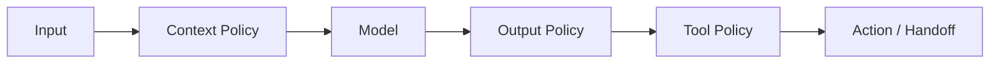

# AI Guardrails

> Status: **Target / normative engineering design**.

Guardrails cover input, context, tool access, output, action approval, and budget.

## Contract

Security/authorization constraints outrank prompts. Retrieved documents and tool outputs are untrusted. On policy violation or uncertainty, stop autonomous action, respond safely, or hand off.

## Mermaid Flow

## Engineering Rule

External inputs are untrusted, tenant scope is mandatory, and side effects require explicit authorization and idempotency where duplicate execution could matter.
