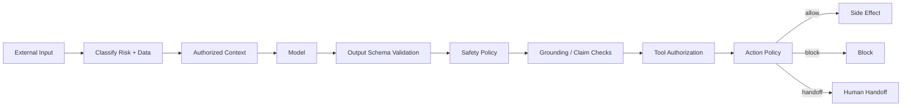
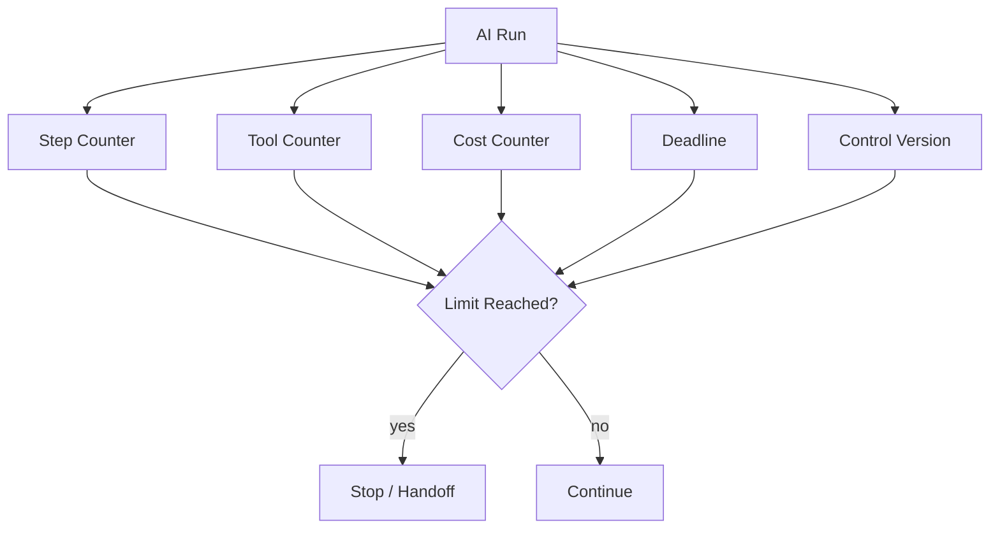

# AI Guardrails — Implementation Specification

> Status: **Target security/runtime blueprint**
>
> Related: context-engine.md, human-handoff.md, agent-runtime.md, tool-runtime.md, model-routing.md, evaluation.md.
>
> Phase tags: **[MVP]** is needed for the first production tenant. **[Later]** and **[Deferred]** are designed now and built later.

Guardrails are independent enforcement layers around model generation. Prompt instructions alone are not security controls.

## 1. Trust Hierarchy

```text
platform security policy
> domain authorization
> tenant enforcement policy
> tenant business context
> agent policy
> workflow policy
> model instruction
> customer/document/tool content and derived memory
```

Lower-trust content can provide facts but cannot redefine higher-trust policy.

Tenant business context is tenant-authored text. It can shape tone, product description and escalation wording. It cannot widen tool permissions, relax data handling or override platform policy. Derived customer memory has the same trust as customer messages.

## 2. Guardrail Pipeline



## 3. Prompt Injection

Treat customer messages, documents and tool outputs as data.

Defenses:

- isolate system/tenant instructions from untrusted content;
- label retrieved content as untrusted;
- treat derived customer memory as untrusted, because stored injection persists across conversations (§13);
- scan tenant-authored business context for override attempts and secrets at publish time (context-engine.md §4);
- never derive authorization from text;
- use tool allowlists;
- validate tool arguments outside the model;
- regression-test direct and indirect injection.

## 4. Context Security

Context eligibility is:

```text
candidate data
INTERSECT tenant scope
INTERSECT resource permission
INTERSECT agent context policy
INTERSECT retention/visibility policy
INTERSECT verified identity link (customer memory only)
```

Retrieval must enforce this before model exposure.

Customer memory is eligible only through a verified identity link (context-engine.md §7). Asserted or heuristic links never widen context.

## 5. Output Validation

Validate:

- required schema;
- allowed enum values;
- response size;
- prohibited data classes;
- unsupported claims, including tenant-specific facts with no retrieved evidence or tool result (context-engine.md §11);
- action claims against authoritative tool results.

Example:

```text
model says: refund completed
tool result: refund pending
authoritative state: pending
```

The model statement is not sufficient evidence of completion.

## 6. Risk Tiers

| Tier | Example | Control |
|---|---|---|
| low | FAQ response | autonomous |
| medium | ticket creation | policy controlled |
| high | account mutation | approval/strict policy |
| critical | irreversible action | human approval |

Risk is an execution input, not a model confidence score.

A model's self-reported confidence, or its judgment that it can solve a request, may only raise the required level of control or request a handoff. It can never lower a risk tier, waive an approval or suppress a required handoff.

## 7. Autonomy Limits

Every run can be bounded by:

- maximum steps;
- maximum tool calls;
- maximum repeated call count;
- deadline;
- cost budget;
- token budget;
- valid conversation control version.



## 8. Handoff Conditions

Handoff can be required by:

- explicit customer request;
- high-risk action;
- low-confidence policy condition;
- unsupported capability;
- repeated failure;
- policy violation;
- SLA risk;
- customer dissatisfaction;
- budget exhaustion;
- relevance gate found no evidence for a request that policy says cannot be answered ungrounded;
- identity uncertain for an account-specific request;
- required context exceeds the budget;
- run failure, timeout or block with an unanswered customer message.

The model cannot veto a required handoff.

The model may request a handoff. That request is a proposal that policy evaluates. Policy computes whether a handoff is required from its own inputs, so a model that omits the request cannot suppress it.

Handoff reasons are a closed set, and the lifecycle and control ownership are specified in human-handoff.md.

## 9. Guardrail Decision Contract

```json
{
  "decision": "allow|transform|block|handoff",
  "policyVersion": 7,
  "riskTier": "high",
  "reasons": ["approval_required"],
  "handoffReason": null,
  "checks": ["tenant_scope", "tool_policy", "output_policy"]
}
```

`handoffReason` is set only when the decision is `handoff`. It uses the closed set in human-handoff.md §3.

High-risk decisions are persisted.

## 10. Dependency Failure

| Operation | Behavior |
|---|---|
| low-risk conversation | degrade only if explicitly allowed |
| medium-risk action | safer fallback/handoff |
| high-risk action | fail closed |
| critical action | fail closed |
| tenant context snapshot | fail closed. The run does not start and the conversation follows handoff policy |
| customer memory store | degrade without derived memory. Authoritative and tool paths are unaffected |
| knowledge retrieval | no-evidence outcome |
| handoff queue | persist the request through the outbox, send a holding message, retry. Never drop |

Safety must not be silently disabled because a dependency is unavailable.

## 11. Required Adversarial Tests

- direct prompt injection;
- indirect injection in knowledge;
- malicious tool result;
- unauthorized resource request;
- secret extraction attempt;
- fabricated action success;
- restricted output data;
- infinite tool loop;
- suppressed mandatory handoff;
- guardrail dependency outage;
- stale control version;
- stored injection through a distilled summary or fact;
- cross-customer memory exposure through a wrong identity merge;
- tenant business context attempting to override platform policy;
- secret placed in tenant business context;
- model omitting a handoff request that policy requires;
- AI tool write while the conversation awaits a human;
- handoff packet exposing data beyond the viewing human's permissions;
- unanswered conversation after a terminal run failure;
- handoff loop on the same issue;
- tenant-specific claim with no evidence.

## 12. Observability

Record or measure:

- rule/policy version;
- decision;
- reason category;
- risk tier;
- latency;
- run/tool correlation;
- block/handoff rate and handoff reason distribution;
- memory write rejections, by reason;
- regression case ID where applicable.

## 13. Memory Write Guardrails [Later]

Memory is a persistence path for untrusted text. A single injected sentence that reaches a summary can influence every later conversation with that customer. Controls, specified in context-engine.md §8 and §9:

- records are schema-bound, with enumerated kinds and keys. Free-form instruction text is rejected;
- every record carries provenance: `authoritative`, `customer_stated` or `model_derived`;
- sources are canonical messages and persisted tool outcomes, never the model's claims about what happened;
- derived memory never feeds an authorization, pricing, eligibility or approval decision;
- a record and everything derived from it can be retracted;
- reading another customer's memory requires a verified identity link;
- rejections of instruction-like content emit a guardrail decision, and a spike is a security signal.

## 14. Handoff Guardrails

- While a conversation is `HUMAN_PENDING`, AI runs are limited to holding messages and information gathering. Tool Runtime denies tool writes regardless of model output.
- A required handoff is enforced by the runtime. Model text cannot cancel it.
- Handoff packet content is filtered by the viewing human's permissions, not by the AI's context eligibility.
- Approval and handoff are separate controls (human-handoff.md §1). An approval never silently transfers conversation control.
- Policy computes whether a handoff is required from its own inputs, so omission by the model is not a bypass.

## 15. Realtime Output Guardrails [Deferred]

Streaming audio changes when output can be validated.

- Unvalidated text is never synthesized. Validation runs on sentence-sized chunks.
- Spoken audio cannot be recalled. A failure after speech starts requires a corrective turn or a handoff, so risky content must be caught before synthesis.
- The control-version check runs per chunk (agent-runtime §23).
- High-risk actions are not confirmed by voice alone.

## 16. Acceptance

A guardrail implementation is complete only when bypass attempts have preventive controls, automated regression tests and an observable security signal.