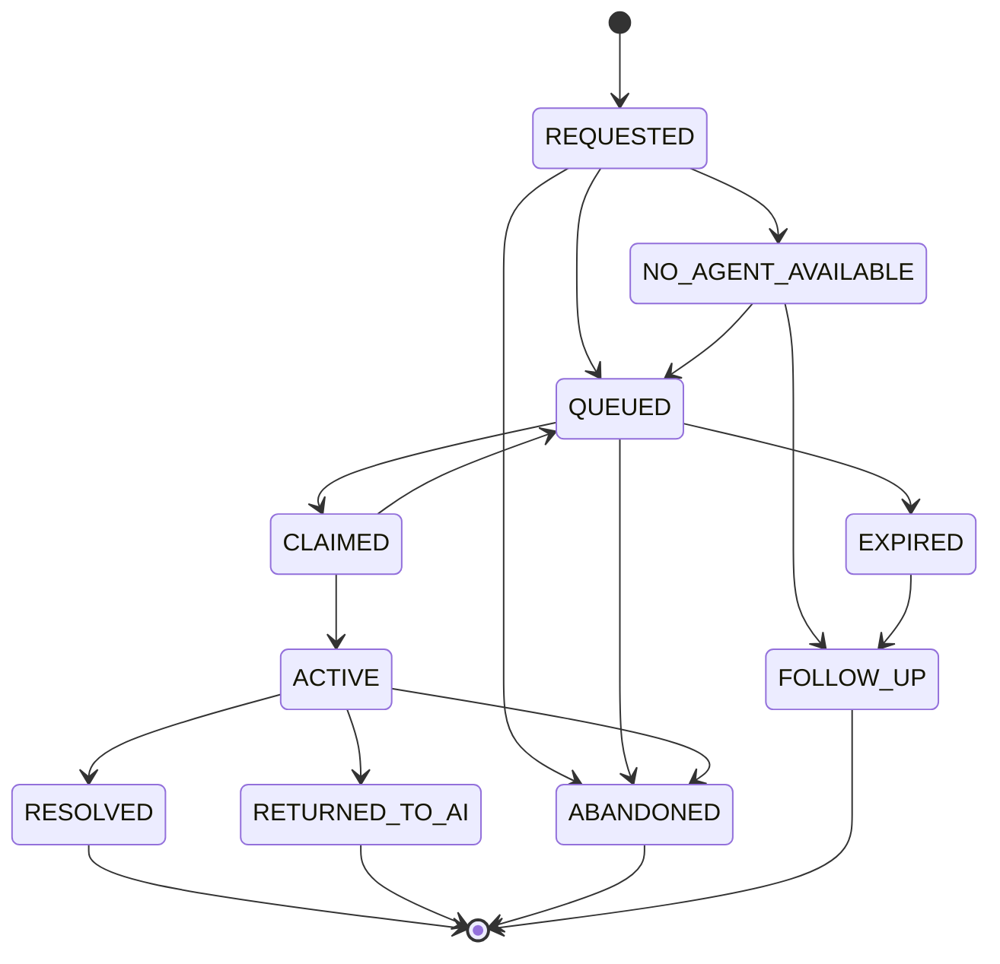

# Human Handoff — Implementation Specification

> Status: **Target implementation blueprint**
>
> Phase tags: **[MVP]** is needed for the first production tenant. **[Later]** is designed now and built later.

Handoff is a product lifecycle, not an error path. An AI run that ends in `HANDOFF` creates a handoff that outlives the run. The invariant behind this document is:

> No terminal AI outcome may leave a customer message both unanswered and unowned.

## 1. Handoff Versus Approval

Two controls involve a human and are easy to confuse. They are different.

| | Handoff | Approval |
|---|---|---|
| Question | Who owns the conversation? | May this exact action proceed? |
| Human does | talks to the customer | approves or rejects one action |
| Bound to | conversation | exact action hash (tool-runtime §9) |
| AI during it | restricted or paused | may keep the conversation going with a holding message |
| `controlVersion` | changes | unchanged |

An approval wait does not change conversation control. An approval that cannot be decided in time, or a customer who needs a person, may trigger a handoff. That is a separate decision with its own reason code (`approval_unavailable`).

## 2. Who Decides

- The model may **request** a handoff through structured output or the reserved tool `handoff.request` (tool-runtime §17).
- Policy may **require** a handoff (guardrails §8).
- The model cannot veto a required handoff.
- Model confidence may only escalate. It can never de-escalate a risk tier or suppress a required handoff (guardrails §6).
- The safety path contains no "can the AI safely solve this?" self-assessment. Risk tier, retrieval gate outcome, identity state, failure counts and customer signals decide.
- An explicit customer request for a human is always honored as a request. Whether a person is available is a separate question (§6).

## 3. Reason Codes

Reasons are a closed set. Free text is allowed only in a notes field.

| Code | Meaning |
|---|---|
| `customer_request` | the customer asked for a person |
| `high_risk_action` | action needs a human decision beyond approval |
| `approval_unavailable` | approval could not be obtained in time |
| `no_evidence` | relevance gate found no usable evidence |
| `identity_uncertain` | account-specific request without verified identity |
| `repeated_failure` | repeated tool, model or comprehension failure |
| `policy_violation` | guardrail decision requires a human |
| `sla_risk` | response time target at risk |
| `dissatisfaction` | customer dissatisfaction signal |
| `budget_exhausted` | run or tenant budget exhausted |
| `context_overflow` | required context exceeds budget |
| `system_failure` | run failed, timed out or was blocked with the customer unanswered |

## 4. Handoff Lifecycle



| State | Meaning |
|---|---|
| REQUESTED | persisted in the same transaction that ends the AI run |
| QUEUED | waiting for a human |
| CLAIMED | a human holds the claim lease but has not engaged |
| ACTIVE | a human is handling the conversation |
| NO_AGENT_AVAILABLE | outside hours or no capacity |
| EXPIRED | maximum wait exceeded |
| FOLLOW_UP | an asynchronous follow-up or ticket was created |
| RESOLVED | human finished. Control is released |
| RETURNED_TO_AI | human explicitly handed control back mid-issue |
| ABANDONED | customer left before resolution |

Every transition is persisted and audited. Only one handoff may be open per conversation.

## 5. Control Ownership

The conversation has a `controlOwner`: `AI`, `HUMAN_PENDING` or `HUMAN`.

| Handoff state | controlOwner |
|---|---|
| REQUESTED, QUEUED, CLAIMED, NO_AGENT_AVAILABLE | HUMAN_PENDING |
| ACTIVE | HUMAN |
| RESOLVED, RETURNED_TO_AI, FOLLOW_UP | AI (for future messages) |

Rules:

- Every change of `controlOwner` increments `controlVersion`. The stale-version rule in agent-runtime §10 applies.
- While `HUMAN_PENDING`, AI runs are restricted. They may acknowledge, set expectations and collect information. They may not perform tool writes or disclose customer-specific data beyond what is already in the conversation. Tool Runtime enforces this regardless of model output.
- Holding runs start after the transition, under the new `controlVersion`, in restricted mode.
- Tenant policy chooses `pendingMode`: `holding` (send a holding message) or `silent`. It may not choose silence for a conversation that has no owner.
- Customer messages that arrive while pending are appended to the handoff.

## 6. Queue, Routing and SLA [Later]

Routing inputs: organization, client or program, channel, language and dialect, skills, priority, business hours.

Rules:

- An agent may claim only handoffs in the client programs they are assigned to. They cannot see other programs' data.
- Priority comes from risk tier, reason and tenant policy.
- SLA timers cover first response and resolution. A breach raises priority and notifies a supervisor.
- When no agent is available, tell the customer honestly: expected wait or follow-up. Never go silent.
- Maximum wait moves the handoff to `EXPIRED`, then `FOLLOW_UP`.
- Agent capacity and concurrency limits apply per agent.

## 7. Handoff Packet

```json
{
  "handoffId": "uuid",
  "organizationId": "uuid",
  "conversationId": "uuid",
  "clientProgramId": "uuid",
  "reason": "no_evidence",
  "riskTier": "medium",
  "priority": 2,
  "customerProjection": {},
  "summary": {
    "text": "...",
    "provenance": "model_derived",
    "sourceRange": ["msg_100", "msg_131"]
  },
  "pendingAction": {
    "toolId": "order.refund",
    "toolVersion": 2,
    "status": "awaiting_human"
  },
  "aiAttempts": 2,
  "createdAt": "...",
  "slaDueAt": "..."
}
```

Rules:

- Content is filtered by the **human's** permissions at view time. The AI's context eligibility does not carry over.
- The summary is derived, labeled, and links to source messages. The human can always see the raw transcript.
- If summary generation fails, the handoff proceeds with the raw transcript and the reason code. Summarization never blocks a handoff.
- A pending action shows what the AI intended. A human who wants it executed approves the exact action, which is an approval (§1), not an implicit grant.

## 8. Human Response Path

- Human replies become canonical outbound messages through the same persistence and delivery path as AI replies. They are audited with the agent's identity.
- AI output guardrails do not apply to human text. Delivery-side controls such as channel policy and tenant data-leak checks do **[Later]**.
- Suggested replies for the human are drafts. They are never sent without explicit human action and are generated from the human's eligible context **[Later]**.

## 9. Return to AI

- Control returns only by explicit human action, or by tenant policy after resolution **[Later]**.
- The AI resumes with the handoff outcome as labeled data in context. It does not inherit human authority.
- Loop guard **[Later]**: if the same issue is handed off N times in a window, it stays human-owned and is flagged for evaluation.
- A customer message after `RESOLVED` follows tenant policy: a new AI run, or a new handoff.

## 10. Failure Modes

| Failure | Behavior |
|---|---|
| two agents claim at once | atomic claim with a lease. The loser sees a conflict |
| agent disconnects or lease expires | handoff returns to QUEUED with priority preserved |
| handoff write fails at run terminal | the run is not marked COMPLETED. Retry through the outbox. Never drop |
| run fails, times out or is blocked with the customer unanswered | `system_failure` handoff (agent-runtime §21) |
| customer writes while REQUESTED or QUEUED | appended to the handoff |
| duplicate requests for one conversation | coalesced into the open handoff |
| queue service unavailable | persist the request, send a holding message, retry |

## 11. Observability

- handoff rate by reason;
- false-escalation and missed-escalation rate, from evaluation sampling;
- queue wait;
- time to first human response;
- SLA breach rate;
- resolution by human;
- return-to-AI rate;
- repeat handoff rate;
- customer re-contact after resolution;
- cost per handoff (cost-control §12);
- open handoffs older than their expiry.

## 12. Test Matrix

- customer asks for a human in Arabic, English and Arabizi;
- policy requires handoff while the model proposes continuing;
- model proposes handoff on a low-risk request;
- no agent online;
- simultaneous claim;
- agent lease expiry;
- AI holding message while `HUMAN_PENDING`;
- AI tool write attempted while `HUMAN_PENDING`;
- packet viewed by an agent from another program;
- summary generation failure;
- queue unavailable at run terminal;
- repeated handoff loop;
- approval pending with no handoff;
- customer message during queue wait;
- return to AI, then immediate re-escalation.

## 13. Phasing

**[MVP]**

- closed reason codes;
- one queue per organization;
- claim and release with a lease;
- human reply over the existing outbound path;
- `controlOwner` and `controlVersion`;
- explicit return to AI;
- `system_failure` handoff on run failure;
- holding message;
- one open handoff per conversation.

**[Later]**

- SLA timers and breach escalation;
- skills and program-scoped routing and visibility;
- suggested replies;
- loop guard and auto-return;
- delivery-side controls on human text.

## 14. Acceptance

Handoff is complete when:

- no terminal AI outcome leaves a customer message unanswered and unowned;
- a handoff survives a crash, a queue outage and an agent disconnect;
- control ownership is unambiguous at every instant;
- every transition is persisted and audited;
- approval and handoff cannot be mistaken for each other.
