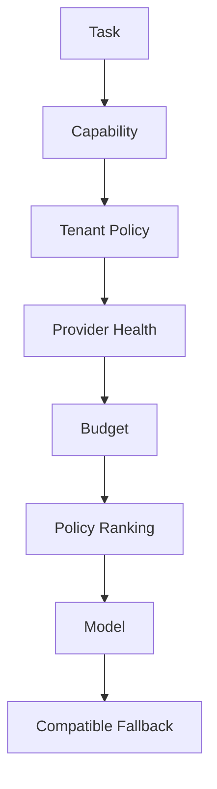

# Model Routing

> Status: **Target / normative engineering design**.

Select compatible models using task capability, tenant policy, provider health, latency, quality, and cost.

## Contract

Filter unsupported models, then tenant-disallowed models, then unhealthy providers; apply budget checks; rank by configured policy; define compatible fallback. Routing decisions are versioned and observable.

## Mermaid Flow

## Engineering Rule

External inputs are untrusted, tenant scope is mandatory, and side effects require explicit authorization and idempotency where duplicate execution could matter.
