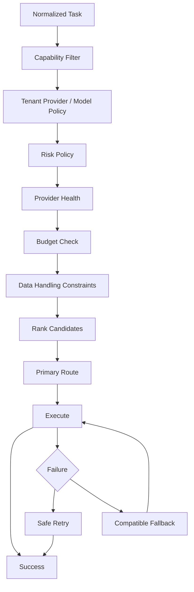
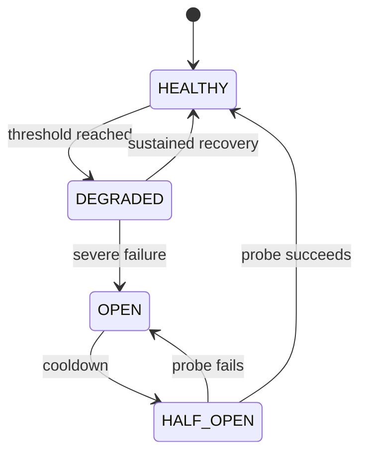

## AI Model Routing

> **Status:** Target production architecture

Model routing prevents OMILINKS from coupling business workflows to one model/provider. It chooses a model only after applying hard compatibility and policy constraints.

## 1. Routing Objective

The route is:

```text
best compatible model
subject to
tenant policy
+ capability
+ safety/risk
+ budget
+ provider health
+ latency constraints
```

"Cheapest available model" is not a valid routing strategy.

## 2. Normalized Task Contract

A request reaching the router should resemble:

```json
{
  "organizationId": "org_123",
  "taskType": "customer_response",
  "language": "ar-EG",
  "requiredCapabilities": [
    "tool_calling",
    "structured_output"
  ],
  "contextTokens": 12000,
  "riskTier": "medium",
  "maxLatencyMs": 5000,
  "budgetRemainingUsd": 1.25
}
```

Critical requirements must be structured data rather than inferred from prompt text.

## 3. Model Capability Registry

Each enabled model has a capability profile:

| Capability | Meaning |
|---|---|
| modalities | text/vision/audio |
| context_window | maximum supported context |
| tool_calling | supported tool interface |
| structured_output | schema enforcement capability |
| languages | validated language coverage |
| latency_class | expected latency band |
| quality_tier | standard/premium/specialized |
| pricing_version | effective pricing contract |
| provider_status | health/circuit state |

Model profiles are versioned when capabilities or policy-relevant semantics change.

## 4. Routing Pipeline



Hard filters happen before ranking. Ranking cannot resurrect a rejected candidate.

## 5. Hard Constraints

A model is not a candidate when any of these fail:

- tenant allow/deny policy;
- capability requirements;
- context capacity;
- required output/tool contract;
- risk policy;
- budget/entitlement;
- configured data handling restriction;
- provider/model disabled state.

## 6. Soft Objectives

After filtering, policy may optimize:

```text
score =
    quality_weight * quality
  + reliability_weight * reliability
  + latency_weight * latency
  - cost_weight * cost
```

Weights belong to a versioned routing policy.

The decision stores the candidate set and selected route.

## 7. Fallback Compatibility

Fallback must preserve the task contract.

Examples:

| Task | Fallback requirement |
|---|---|
| Tool calling | tool-compatible model |
| JSON extraction | same structured-output requirement |
| Vision | vision-capable model |
| Long context | sufficient context window |
| High-risk action | allowed by risk policy |
| Arabic support | validated Arabic quality threshold |

A text-only fallback is invalid for a workflow that requires a tool call.

## 8. Retry vs Fallback

Retry the same model for likely transient failure:

- timeout;
- 429;
- temporary provider 5xx.

Fallback when:

- health circuit is open;
- model capability unexpectedly fails;
- provider remains degraded;
- tenant policy permits alternatives.

Do not use fallback to hide application validation errors.

## 9. Provider Health

Health uses observed signals:

- error rate;
- timeout rate;
- 429 rate;
- p95 latency;
- tool-call failure rate;
- structured-output failure rate.



Circuit state should influence candidate filtering.

## 10. Tenant Routing Policy

Organizations can configure:

- allowed providers;
- allowed models;
- excluded models;
- maximum cost tier;
- maximum latency;
- fallback policy;
- supported AI capabilities.

The backend enforces this policy. UI selections are advisory.

## 11. Versioned Decision Record

Every route should be explainable through:

```text
run_id
  -> routing_policy_version
  -> candidate_set
  -> rejection reasons
  -> selected provider/model
  -> fallback attempts
  -> terminal result
```

This is essential for debugging unexpected model behavior.

## 12. Cost Integration

The router receives a preflight estimate and a remaining budget. Actual usage is metered after execution.

Estimated cost must never be represented as final billing truth.

## 13. Failure States

| State | Response |
|---|---|
| NO_COMPATIBLE_MODEL | stop/handoff |
| BUDGET_EXCEEDED | enforce tenant overage policy |
| ALL_PROVIDERS_DEGRADED | queue/handoff/fail closed by risk |
| POLICY_CONFLICT | fail closed and surface configuration error |
| PROVIDER_TIMEOUT | retry/fallback according to operation safety |

## 14. Acceptance Criteria

- No route violates tenant policy.
- Capability mismatches are eliminated before ranking.
- Fallback preserves hard task requirements.
- Provider degradation can change the route without changing business semantics.
- Routing decisions are reproducible.
- Cost and policy reasons are observable.
