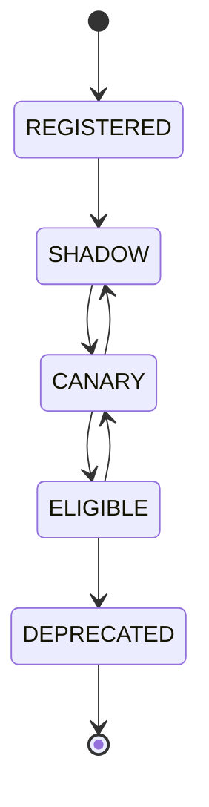

# AI Model Routing — Implementation Specification

> Status: **Target implementation blueprint**
>
> Related: context-engine.md, agent-runtime.md, evaluation.md (model certification), cost-control.md (self-hosted economics), guardrails.md.
>
> Phase tags: **[MVP]** is needed for the first production tenant. **[Later]** and **[Deferred]** are designed now and built later.

Routing selects a provider/model only after hard compatibility and policy constraints have removed invalid candidates.

## 1. Responsibilities

- task normalization;
- candidate discovery;
- hard filtering;
- candidate scoring;
- deterministic tie breaking;
- provider health state;
- fallback selection;
- route decision persistence.

Execution remains the responsibility of the model runtime/provider adapter.

## 2. Normalized Task Contract

~~~json
{
  "taskType": "customer_response",
  "organizationId": "org_123",
  "agentId": "agent_7",
  "language": "ar-EG",
  "script": "arabic",
  "contextTokens": 12000,
  "requiredCapabilities": ["tool_calling", "structured_output"],
  "riskTier": "medium",
  "deadlineMs": 5000,
  "channelClass": "async",
  "dataClassification": "confidential",
  "remainingBudgetUsd": 0.42
}
~~~

Routing decisions must be driven by structured task requirements rather than prompt-text guessing.

`script` is `arabic`, `arabizi` (Arabic written in Latin letters) or `latin`. Dialect and script change model behavior and must be matched against language capability metadata.

`dataClassification` is the input to the data-handling check in §12. `deadlineMs` in this example is for `async` text runs. Realtime runs use a per-turn latency budget and are **[Deferred]** (§18).

## 3. Model Profile

Each enabled model has:

- provider_id;
- model_id;
- profile_version;
- context_window;
- modality set;
- tool calling support (declared and certified);
- structured output support (declared and certified);
- language capability metadata (languages, dialects, scripts such as Arabic script and Arabizi);
- expected latency class (`standard` or `realtime`) and streaming support;
- quality tier;
- price version;
- hosting (`self_hosted` or `third_party`);
- data handling class;
- certification references;
- lifecycle stage (§17);
- health state.

Capability flags have two states. **Declared** means the vendor or builder claims it. **Certified** means an evaluation run passed the gate in evaluation.md §15 for this profile version and scope. Hard filters use certified capabilities for tasks at medium risk or above. Declared-only capabilities are usable only in the `SHADOW` and `CANARY` stages (§17).

## 4. Candidate Pipeline

~~~mermaid
flowchart TD
TASK[Normalized Task] --> TENANT[Tenant Model Policy]
TENANT --> STAGE[Lifecycle Stage]
STAGE --> CAP[Capability and Certification Filter]
CAP --> CTX[Context Capacity]
CTX --> RISK[Risk Policy]
RISK --> DATA[Data Handling and Egress Policy]
DATA --> BUDGET[Budget / Entitlement]
BUDGET --> HEALTH[Provider Health]
HEALTH --> SET[Eligible Candidates]
SET --> SCORE[Score Candidates]
SCORE --> TIE[Deterministic Tie Break]
TIE --> DECISION[Route Decision]
~~~

Hard filters happen before scoring.

## 5. Rejection Reasons

- TENANT_DENIED;
- CAPABILITY_MISSING;
- CONTEXT_TOO_LARGE;
- RISK_NOT_ALLOWED;
- DATA_POLICY_VIOLATION;
- ENTITLEMENT_DENIED;
- BUDGET_EXCEEDED;
- PROVIDER_UNHEALTHY;
- MODEL_DISABLED;
- CAPABILITY_NOT_CERTIFIED;
- STAGE_NOT_ELIGIBLE;
- EGRESS_NOT_ALLOWED.

## 6. Scoring Contract

~~~text
score =
  quality_weight * quality_score
  + reliability_weight * reliability_score
  + latency_weight * latency_score
  - cost_weight * normalized_cost
  + preference_weight * policy_preference
~~~

All weights and normalization rules belong to a versioned routing policy.

`policy_preference` expresses a platform or tenant default, such as a preferred in-house model. It is bounded and applied only after the hard filters. It reorders eligible candidates and can never make an ineligible candidate eligible. A default is a preference, not a hard-coded route (§17).

## 7. Deterministic Tie Breaking

Final ties should use stable ordering such as:

~~~text
provider_id ASC
model_id ASC
profile_version ASC
~~~

Do not use random selection when reproducibility matters.

## 8. Decision Record

~~~json
{
  "decisionId": "uuid",
  "routingPolicyVersion": 4,
  "candidateSnapshotVersion": 2,
  "candidates": [],
  "selectedProvider": "provider-a",
  "selectedModel": "model-x",
  "dataClassification": "confidential",
  "preferenceApplied": "tenant_default",
  "certificationRefs": [],
  "egressDecision": "not_required",
  "createdAt": "..."
}
~~~

Store enough evidence to explain a route without storing unnecessary prompt content.

## 9. Provider Health

Health derives from timeout rate, 5xx rate, 429 rate, latency percentiles, structured-output failures and tool-call failures.

~~~mermaid
stateDiagram-v2
    [*] --> HEALTHY
    HEALTHY --> DEGRADED
    DEGRADED --> OPEN
    OPEN --> HALF_OPEN
    HALF_OPEN --> HEALTHY
    HALF_OPEN --> OPEN
~~~

Semantics:

~~~text
HEALTHY   -> normal candidate pool
DEGRADED  -> reduced route weight
OPEN      -> excluded
HALF_OPEN -> limited probe
~~~

Self-hosted models add capacity health: queue depth, accelerator saturation, cold-start time and single-instance exposure. A single self-hosted instance is a single point of failure. When its circuit opens, the only available fallback may be a third-party provider, which is subject to the egress rule in §10.

## 10. Fallback Compatibility

Fallback must preserve hard requirements.

~~~text
tool_calling + structured_output task
 -> alternate model with both capabilities
~~~

An incompatible model is not a fallback merely because it is available.

A fallback must also be certified for the task and must preserve data handling. Falling back from a self-hosted model to a third-party provider moves tenant data across a trust boundary. It is allowed only if tenant policy permits egress for that data classification. Otherwise the candidate is rejected with `EGRESS_NOT_ALLOWED`.

When no eligible fallback exists, the run does not fail silently. It follows the handoff path (agent-runtime §21).

## 11. Retry vs Fallback

| Failure | Retry | Fallback |
|---|---|---|
| transient timeout | bounded | after retry policy |
| 429 | provider-aware | alternate eligible candidate |
| temporary 5xx | bounded | alternate eligible candidate |
| local schema error | no | no |
| capability mismatch | no | compatible candidate |
| tenant policy denial | no | another allowed candidate only |

## 12. Data Handling

Provider candidates are filtered by the data classification they are allowed to receive.

Example:

~~~text
task classification = confidential
provider policy = public-only
-> candidate rejected
~~~

This check occurs before the request is constructed.

## 13. Budget Preflight

Preflight estimates include expected input tokens, output allowance, likely tool calls and provider price version.

The estimate controls admission. Actual usage is recorded after execution.

For self-hosted models the estimate uses the versioned capacity price record (cost-control §17).

## 14. Cache Safety

Safe cache candidates include model profiles, provider health snapshots and immutable routing policies.

Tenant-sensitive route decisions must include every security-relevant input in the cache key.

## 15. Reproducibility

Persist:

- task normalization version;
- routing policy version;
- model profile versions;
- provider health snapshot;
- budget snapshot;
- candidate rejection reasons;
- selected route.

## 16. Test Matrix

- no compatible model;
- one candidate;
- capability mismatch;
- tenant allowlist;
- risk-tier exclusion;
- provider circuit open;
- circuit recovery;
- exact score tie;
- budget nearly exhausted;
- structured-output fallback;
- tool-call fallback;
- Arabic capability requirement;
- data-policy rejection;
- uncertified model configured as the tenant default;
- default preference in conflict with a hard filter;
- certification revoked while the model is a default;
- self-hosted circuit open with egress forbidden;
- self-hosted circuit open with egress allowed;
- shadow model output never reaching a customer;
- Arabizi input to a model certified only for Arabic script;
- realtime candidate with no streaming support.

## 17. Model Lifecycle and Default Models

A model earns eligibility. It is not granted it by being preferred.

| Stage | Meaning |
|---|---|
| REGISTERED | profile exists and is never selected |
| SHADOW | receives a copy of eligible traffic for evaluation. Its output never reaches a customer. Its cost is counted (cost-control §18) |
| CANARY | serves a bounded share of low-risk tasks for opted-in tenants. Hard safety gates apply |
| ELIGIBLE | may be selected within its certified capability, risk and language scope. May be a default |
| DEPRECATED | no new selection |

Rules:

- Promotion needs a passing certification run (evaluation.md §15). Demotion is automatic when a certification is revoked or a hard safety gate fails.
- A **default** is a policy preference (§6) on an `ELIGIBLE` model. It cannot make an uncertified model eligible and cannot override a hard filter.
- Defaults are scoped by task type, risk tier and language. A model certified for Egyptian Arabic FAQ answers is not thereby the default for tool-calling account actions.
- Shadow traffic follows the same data-handling and egress rules as live traffic, and uses minimized, redacted data (evaluation.md §13).
- Fallback chains may not route around these rules. Every member of a chain is itself eligible for the task.

## 18. Realtime Routing [Deferred]

Realtime audio needs different routing (agent-runtime §23).

- Candidates must have `realtime` latency class, streaming support and a certified first-output latency.
- Routing must decide before the first output. A model cannot be swapped after audio has started.
- Retries are limited to before the first output. After that the run recovers through a corrective turn or a handoff.
- A per-turn latency budget replaces `deadlineMs`.
- Cost is metered while the session runs and capped (cost-control §19).

## 19. Acceptance

A route is production-grade when it is explainable, reproducible from its input snapshot, policy-compliant, cost-aware and contract-compatible.

A default model is production-grade only when it is certified for the scope in which it is preferred.