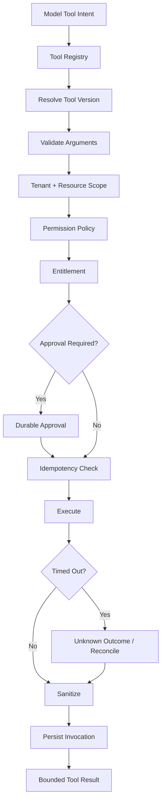
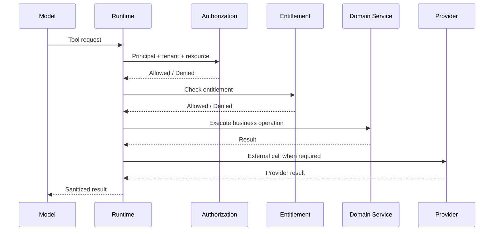
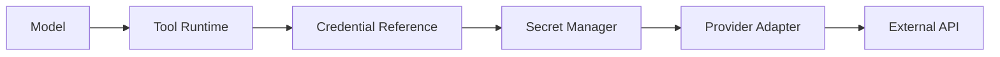
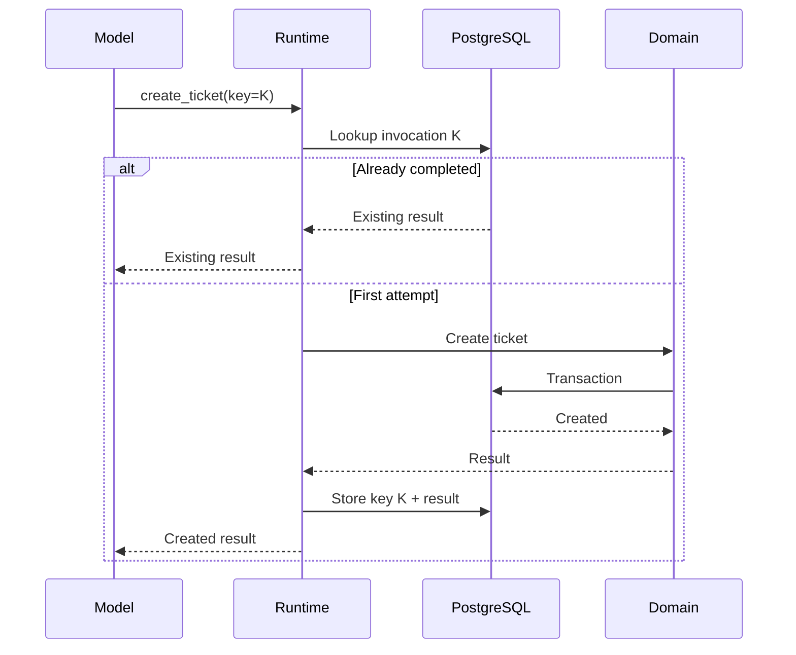
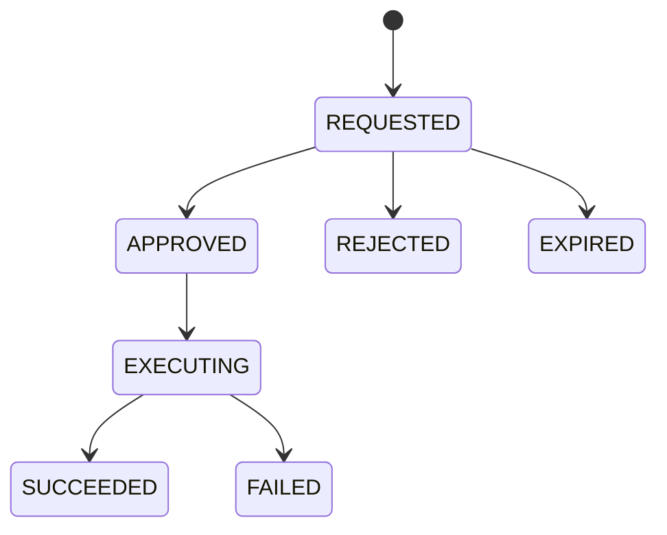

## AI Tool Runtime

> **Status:** Target production architecture

The Tool Runtime is the action boundary between AI and OMILINKS business systems.

The model produces a **request**. The runtime determines whether the action can execute.

## 1. Non-Negotiable Boundary

```text
MODEL OUTPUT
    !=
AUTHORIZATION
```

An AI-generated tool request is never evidence of permission.

## 2. Tool Lifecycle



## 3. Tool Definition Contract

Every tool has:

| Property | Purpose |
|---|---|
| tool_id | stable identifier |
| version | immutable executable contract |
| name | model-visible name |
| description | usage semantics |
| input_schema | runtime validation |
| output_schema | result contract |
| risk_tier | autonomy level |
| side_effect | none/read/write/external |
| timeout_ms | execution deadline |
| retry_policy | retry semantics |
| required_permissions | security requirements |
| required_entitlement | billing gate |
| adapter | implementation boundary |

## 4. Tool Versioning

Breaking changes create a new version.

```text
customer.lookup v1
customer.lookup v2
```

Historical AI runs retain the exact version used.

Never silently replace a schema that historical runs depend on.

## 5. Authorization Sequence

Authorization evaluates all restrictions:



A frontend "AI is enabled" flag has no security meaning.

## 6. Tenant Resource Protection

A tool request such as:

```json
{"tool":"customer.lookup","customer_id":"cust_123"}
```

must resolve:

```text
cust_123 -> organization X
requesting run -> organization Y
X != Y
=> DENY
```

Do not trust an organization ID supplied by the model or customer.

## 7. Credential Boundary

The model gets a logical tool name, never a raw provider credential.



Secrets are never written to prompts, tool results, events, logs, or browser payloads.

## 8. Idempotency

Every side-effecting tool must define duplicate behavior.

Example:



A provider timeout is not proof that a side effect did not occur.

## 9. Approval

High-risk operations may require human approval.



Approval is bound to the exact tool version, arguments, tenant, resource and requester.

## 10. Timeouts and Cancellation

Every tool has a deadline.

Cancellation sources:

- human takeover;
- conversation closure;
- workflow cancellation;
- run deadline;
- platform shutdown.

The runtime must distinguish cancellation from unknown external outcome.

## 11. Output Sanitization

Provider/internal results are projected into a model-safe result.

Remove:

- credentials;
- irrelevant tenant data;
- stack traces;
- internal IDs not needed for reasoning;
- huge payloads;
- private fields not required by the task.

## 12. Failure Taxonomy

- VALIDATION_FAILED
- FORBIDDEN
- ENTITLEMENT_DENIED
- PROVIDER_TIMEOUT
- PROVIDER_REJECTED
- BUSINESS_CONFLICT
- UNKNOWN_OUTCOME
- INTERNAL_ERROR

Only known-safe failure classes should be automatically retried.

## 13. Observability

Persist:

- invocation ID;
- run ID;
- organization;
- tool/version;
- risk tier;
- authorization decision;
- approval;
- duration;
- retry count;
- provider;
- outcome;
- error class;
- idempotency key.

## 14. Acceptance Criteria

- No model output can directly execute an arbitrary capability.
- Cross-tenant tool access is denied.
- Tool schemas are versioned and validated.
- Raw credentials never reach model context.
- Side effects are idempotent or reconciled.
- High-risk actions support approval.
- Unknown outcomes do not trigger blind retries.
