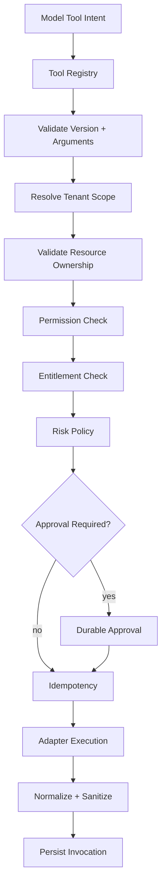
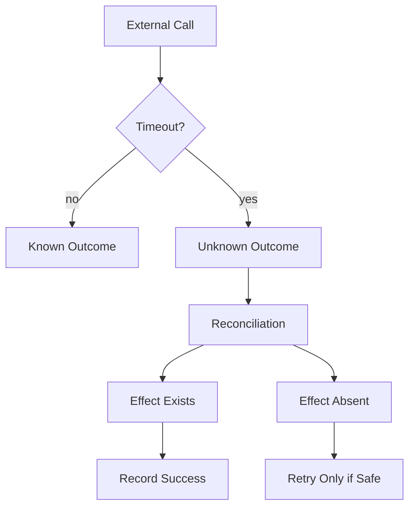
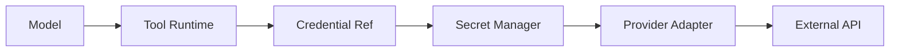

# AI Tool Runtime — Implementation Specification

> Status: **Target implementation blueprint**

The Tool Runtime is the hard boundary between model-generated intent and real business side effects.

## 1. Core Principle

```text
model output != authorization
model output != validated arguments
model output != successful business action
```

Every tool call passes independent registry, schema, scope, authorization, entitlement, risk and idempotency checks.

## 2. Tool Contract

```json
{
  "toolId": "customer.update",
  "version": 3,
  "riskTier": "high",
  "sideEffect": "write",
  "timeoutMs": 5000,
  "retryPolicy": "reconcile-first",
  "requiredPermissions": ["customer.write"]
}
```

## 3. Execution Pipeline



Any hard failure stops execution.

## 4. Versioning

Breaking input/output changes create a new tool version.

Historical invocations reference their exact version.

Never silently replace v1 semantics under the v1 identifier.

## 5. Permission Resolution

Effective permission combines:

```text
platform security
+ tenant policy
+ agent policy
+ principal permissions
+ resource ownership
+ tool risk policy
```

The administrator who configured an AI agent does not transfer administrator permissions to that agent.

## 6. Tenant and Resource Scope

Example request:

```json
{
  "customerId": "cust_123"
}
```

The runtime compares the target resource organization with the run organization. A mismatch means DENY.

## 7. Idempotency

Side-effecting tools define a semantic execution key.

Example components:

```text
organization_id
tool_id
tool_version
run_id
semantic_request_key
```

Repeated delivery checks for an existing completed invocation before another side effect.

## 8. Unknown Outcome

Timeout after an external write is UNKNOWN, not FAILED.



Blind retry is prohibited for high-impact side effects.

## 9. Approval Contract

Approval is bound to:

- organization;
- requester/run;
- tool ID/version;
- exact arguments or normalized action hash;
- target resource;
- expiry;
- approver.

Changing a material argument invalidates the previous approval.

## 10. Credential Boundary



The model, browser and generic event stream never receive raw credentials.

## 11. Output Projection

Tool results are projected into a model-safe contract.

Remove secrets, unrelated records, stack traces, internal authorization metadata and uncontrolled payload sizes.

## 12. Internal vs External Mutation

Internal domain mutation:

```text
authorize
 -> application command
 -> database transaction
 -> durable result
```

External mutation:

```text
create invocation identity
 -> provider call
 -> reconcile unknown outcome
 -> persist canonical result
```

## 13. Failure Taxonomy

- INVALID_TOOL;
- INVALID_ARGUMENTS;
- FORBIDDEN;
- ENTITLEMENT_DENIED;
- APPROVAL_REJECTED;
- PROVIDER_RATE_LIMITED;
- PROVIDER_TIMEOUT;
- UNKNOWN_OUTCOME;
- BUSINESS_CONFLICT;
- INTERNAL_ERROR.

Retry behavior is determined by failure class.

## 14. Observability

Invocation telemetry includes:

- invocation ID;
- run ID;
- organization;
- tool/version;
- risk tier;
- authorization result;
- approval state;
- duration;
- retry count;
- provider;
- outcome;
- error class.

## 15. Test Matrix

- malformed arguments;
- unknown tool;
- disabled tool;
- missing permission;
- cross-tenant resource;
- entitlement exceeded;
- approval rejection;
- duplicate invocation;
- provider timeout;
- unknown external outcome;
- secret leakage;
- stale run/control version.

## 16. Acceptance

No model-generated action is considered successful until the Tool Runtime and domain layer produce a durable authoritative result.