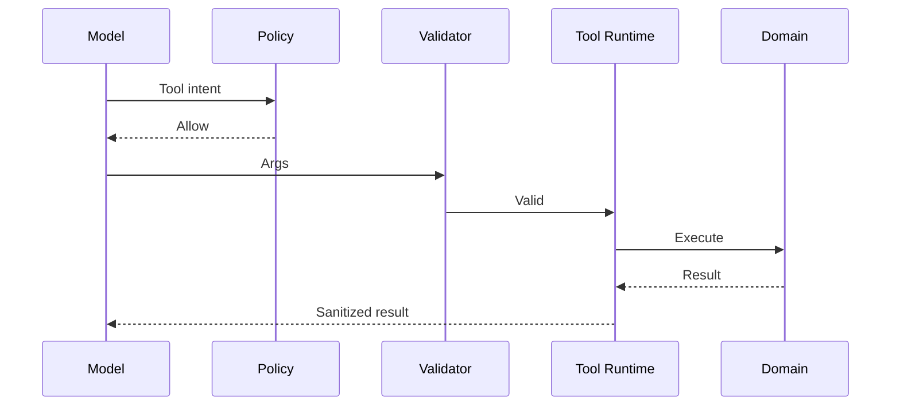

# AI Tool Runtime

> Status: **Target / normative engineering design**.

Tools are the controlled action plane between AI and business/external systems. Models never receive raw credentials and never directly mutate the database.

## Contract

Validate schema -> authorize -> check entitlement -> resolve credential -> execute with timeout/idempotency -> sanitize result -> audit. High-impact tools can require durable human approval.

## Mermaid Flow

## Engineering Rule

External inputs are untrusted, tenant scope is mandatory, and side effects require explicit authorization and idempotency where duplicate execution could matter.
