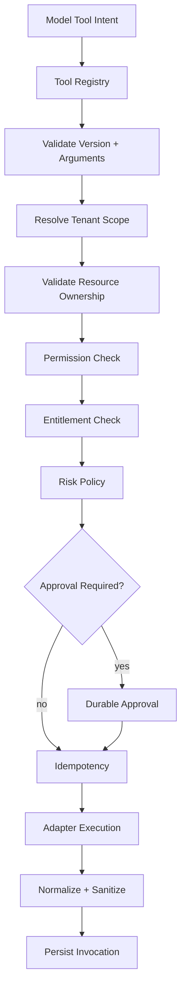
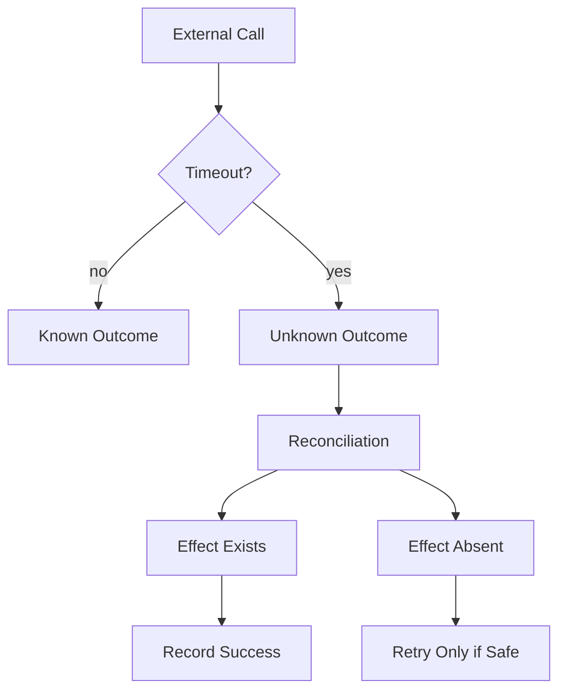
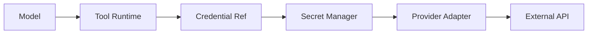

# AI Tool Runtime — Implementation Specification

> Status: **Target implementation blueprint**
>
> Related: agent-runtime.md, guardrails.md, human-handoff.md, context-engine.md.
>
> Phase tags: **[MVP]** is needed for the first production tenant. **[Later]** is designed now and built later.

The Tool Runtime is the hard boundary between model-generated intent and real business side effects.

## 1. Core Principle

```text
model output != authorization
model output != validated arguments
model output != successful business action
```

Every tool call passes independent registry, schema, scope, authorization, entitlement, risk and idempotency checks.

## 2. Tool Contract

```json
{
  "toolId": "customer.update",
  "version": 3,
  "riskTier": "high",
  "sideEffect": "write",
  "timeoutMs": 5000,
  "retryPolicy": "reconcile-first",
  "requiredPermissions": ["customer.write"]
}
```

## 3. Execution Pipeline



Any hard failure stops execution.

## 4. Versioning

Breaking input/output changes create a new tool version.

Historical invocations reference their exact version.

Never silently replace v1 semantics under the v1 identifier.

## 5. Permission Resolution

Effective permission combines:

```text
platform security
+ tenant policy
+ agent policy
+ principal permissions
+ resource ownership
+ tool risk policy
```

The administrator who configured an AI agent does not transfer administrator permissions to that agent.

## 6. Tenant and Resource Scope

Example request:

```json
{
  "customerId": "cust_123"
}
```

The runtime compares the target resource organization with the run organization. A mismatch means DENY.

## 7. Idempotency

Side-effecting tools define a semantic execution key.

Example components:

```text
organization_id
tool_id
tool_version
run_id
semantic_request_key
```

Repeated delivery checks for an existing completed invocation before another side effect.

## 8. Unknown Outcome

Timeout after an external write is UNKNOWN, not FAILED.



Blind retry is prohibited for high-impact side effects.

## 9. Approval Contract

Approval is bound to:

- organization;
- requester/run;
- tool ID/version;
- exact arguments or normalized action hash;
- target resource;
- expiry;
- approver.

Changing a material argument invalidates the previous approval.

Approval is not handoff. An approval authorizes one exact action. It does not transfer conversation control (human-handoff.md §1).

## 10. Credential Boundary



The model, browser and generic event stream never receive raw credentials.

## 11. Output Projection

Tool results are projected into a model-safe contract.

Remove secrets, unrelated records, stack traces, internal authorization metadata and uncontrolled payload sizes.

## 12. Internal vs External Mutation

Internal domain mutation:

```text
authorize
 -> application command
 -> database transaction
 -> durable result
```

External mutation:

```text
create invocation identity
 -> provider call
 -> reconcile unknown outcome
 -> persist canonical result
```

## 13. Failure Taxonomy

- INVALID_TOOL;
- INVALID_ARGUMENTS;
- FORBIDDEN;
- ENTITLEMENT_DENIED;
- APPROVAL_REJECTED;
- PROVIDER_RATE_LIMITED;
- PROVIDER_TIMEOUT;
- UNKNOWN_OUTCOME;
- BUSINESS_CONFLICT;
- INTERNAL_ERROR.

Retry behavior is determined by failure class.

## 14. Observability

Invocation telemetry includes:

- invocation ID;
- run ID;
- organization;
- tool/version;
- risk tier;
- authorization result;
- approval state;
- duration;
- retry count;
- provider;
- outcome;
- error class.

## 15. Test Matrix

- malformed arguments;
- unknown tool;
- disabled tool;
- missing permission;
- cross-tenant resource;
- entitlement exceeded;
- approval rejection;
- duplicate invocation;
- provider timeout;
- unknown external outcome;
- secret leakage;
- stale run/control version;
- duplicate `handoff.request`;
- tenant allowlist attempting to remove `handoff.request`;
- AI-initiated tool write while the conversation is `HUMAN_PENDING`;
- human-initiated tool action checked against the human's permissions;
- action history built from an UNKNOWN outcome;
- model-proposed memory write in version 1 (rejected).

## 16. Conversation Control and Tool Writes [MVP]

The Tool Runtime reads the conversation `controlOwner` and `controlVersion` for every side-effecting tool.

- When the conversation is `HUMAN_PENDING` or `HUMAN`, AI-initiated tool writes are denied with `FORBIDDEN` and a `control_owner` subcode, whatever the model output says.
- Read tools remain available to holding-mode runs only if handoff policy allows them.
- When a human agent triggers an action from the agent interface, the same pipeline runs with the human as the principal. Permissions are those of the human, not of the AI agent (§5).

## 17. Reserved Platform Tools

| Tool | Risk | Behavior |
|---|---|---|
| `handoff.request` | low | Creates a handoff request through the domain service. Idempotent per run. Cannot be removed from the allowlist by tenant or agent policy. Returns "queued" to the model only after the request is persisted |
| `memory.remember` **[Later, not in version 1]** | medium | Writes `model_derived` records only. Schema-bound. Subject to the same validation as the post-run extractor (context-engine.md §8) |

Rules:

- A `handoff.request` call is a proposal evaluated by policy (guardrails §8). Policy can also create a handoff without it.
- Reserved tools still pass every check in §3.

## 18. Tool Results, Memory and Pre-Loaded Context

- Action history used as customer memory is built from persisted invocations with a known outcome. An UNKNOWN outcome is not a fact until reconciled (§8).
- Tool output entering the next prompt is untrusted data. It is never written to derived memory as an instruction.
- Volatile or deep customer data (order status, balances) is fetched by read tools at call time, each call independently authorized, instead of being pre-loaded into the prompt (context-engine.md §12).
- Read tools that return customer data apply output projection (§11) and respect identity-link eligibility.

## 19. Acceptance

No model-generated action is considered successful until the Tool Runtime and domain layer produce a durable authoritative result.