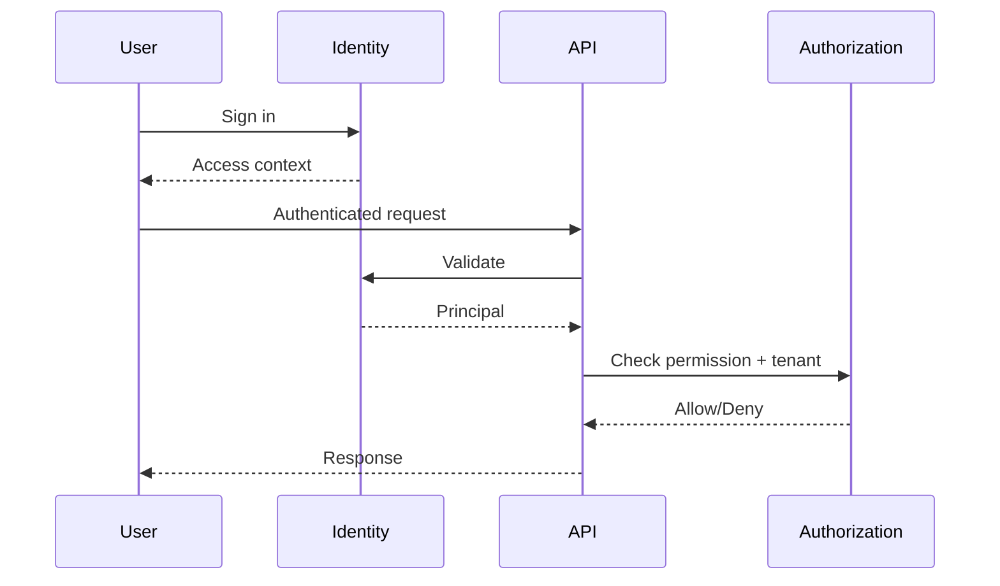

# API Authentication

> Status: **Target / normative engineering design**. This document defines behavior and implementation constraints even when the current code has not implemented the subsystem yet.

## Purpose

Authentication establishes a principal; authorization and tenant resolution determine what that principal may do.

## User Access

Use short-lived access context for API calls. Browser sessions should use secure httpOnly patterns where practical. Credentials are never placed in URLs.

## Tenant Resolution

Organization context is derived from authenticated membership and permitted scope. A client-supplied organization ID cannot elevate access.

## Service Identity

Webhooks, workers, schedulers, AI runtime infrastructure, and provider adapters use narrowly scoped machine credentials with independent rotation/revocation.

## Authorization

Every protected use case checks permission plus resource scope. A valid UUID is not proof of access.

## Lifecycle

Credential issuance, rotation, revocation, suspicious activity, and privileged changes are security-audited.

## Mermaid System View

## Change Rule

Changes that alter these contracts must update the affected requirement, API/event contract, tests, and this document. Security and tenant-isolation constraints cannot be weakened for implementation convenience.
