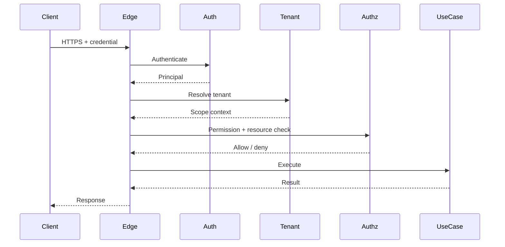
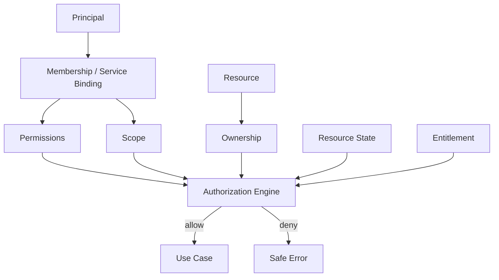

# API Authentication and Authorization — Implementation Specification

> Status: **Target implementation blueprint**

## 1. Authentication Is Not Authorization

Authentication establishes a principal.

Authorization establishes:

> principal
> + organization
> + permission
> + scope
> + resource
> + resource state
> + entitlement
> = allowed operation


A valid token is never proof that a resource may be accessed.

## 2. Credential Classes

| Caller | Credential | Scope |
|---|---|---|
| browser user | secure session/access context | memberships |
| public API | scoped API key | organization/scope |
| worker | service principal credential | narrow machine permissions |
| provider webhook | signature/token | integration binding |
| AI runtime | internal service identity | runtime capabilities |

## 3. HTTP Security Pipeline



## 4. Tenant Context

The tenant context must be derived from server-known membership/binding.

Never trust:

```json
{
  "organizationId": "requested-by-client"
}
```

as an access grant.

For users with multiple memberships, the target organization must be one of their active memberships.

## 5. Token Claims

Claims may identify:


> - subject
> - session
> - issuer
> - issued_at
> - expires_at
> - auth_strength


Do not put a permanently trusted organization role into a token if authorization may change before token expiry.

Prefer server-side membership lookup/revalidation for sensitive actions.

## 6. Session Revocation

> ***Revocation mechanisms:***
> - session version;
> - revoked -at threshold;
> - session denylist for high -risk incidents;
> - credential status.

The design must allow a compromised session to be invalidated before natural expiry.

## 7. API Key Storage

> ***Store:***
> - key_id
> - prefix
> - hash
> - organization
> - scope
> - permissions
> - created_at
> - last_used_at
> - expires_at
> - revoked_at


The full key should normally be shown only at creation.

## 8. Authorization Decision



## 9. HTTP Error Contract

Use:

```json
{
  "error": {
    "code": "FORBIDDEN",
    "message": "Operation is not permitted.",
    "requestId": "req_123",
    "details": {}
  }
}
```

Never include another tenant's resource identity in a denial.

## 10. CSRF / Browser Security

Browser session design must account for:

- CSRF;
- XSS;
- session fixation;
- open redirect;
- insecure cookie configuration.

Secure, HttpOnly and SameSite controls should be explicit in implementation.

## 11. Rate Limiting

Different classes require different controls:

```text
authentication
public reads
writes
search
exports
AI
bulk
webhooks
```

A tenant-level AI limit should not consume the same bucket as login attempts.

## 12. Privileged Reauthentication

Require recent/strong authentication before:

- owner transfer;
- credential rotation;
- API-key creation;
- billing configuration;
- tenant-wide export;
- destructive operations;
- AI tool activation.

## 13. Audit

Record:

```text
request_id
principal
organization
operation
resource
authorization result
timestamp
correlation_id
```

Do not log credentials.

## 14. Security Tests

- expired credential;
- revoked credential;
- stale role;
- multi-organization access;
- cross-tenant ID;
- scope escalation;
- privileged operation without reauthentication;
- API key after revocation;
- service principal overreach.

## 15. Acceptance

Authentication is complete only when credential issuance, validation, revocation, tenant resolution and resource authorization are separately testable.
