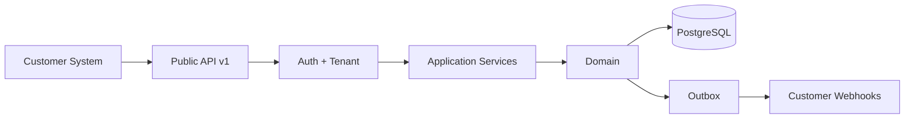

# Public API

> Status: **Target / normative engineering design**. This document defines behavior and implementation constraints even when the current code has not implemented the subsystem yet.

## Purpose

Public APIs expose stable capabilities to customer systems without creating a second business-rule implementation.

## Versioning

Use /api/v1 style major versions. Prefer additive changes. Breaking changes require a new version or migration period.

## Idempotency

State-changing public operations support Idempotency-Key where duplicate requests could create duplicate business outcomes.

## Pagination

Large collections use stable cursor pagination. Cursors are tenant-scoped and opaque.

## Rate Limits

Apply limits per credential, tenant, and expensive operation class. Return deterministic retry metadata.

## Customer Webhooks

Outbound customer webhooks are signed, versioned, idempotent, retried, and recorded in delivery history.

## Rule

Public API handlers call the same domain/application services as internal UI whenever possible; the public contract must not fork core business semantics.

## Mermaid System View

## Change Rule

Changes that alter these contracts must update the affected requirement, API/event contract, tests, and this document. Security and tenant-isolation constraints cannot be weakened for implementation convenience.
