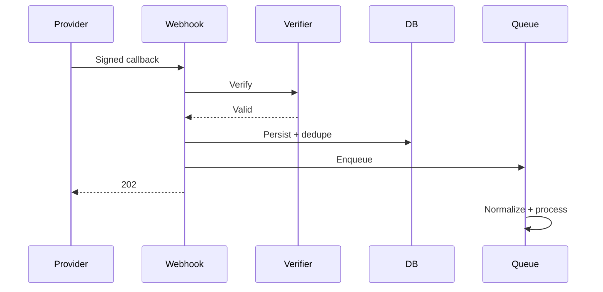

# Webhook Contract

> Status: **Target / normative engineering design**. This document defines behavior and implementation constraints even when the current code has not implemented the subsystem yet.

## Purpose

Webhook endpoints are fast, authenticated ingress points. They persist verified provider events before expensive business processing.

## Processing

Receive -> verify signature/token -> normalize identity -> persist raw event and dedupe key -> acknowledge -> process asynchronously.

## Idempotency

Prefer provider event/update IDs. When unavailable, compose provider + account + message/update identifiers. Never rely on browser-visible state.

## Replay

Security replay protection follows provider semantics. Internal replay uses stored verified payloads and explicit operator authorization.

## Failure

Invalid signature: reject without mutation. Authenticated malformed payload: quarantine. Transient internal error: retry after durable persistence. Downstream failure: retain event and retry asynchronously.

## Observability

Record provider, account identifier, event ID, correlation ID, verification outcome, processing state, attempt count, and latency.

## Mermaid System View

## Change Rule

Changes that alter these contracts must update the affected requirement, API/event contract, tests, and this document. Security and tenant-isolation constraints cannot be weakened for implementation convenience.
