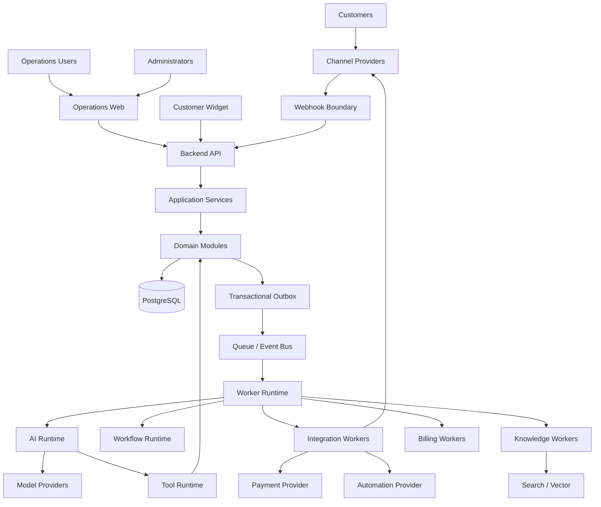
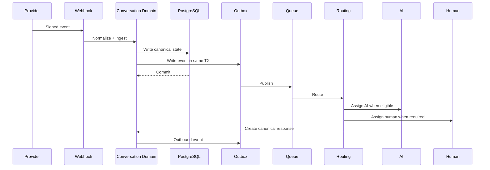
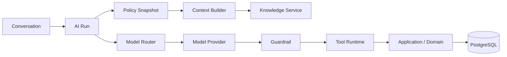

# High-Level Architecture — Implementation Blueprint

> Status: **Target production architecture**

## 1. Architectural Decision

OMILINKS starts as a modular monolith.

This is deliberate:

- strong transaction boundaries are more important than service distribution;
- tenant isolation is easier to prove inside one transactional system;
- product requirements are still evolving;
- unnecessary microservices would add network failure, deployment and observability complexity before scale requires it.

The architecture is designed so modules can be extracted later without changing domain semantics.

## 2. System Context



## 3. Runtime Planes

### Control plane

Configuration and administration:

- organizations;
- users/memberships;
- roles;
- integrations;
- AI agents/policies;
- workflows;
- billing configuration.

### Data plane

Customer operations:

- inbound events;
- conversations;
- routing;
- assignments;
- AI runs;
- tool actions;
- provider delivery.

### Intelligence plane

- model routing;
- knowledge retrieval;
- evaluation;
- AI observability;
- cost control.

Separating these concepts improves operational reasoning even when deployment remains a modular monolith.

## 4. Core Dependency Direction

```text
transport
 -> application
   -> domain
     -> ports
       <- infrastructure/adapters
```

Domain modules never depend on provider SDKs.

## 5. Synchronous vs Asynchronous

Synchronous:

- authentication;
- tenant resolution;
- permission checks;
- current-state reads;
- short transactional commands.

Asynchronous:

- AI inference;
- provider outbound delivery;
- webhook downstream processing;
- workflow timers;
- knowledge ingestion;
- QA sampling;
- billing reconciliation;
- analytics projection.

## 6. Canonical Conversation Path



Provider acknowledgement occurs before expensive asynchronous handling.

## 7. Data Source of Truth

PostgreSQL owns:

- transactional business state;
- authorization/membership;
- conversation/message state;
- workflow state;
- billing state;
- audit records.

Derived systems:

- vector/search index;
- cache;
- analytics projections;
- realtime fan-out.

## 8. AI Boundary



The model cannot directly reach domain persistence.

## 9. Event Consistency

Transactional write:

```text
business mutation
+
outbox event
=
one database transaction
```

Event publication after commit is asynchronous.

This creates eventual delivery but prevents a committed state with no corresponding event intent.

## 10. Failure Domains

Target isolation:

```text
channel provider failure
 -> one channel degraded

model provider failure
 -> AI route/fallback/handoff

search failure
 -> retrieval degraded; deterministic tools remain possible

billing provider failure
 -> payment pending/reconciliation

queue failure
 -> async work delayed; transactional state remains
```

## 11. Scaling Strategy

First:

```text
API replicas
worker replicas
managed PostgreSQL
Redis/queue
object storage
```

Then independently scale:

- webhook workers;
- AI workers;
- workflow workers;
- integration workers;
- analytics consumers.

Extract services only when a measurable bottleneck or team ownership boundary justifies it.

## 12. Current Repository Alignment

The repository is presently an implementation scaffold with a thin backend entry point and Next.js application shells.

The documentation therefore defines the target architecture, not a claim that all runtime modules already exist.

Implementation should add the target module boundaries incrementally rather than creating placeholder directories with no ownership.

## 13. Architecture Invariants

- PostgreSQL is transactional truth.
- organization context precedes tenant-owned data access.
- domain rules are not implemented in provider adapters.
- asynchronous work is durable.
- model output is not authorization.
- external side effects are idempotent/reconciled.
- derived systems can be rebuilt.

## 14. Acceptance

The architecture is complete when a feature can be located in one domain, one application boundary, one persistence strategy, one event strategy and one explicit failure model.
