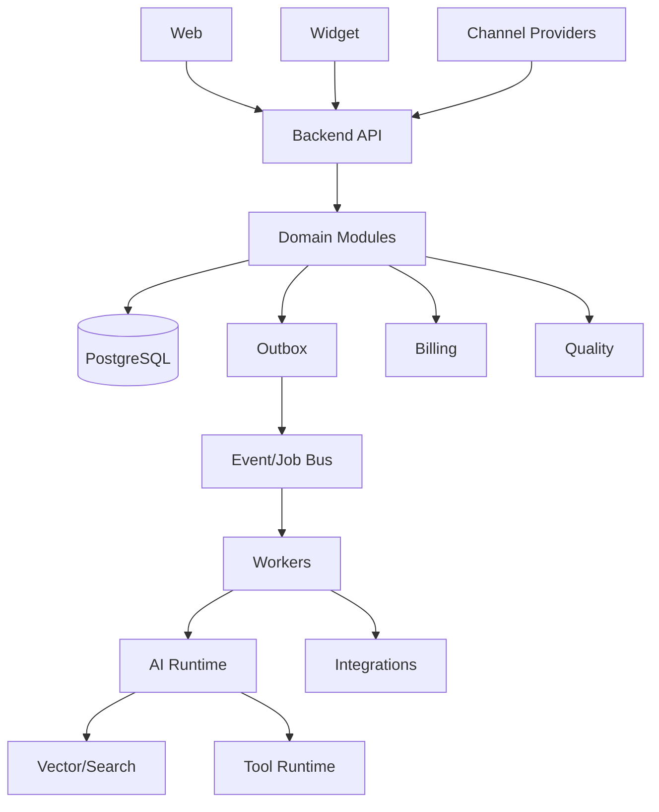

# High-Level Architecture

> Status: **Target / normative engineering design**. This document defines behavior and implementation constraints even when the current code has not implemented the subsystem yet.

## Purpose

OMILINKS starts as a modular monolith in a pnpm/Turborepo monorepo. Domain boundaries are explicit; microservices are an extraction option, not the initial architectural goal.

## Major Components

| Component | Responsibility |
|---|---|
| web | Operations console |
| widget | Embeddable customer interface |
| backend | HTTP/API + application/domain execution |
| worker | Events, webhooks, workflows, AI jobs |
| PostgreSQL | Transactional source of truth |
| Redis/Queue | Coordination, async work, rate limiting where used |
| Object Storage | Documents/media/exports |
| Vector/Search | Derived knowledge retrieval index |
| Provider Adapters | Channel/payment/automation integrations |
| AI Runtime | Agent execution, routing, tools, guardrails |
| Observability | logs, metrics, traces, audit |

## Boundary Rules

UI never decides authorization. Provider SDKs stay behind adapters. Vector search never owns canonical data. Events communicate facts/work; they do not replace transactions. AI is a governed workforce capability, not a privileged database client.

## End-to-End Behavior

Inbound provider traffic becomes a canonical event, is persisted, then processed asynchronously. Routing assigns responsibility. AI may retrieve knowledge and call tools. Outbound traffic goes through the provider adapter. Durable events feed quality, billing, analytics, and workflow automation.

## Mermaid System View

## Change Rule

Changes that alter these contracts must update the affected requirement, API/event contract, tests, and this document. Security and tenant-isolation constraints cannot be weakened for implementation convenience.
