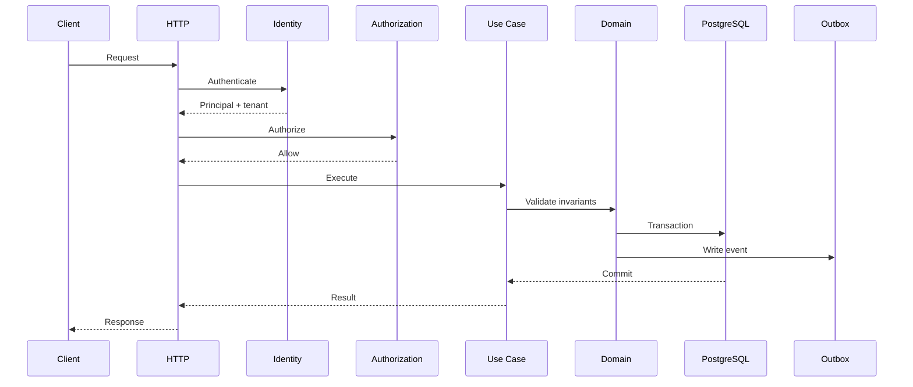

# Low-Level Architecture

> Status: **Target / normative engineering design**. This document defines behavior and implementation constraints even when the current code has not implemented the subsystem yet.

## Purpose

Low-level structure keeps transport, application, domain, persistence, integration, and event concerns separate so the system can evolve without cross-module coupling.

## Request Pipeline

HTTP adapter -> authentication -> tenant resolution -> authorization -> application service -> domain invariants -> transaction/repository -> outbox -> response mapping.

## Module Contract

Each domain module owns its business rules and exposes application-level operations. Other modules use public module interfaces or domain events rather than importing internal persistence implementation.

## Transaction Boundary

Business state plus the corresponding outbox record are written in one transaction. Background publication happens after commit.

## Concurrency

Use database constraints and explicit optimistic concurrency/versioning where conflicting updates are possible. Exclusive assignment/state transitions may require row-level locking.

## Provider Abstraction

Interfaces such as verifyWebhook(), normalizeInbound(), sendMessage(), and getConnectionHealth() isolate provider SDKs. Provider-specific identifiers live in integration records.

## Error Model

Use stable categories: VALIDATION_ERROR, UNAUTHORIZED, FORBIDDEN, NOT_FOUND, CONFLICT, RATE_LIMITED, UPSTREAM_ERROR, INTERNAL_ERROR. Responses carry correlation IDs without leaking secrets or unauthorized existence.

## Mermaid System View

## Change Rule

Changes that alter these contracts must update the affected requirement, API/event contract, tests, and this document. Security and tenant-isolation constraints cannot be weakened for implementation convenience.
