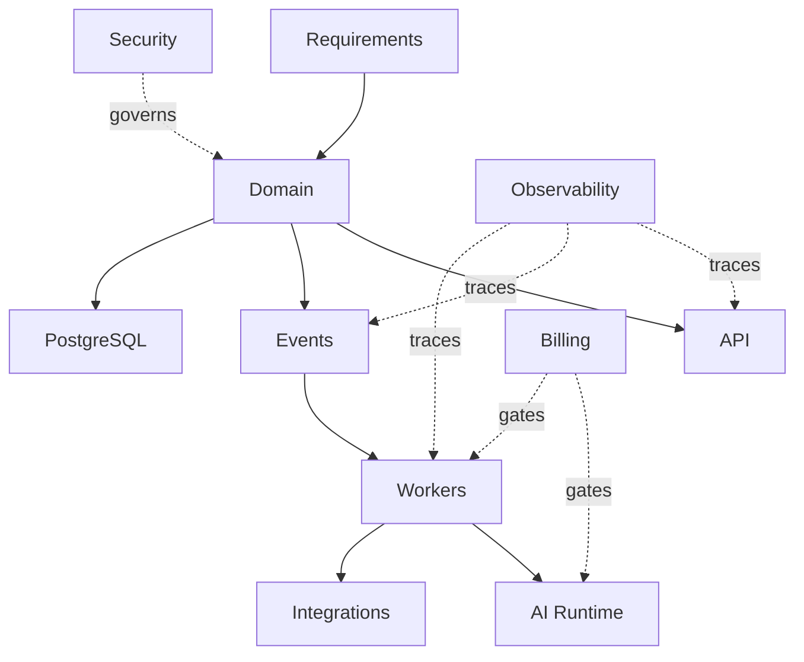

# System Contract Map

> Status: **Target architecture map**

## 1. Canonical Boundaries



## 2. Primary Contracts

| Boundary | Contract |
|---|---|
| UI -> API | OpenAPI/request DTO |
| Webhook -> Integration | provider verification + normalization |
| Application -> Domain | command/query |
| Domain -> Event | versioned event schema |
| Worker -> Application | command + durable job |
| AI -> Tool Runtime | tool definition/version |
| Tool Runtime -> Domain | authorized command |
| Domain -> DB | repository/transaction |
| Provider -> Integration | adapter contract |
| Billing -> Entitlement | capability/limit decision |

## 3. Contract Ownership

The component that owns business meaning owns its contract.

Example:

~~~text
Conversation domain
  owns message semantics

WhatsApp adapter
  owns WhatsApp translation

Provider
  owns provider protocol
~~~

Do not let provider SDK types redefine domain semantics.

## 4. Contract Change Rule

A behavioral change asks:

```text
does requirement change?
does domain invariant change?
does API change?
does event schema change?
does data schema change?
does security policy change?
does test contract change?
```

All applicable artifacts update together.

## 5. Acceptance

No cross-module dependency is allowed to exist without an explicit contract or documented reason.
