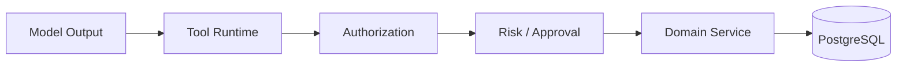

# ADR-0005: AI Cannot Bypass the Tool and Domain Boundaries

> Status: **Accepted**

## Context

Model output is probabilistic/untrusted and can contain prompt injection or incorrect actions.

## Decision

All AI side effects go through independently authorized tools/domain services.

## Consequences

- AI behavior is auditable;
- tool permissions are explicit;
- high-risk actions can require approval;
- provider/model replacement does not change business authorization.

## Rejected Alternative

Allowing the model to call internal APIs/DB directly would merge reasoning with authorization and create a security boundary that is impossible to reason about reliably.
