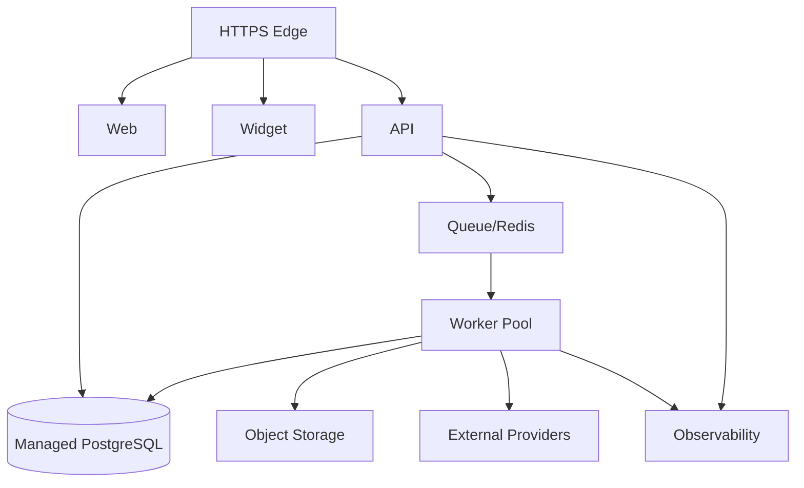

# Deployment Architecture

> Status: **Target / normative engineering design**. This document defines behavior and implementation constraints even when the current code has not implemented the subsystem yet.

## Purpose

Deploy OMILINKS as independently scalable stateless web/API and worker processes backed by managed stateful infrastructure.

## Runtime Units

web, widget, backend API, worker pool, PostgreSQL, Redis/queue, object storage, search/vector, observability.

## Environment Model

Development, staging, and production are separate trust boundaries. Production credentials never enter lower environments. Provider sandbox/test accounts are preferred for integration development.

## Scaling

API scales on latency/CPU/concurrency. Workers scale on queue depth, event age, AI concurrency, and provider throughput. Long-running work never occupies the request process.

## Release

Build immutable artifacts, run compatible migrations, deploy backend/workers, run smoke tests, then progressively enable high-risk features.

## Recovery

Recover PostgreSQL first, restore object storage references, replay safe durable events, and reconcile external provider/payment state before declaring full recovery.

## Mermaid System View

## Change Rule

Changes that alter these contracts must update the affected requirement, API/event contract, tests, and this document. Security and tenant-isolation constraints cannot be weakened for implementation convenience.
