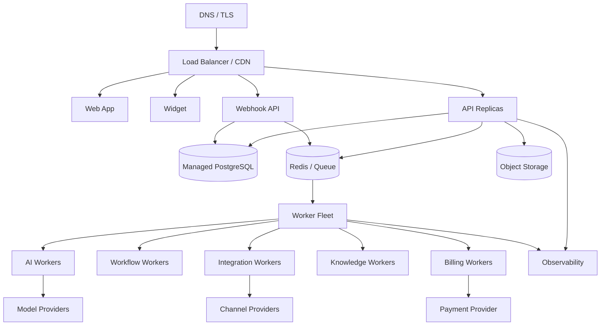

# Deployment Architecture — Implementation Blueprint

> Status: **Target production deployment architecture**

## 1. Environment Model

```text
development
staging
production
```

Each environment has separate:

- database;
- object storage;
- secrets;
- provider credentials;
- queue;
- domain configuration.

## 2. Production Topology



## 3. Stateless Compute

API/worker containers should be stateless.

No business state should require:

- local filesystem;
- process memory;
- one specific machine.

## 4. Scaling Units

Scale independently by bottleneck:

```text
API:
requests / CPU / latency

Webhook:
ingress rate / persistence latency

AI:
concurrent runs / provider limits

Workflow:
ready-step backlog / timer volume

Integration:
provider rate limits / outbound queue

Knowledge:
ingestion/indexing backlog

Billing:
reconciliation queue
```

## 5. Readiness vs Liveness

Liveness asks:

```text
Can the process continue?
```

Readiness asks:

```text
Can this instance safely serve normal work?
```

External provider outage should not automatically mark the API dead if degraded operation remains safe.

## 6. Deployment Sequence

Typical:

1. build immutable artifact;
2. run CI;
3. deploy compatible backend;
4. apply compatible schema migration;
5. deploy workers;
6. deploy web/widget;
7. enable feature flag;
8. monitor.

## 7. Feature Flags

Use independent controls for:

- autonomous AI;
- channel activation;
- new routing algorithms;
- new workflow semantics;
- billing enforcement changes.

Feature flags are not authorization.

## 8. Migration Compatibility

Rolling deployment must support:

```text
old code
+
new code
+
compatible schema
```

Destructive schema changes happen only after all old consumers are removed.

## 9. Failure Isolation

A provider-specific worker should fail without killing unrelated workers.

Use separate queues/concurrency limits where noisy-neighbor risk is high.

## 10. Disaster Recovery

Recovery:

```text
restore database
 -> verify schema
 -> restore object references
 -> restart queues/workers
 -> reconcile payments/providers
 -> verify tenant isolation
 -> resume traffic
```

## 11. Security

- private database networking;
- runtime secret injection;
- service-level credentials;
- restricted management access;
- encrypted backup storage;
- controlled outbound network;
- audit privileged infrastructure actions.

## 12. Observability

Deployment dashboards include:

- version;
- error rate;
- latency;
- queue age;
- worker failures;
- provider health;
- AI cost;
- billing mismatches.

## 13. Acceptance

Deployment is complete when production state is reproducible from release metadata and recovery is tested rather than assumed.
