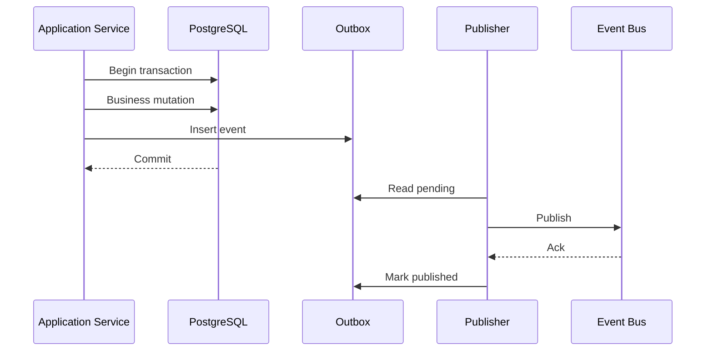
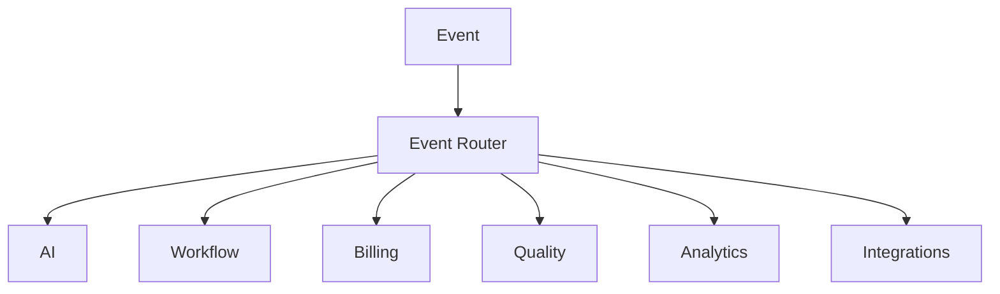

# Event Architecture — Implementation Blueprint

> Status: **Target production event architecture**

## 1. Event Semantics

There are three distinct concepts:

```text
Domain fact:
  something happened.

Work request:
  something should be processed.

Integration notification:
  an external boundary changed.
```

These must not be mixed.

## 2. Transactional Outbox



A committed business mutation always creates its required event intent in the same transaction.

## 3. Delivery Semantics

Assume at-least-once.

```text
publish succeeds
consumer crashes before ack
message delivered again
```

Therefore every consumer must be idempotent.

## 4. Consumer Inbox

Where needed:

```text
consumer_id
event_id
first_seen_at
processed_at
result_reference
status
```

Unique constraint on consumer + event prevents duplicate effects.

## 5. Ordering

No global order.

Partition by aggregate when necessary:

```text
conversation_id
workflow_run_id
subscription_id
```

Example: conversation message processing may require in-order handling while independent conversations process concurrently.

## 6. Event Schema

Envelope:

```json
{
  "event_id": "uuid",
  "event_type": "conversation.message.received",
  "version": 1,
  "occurred_at": "...",
  "organization_id": "uuid",
  "actor": {},
  "correlation_id": "uuid",
  "causation_id": "uuid",
  "data": {},
  "metadata": {}
}
```

## 7. Event Routing



Consumers should subscribe only to event types they need.

## 8. Retry

Failure classes:

```text
transient -> retry
permanent -> dead letter
unknown side effect -> reconcile
authorization -> no retry
schema invalid -> quarantine
```

## 9. Dead Letter

Dead-letter record retains:

- event;
- tenant;
- consumer;
- attempt count;
- error;
- worker version;
- timestamps;
- replay state.

## 10. Replay

Replay is an operator-controlled operation and must preserve original history.

It passes through normal consumer idempotency and authorization.

## 11. Event Evolution

Compatibility:

```text
add optional field -> compatible
change field meaning -> new version
remove required field -> breaking/new version
change units/semantic -> new version
```

## 12. Event Security

Never place:

- passwords;
- API keys;
- access tokens;
- raw payment secrets.

Large payloads are references to durable storage.

## 13. Observability

Measure:

- outbox age;
- publish lag;
- consumer lag;
- retry rate;
- duplicate rate;
- dead-letter count;
- per-consumer failures.

## 14. Acceptance

Event architecture is complete when every event type has a defined producer, consumer, schema, ordering rule, retry class, dedupe rule and replay behavior.
