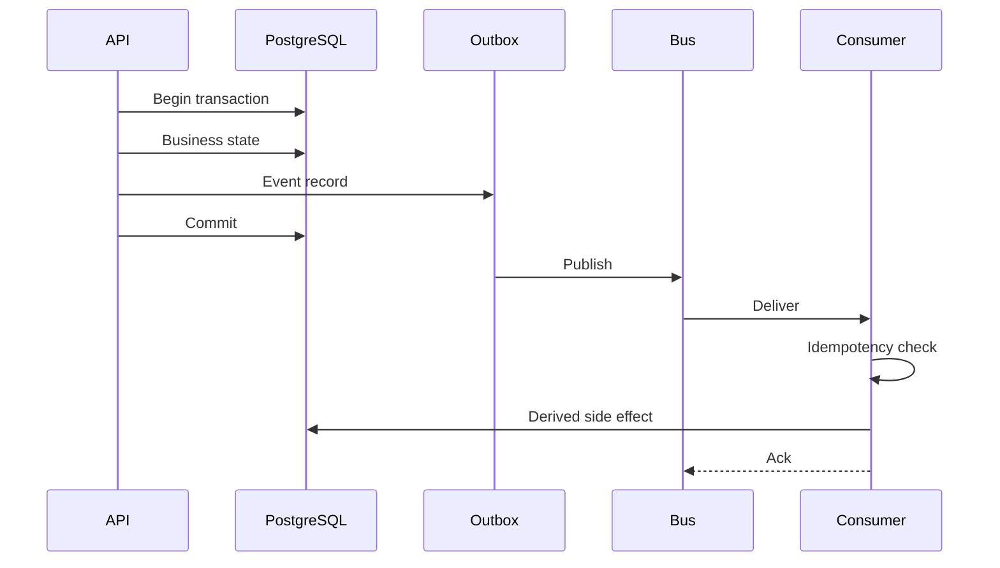

# Event Architecture

> Status: **Target / normative engineering design**. This document defines behavior and implementation constraints even when the current code has not implemented the subsystem yet.

## Purpose

Events are durable communication contracts around transactional state changes and external integration work. Delivery is at least once.

## Envelope

event_id, event_type, version, occurred_at, organization_id when applicable, actor, correlation_id, causation_id, data, metadata.

## Outbox

Write business state and its event record in one database transaction. A dispatcher publishes uncommitted outbox records only after transaction commit.

## Idempotency

Consumers record event IDs or an equivalent semantic idempotency key before non-idempotent side effects. Duplicate deliveries must be safe.

## Ordering

Ordering is required only per explicitly defined aggregate, such as a conversation or workflow run. Global event order is not required.

## Dead Letters

Events that exceed bounded retry attempts become searchable dead-letter records with error, attempts, timestamps, handler version, and replay eligibility.

## Mermaid System View

## Change Rule

Changes that alter these contracts must update the affected requirement, API/event contract, tests, and this document. Security and tenant-isolation constraints cannot be weakened for implementation convenience.
