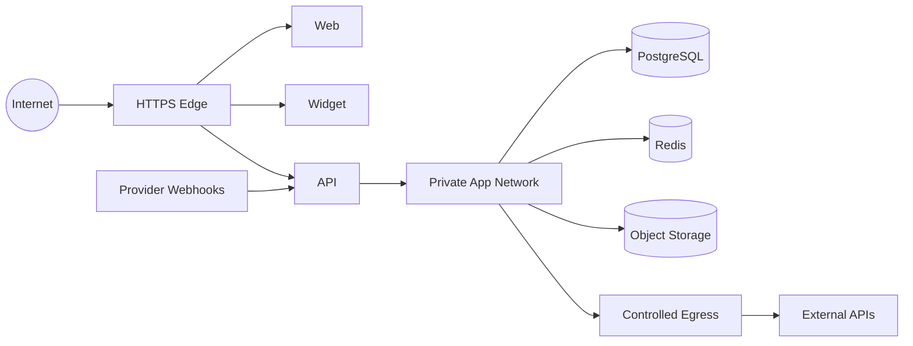

# Network Architecture

> Status: **Target / normative engineering design**. This document defines behavior and implementation constraints even when the current code has not implemented the subsystem yet.

## Purpose

Network controls separate public ingress, application workloads, data services, external providers, and management systems.

## Trust Zones

1. Public edge: browser/widget/provider webhook traffic.
2. Application zone: web, API, workers.
3. Data zone: PostgreSQL, Redis, object storage, search.
4. External zone: channel providers, Paymob, n8n, model providers.
5. Management plane: CI/CD, secrets, observability.

## Ingress

Only required HTTP routes are public. Webhooks are isolated by route and verified before processing. Database and internal service ports are never exposed publicly.

## Egress

Outbound calls are restricted to required providers. API credentials and secrets are loaded server-side only.

## Failure

Authorization and protected mutations fail closed when critical dependencies cannot be trusted. External provider timeouts are bounded and converted to retryable internal state where appropriate.

## Mermaid System View

## Change Rule

Changes that alter these contracts must update the affected requirement, API/event contract, tests, and this document. Security and tenant-isolation constraints cannot be weakened for implementation convenience.
