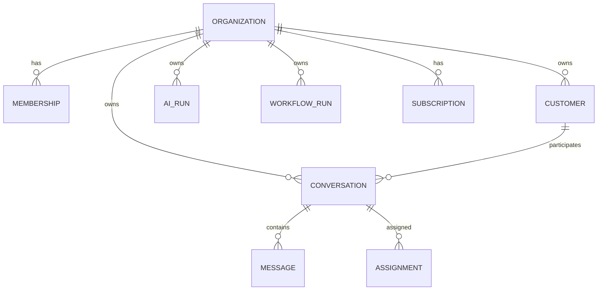

# Data Model and ERD

> Status: **Target / normative engineering design**.

PostgreSQL owns transactional truth. Search/vector, caches, analytics tables and object storage are derived or specialized.

## Contract

Core relationships: Organization owns Membership, Customer, Conversation, Workforce, Knowledge, Workflow, Quality and Billing. Customer has identities; Conversation has messages and assignments; AI has runs; Workflow has versioned runs; Subscription has usage. Use foreign keys and uniqueness constraints for ownership/idempotency.

## Mermaid Flow

## Engineering Rule

The design must fail closed on authorization, preserve tenant scope, make retries safe, and expose enough telemetry to diagnose production behavior.
