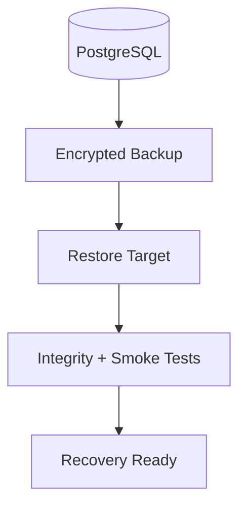

# Backup and Restore

> Status: **Target / normative engineering design**.

Backup success is not proven until restoration has been tested.

## Contract

Use managed PostgreSQL backups plus suitable object-storage versioning/replication. Define RPO/RTO per tier. Restore into isolation, verify schema/constraints, run tenant-isolation and smoke tests, then reconcile external providers and payment state before declaring recovery.

## Mermaid Flow

## Engineering Rule

The design must fail closed on authorization, preserve tenant scope, make retries safe, and expose enough telemetry to diagnose production behavior.
