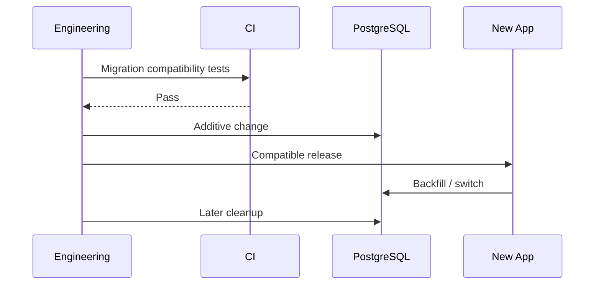

# Migration Policy

> Status: **Target / normative engineering design**.

Database changes are deployed using compatibility-first migration patterns.

## Contract

Prefer additive migrations, deploy compatible code, backfill in bounded batches, switch reads/writes, then remove obsolete structures later. Estimate locks and query impact. Destructive/external mutations require compensating procedures, not assumptions about transaction rollback.

## Mermaid Flow

## Engineering Rule

The design must fail closed on authorization, preserve tenant scope, make retries safe, and expose enough telemetry to diagnose production behavior.
