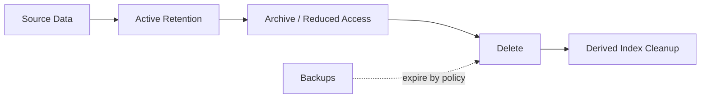

# Data Retention

> Status: **Target / normative engineering design**.

Retention is data-class specific and based on product, contractual, security, operational and legal needs.

## Contract

Conversation history is tenant-configurable; audit data is long-lived; raw provider webhook payloads are operationally retained; AI traces should have shorter/privacy-aware retention; billing records follow financial obligations; logs have short raw retention and longer aggregated metrics. Deletion must propagate to derived indexes and caches.

## Mermaid Flow

## Engineering Rule

The design must fail closed on authorization, preserve tenant scope, make retries safe, and expose enough telemetry to diagnose production behavior.
