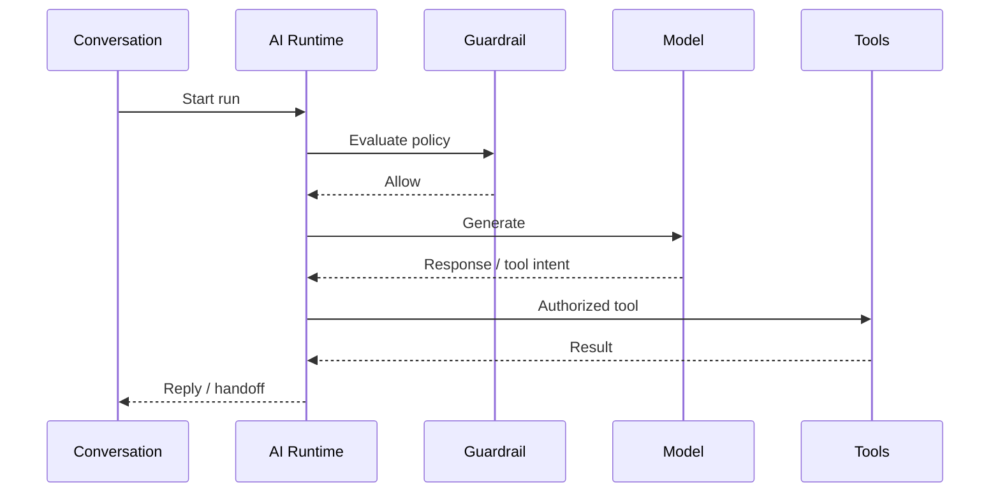

# AI Domain

> Status: **Target / normative engineering design**. This contract defines the intended business model and implementation rules.

## Purpose

AI is a governed workforce capability with bounded context, tools, models, budgets, and termination conditions.

## Core Model

AIAgent -> AgentPolicy, ModelProfile, PromptVersion, ContextPolicy, ToolPolicy. Each execution creates AIRun records and ToolInvocation records.

## Invariants

- Every AI run has explicit organization and agent policy context.
- Model selection is observable and policy constrained.
- Tool access is resolved before execution.
- Domain services validate all AI-proposed state changes.
- Budgets and guardrails may terminate a run.

## Operations

- Create/read/update operations are organization-scoped and permission-checked.
- Cross-domain behavior goes through explicit application services or events.
- External identifiers remain provider references and never become authorization keys.
- State changes are observable and auditable where they affect security, money, customer communication, or workflow control.

## Failure and Concurrency

- Validation fails before side effects.
- Concurrent state changes use constraints or explicit version checks.
- Retries are safe only where idempotency is defined.
- External failures produce explicit recoverable states.

## Mermaid Flow

## Change Rule

Changing an invariant or state transition requires updating the relevant requirements, acceptance criteria, tests, API/event contract, and this document.
