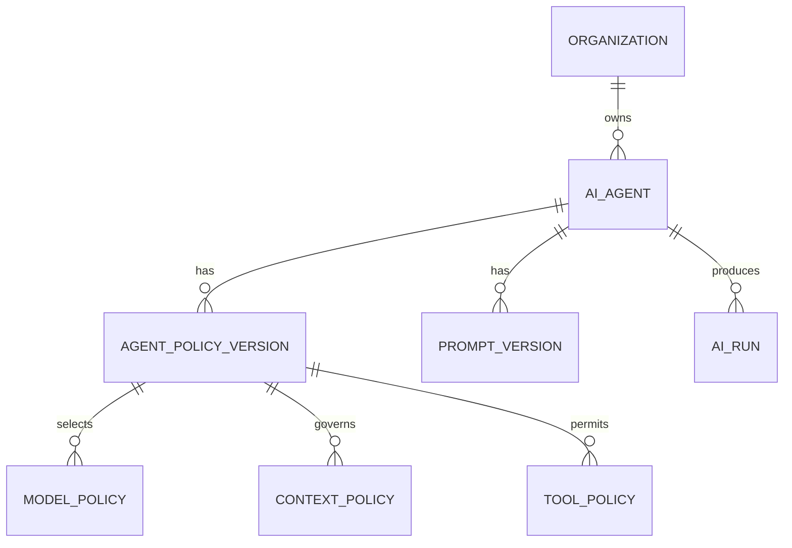
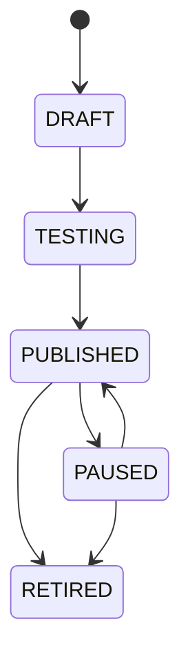
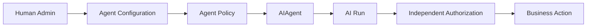

# AI Domain

> Status: **Target production domain contract**

The AI domain defines AI workforce configuration and policy. The execution machinery is specified in `docs/ai/agent-runtime.md`.

## 1. Domain Boundary

The AI domain owns the business configuration that determines what an AI workforce member is allowed and expected to do:

- AIAgent
- AgentPolicy and immutable policy versions
- PromptVersion
- ModelPolicy
- ContextPolicy
- ToolPolicy
- AutonomyPolicy
- AI capability metadata
- AI entitlement configuration
- references to AIRun history.

The runtime executes this configuration. The domain decides which configuration is valid and published.

## 2. Core Model



## 3. Agent Lifecycle



A published agent policy is immutable. Changes produce a new version that must pass validation before activation.

## 4. Agent Configuration

| Configuration | Example |
|---|---|
| name | Billing Support Agent |
| purpose | answer billing questions |
| supported channels | WhatsApp, widget |
| autonomy | copilot/autonomous |
| model policy | routing-v4 |
| knowledge policy | billing-kb |
| tool policy | billing-tools-v2 |
| handoff policy | billing escalation |
| budget policy | standard AI budget |
| language policy | ar-EG/en |

## 5. Policy Composition

The effective AI policy is the intersection of platform constraints and tenant-level policies:

```text
platform security
+ tenant subscription/entitlement
+ agent policy
+ model policy
+ context policy
+ tool policy
+ autonomy policy
= effective AI policy
```

No child policy can widen a higher-level security restriction.

## 6. AI vs Human Permissions

Creating an AI agent from an administrator account does not copy administrator permissions to the AI.



The agent's effective authority is the intersection of platform security, tenant policy, agent policy, and tool authorization.

## 7. Autonomy Levels

| Level | Behavior |
|---|---|
| assist | generate suggestions only |
| copilot | prepare action; human commits |
| autonomous | execute within policy |
| approval-gated | pause for human approval |
| disabled | no AI execution |

Autonomy is enforced by backend policy.

## 8. Context Policy

Context policy specifies what information an agent can consume:

- conversation messages
- customer profile
- account/program data
- knowledge sources
- workflow state
- previous tool results

Each class has scope rules.

Example:

```text
Billing Support Agent
customer profile: allowed
billing records: allowed
other customers: forbidden
internal HR data: forbidden
unrelated program data: forbidden
```

## 9. Model Policy

Model choice is indirect:

```text
Agent Policy
  -> Model Routing Policy
      -> compatible model
```

The AI domain should not hardcode provider behavior. The runtime resolves the model according to `docs/ai/model-routing.md`.

## 10. Tool Policy

Tool policy is an explicit allowlist:

```text
tool
risk tier
allowed agent
allowed scope
approval required
argument constraints
```

The Tool Runtime independently validates every call.

## 11. AI Run Linkage

Every run references organization, agent, policy version, prompt version, routing policy version, conversation, autonomy level, timestamps, and outcome.

## 12. Handoff

Handoff creates a workforce/routing operation. Triggers include explicit human request, low confidence, unsupported task, high-risk action, repeated tool failure, policy block, and SLA escalation.

After handoff, conversation control changes to human/queue and stale AI continuations are invalidated.

## 13. Publishing Rules

Before publishing an agent version:

1. referenced model policy exists.
2. referenced knowledge policy exists.
3. referenced tool versions are valid.
4. autonomy level is allowed by platform/subscription policy.
5. required dependencies can be resolved.
6. evaluation requirements for the risk tier pass.

## 14. Cross-Domain Contracts

**Tenancy:** organization and scope.
**Workforce:** AIAgent participates as a workforce unit.
**Conversations:** AI runs obey conversation control version.
**Knowledge:** retrieval obeys context policy.
**Tools:** tool policy limits actions.
**Billing:** AI execution consumes entitlements and usage.
**Quality:** completed runs feed evaluation/QA.

## 15. Failure Modes

| Failure | Behavior |
|---|---|
| invalid policy version | refuse publish |
| disabled entitlement | prevent governed AI execution |
| missing tool version | refuse publish or disable capability |
| model unavailable | runtime routing/fallback |
| unsafe output | guardrail block/handoff |
| budget exceeded | autonomy budget policy |
| human takeover | invalidate continuation |

## 16. Observability

Track active policy version, run count, success, handoff/block rates, tool use, model distribution, latency and cost.

## 17. Acceptance Criteria

- Published policies are immutable.
- AI does not inherit human creator permissions.
- Every run references exact policy/config versions.
- Tool and context restrictions are explicit.
- Agent publishing validates dependencies.
- Handoff changes conversation control.
- AI configuration is organization-attributable.