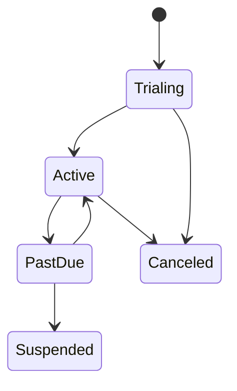

# Billing Domain

> Status: **Target / normative engineering design**. This contract defines the intended business model and implementation rules.

## Purpose

Represent plans, subscriptions, entitlements, usage, payments, and reconciliation as an explicit financial control plane.

## Core Model

Plan -> Entitlement. Organization -> Subscription -> UsageRecord, Invoice, Payment, PaymentWebhook. Backend entitlement checks gate governed capabilities.

## Invariants

- Subscription is organization-scoped.
- Backend entitlement state is authoritative.
- Usage facts are append-oriented and reconciliable.
- Verified Paymob backend events drive payment state.
- Webhook replay cannot duplicate financial effects.

## Operations

- Create/read/update operations are organization-scoped and permission-checked.
- Cross-domain behavior goes through explicit application services or events.
- External identifiers remain provider references and never become authorization keys.
- State changes are observable and auditable where they affect security, money, customer communication, or workflow control.

## Failure and Concurrency

- Validation fails before side effects.
- Concurrent state changes use constraints or explicit version checks.
- Retries are safe only where idempotency is defined.
- External failures produce explicit recoverable states.

## Mermaid Flow

## Change Rule

Changing an invariant or state transition requires updating the relevant requirements, acceptance criteria, tests, API/event contract, and this document.
