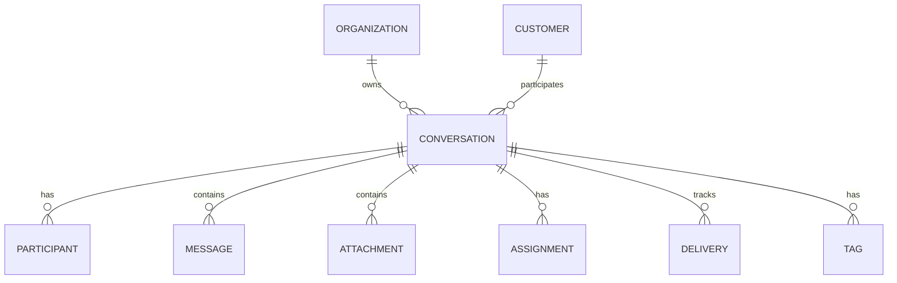
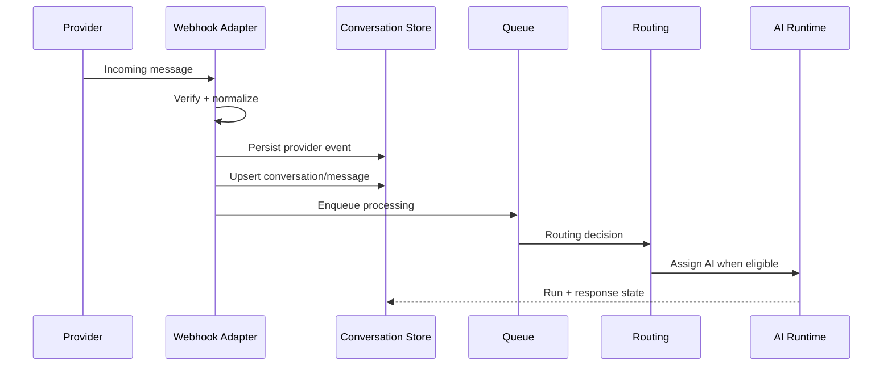
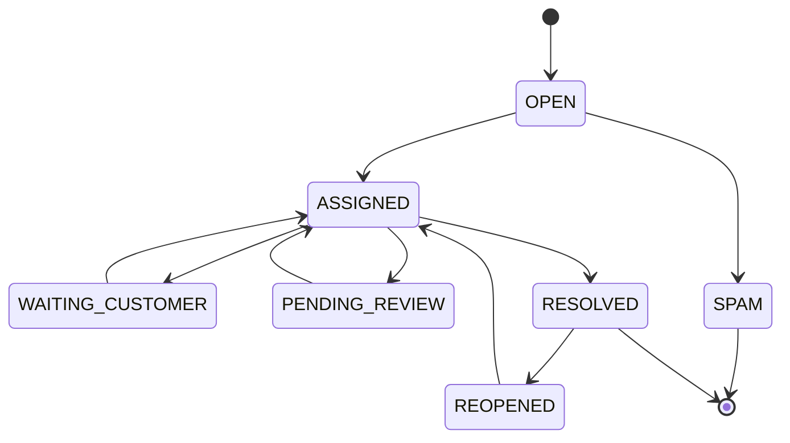
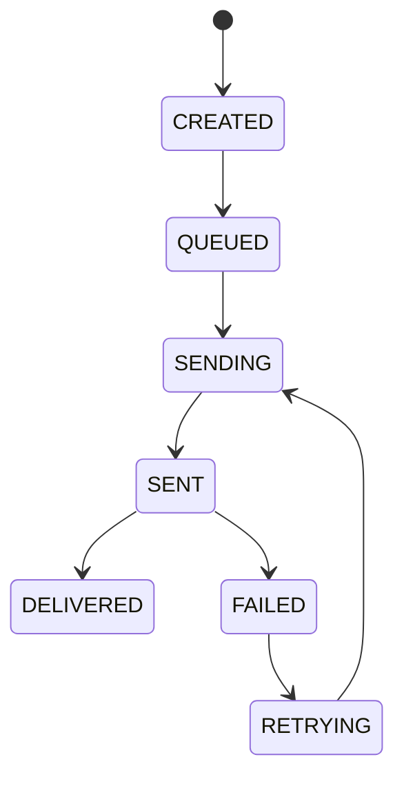

# Conversations Domain

> Status: **Target production domain contract**
>
> Conversations are the canonical operational record connecting customers, channels, workforce, AI, workflows, delivery, and quality.

## 1. Domain Responsibility

The Conversation domain owns:

- conversation lifecycle;
- participants;
- message records;
- attachments/media references;
- assignment/control state;
- delivery state;
- conversation tags and operational metadata;
- customer-visible timeline semantics.

Channel adapters own provider-specific protocol behavior. The Conversation domain owns the canonical representation.

## 2. Core Model



## 3. Conversation Identity

A provider conversation/thread identifier may be stored, but the internal `conversation_id` is authoritative.

Possible relationship:

```text
Organization
  -> ChannelAccount
    -> ProviderThread
      -> Conversation
```

Do not assume one customer equals one conversation. Customers may have multiple active or historical conversations depending on channel and product policy.

## 4. Message Model

Messages are append-oriented facts.

Important fields:

- message ID;
- conversation ID;
- direction: inbound/outbound;
- author type: customer/human/AI/system;
- content representation;
- provider message ID;
- timestamps;
- delivery status;
- attachment references;
- correlation ID.

Edits, retries, and corrections should preserve the original fact rather than rewriting history without trace.

## 5. Inbound Processing



Webhook acknowledgement should not depend on model completion.

## 6. Conversation State

Suggested state machine:



Actual states may vary by workflow, but every transition must be explicit.

## 7. Conversation Control

Separate conversation business status from **control owner**.

Example:

```text
status = ASSIGNED
control = HUMAN
```

or:

```text
status = ASSIGNED
control = AI
```

This distinction is required for safe AI/human handoff.

## 8. Control Version

Each conversation maintains a monotonic `control_version`.

```text
AI run starts at version 41
Human takeover increments conversation to 42
AI run finishes with version 41
AI send checks 41 != 42
send is rejected as stale
```

This protects against delayed model responses.

## 9. Assignment

Assignments are durable records, not merely a mutable `assignee_id` field.

An assignment should capture:

- workforce member;
- queue/team;
- actor who assigned;
- timestamp;
- reason;
- assignment version/state.

The latest active assignment can be derived while history remains immutable.

## 10. Delivery

Outbound message lifecycle should distinguish business creation from provider delivery.



A message can be a valid business record even if the external provider failed to deliver it.

## 11. Idempotency

Provider messages require a dedupe key such as:

```text
(organization_id, provider, provider_account_id, provider_message_id)
```

Outbound idempotency should use a canonical message ID or semantic request key so worker retries cannot send multiple customer-visible messages.

## 12. Attachments

Store metadata and object-storage references rather than putting large binary data in PostgreSQL.

Attachment metadata may include:

- MIME type;
- size;
- storage reference;
- checksum;
- provider media ID;
- scan/processing state.

## 13. Conversation Search

Search must retain organization and permission scope in the query itself.

Do not implement:

```text
search globally -> filter results in UI
```

Prefer:

```text
search within authorized organization/scope
```

## 14. Cross-Domain Contracts

### Customers

Conversation belongs to canonical Customer where identity is known.

### Routing

New work produces a routing request and assignment decision.

### Workforce

Assignments and human takeover live in workforce/control boundaries.

### AI

AI runs are attached to a conversation and obey control/version state.

### Quality

Conversation evidence can be sampled for evaluation without modifying message facts.

### Billing

Message and AI events can feed usage metering.

## 15. Failure Modes

| Failure | Behavior |
|---|---|
| duplicate inbound event | return existing message state |
| provider send timeout | preserve message, mark uncertain/retry according to provider semantics |
| stale AI continuation | reject send, mark run stale/cancelled |
| assignment race | use version/lock; only one valid winner |
| conversation closed during processing | cancel or re-evaluate pending action |
| unauthorized read | deny without cross-tenant leakage |

## 16. Audit Requirements

Audit:

- assignment changes;
- human takeover/release;
- message deletion/redaction where supported;
- state transitions with operational impact;
- privileged export;
- AI auto-send enable/disable.

## 17. Acceptance Criteria

- Duplicate provider messages create one canonical message.
- Human takeover blocks stale autonomous sends.
- Outbound retries do not create duplicate customer-visible messages.
- Conversation history remains traceable after delivery failure.
- Search is tenant/scope restricted.
- Assignments are concurrency-safe.
- Conversation state transitions are validated.