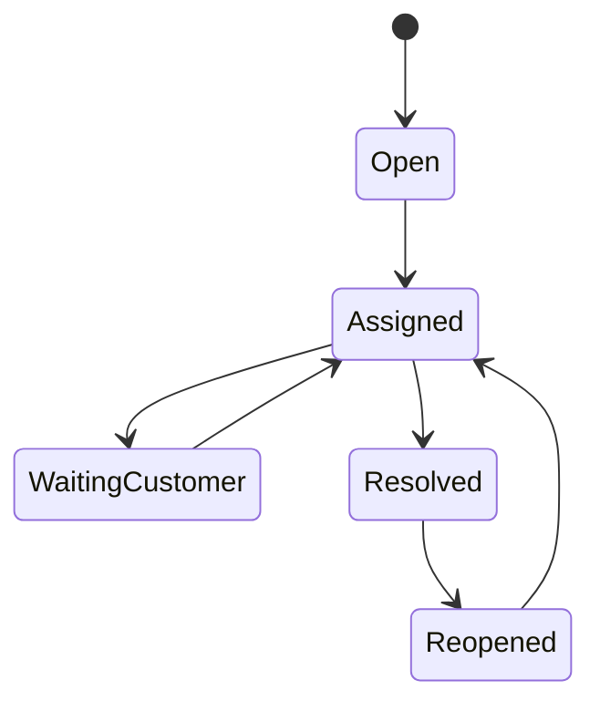

# Conversations Domain

> Status: **Target / normative engineering design**. This contract defines the intended business model and implementation rules.

## Purpose

Provide a canonical operational conversation regardless of the underlying channel.

## Core Model

Conversation contains participants, Message records, Attachments, Assignment history, status, tags, SLA metadata, and delivery state.

## Invariants

- Conversation belongs to one Organization and normally resolves to one Customer.
- Inbound provider message IDs are deduplicated.
- Messages are append-oriented business facts; corrections are explicit derived events/state.
- Human takeover is a control state that prevents autonomous sends.
- Conversation status transitions are explicit and auditable.

## Operations

- Create/read/update operations are organization-scoped and permission-checked.
- Cross-domain behavior goes through explicit application services or events.
- External identifiers remain provider references and never become authorization keys.
- State changes are observable and auditable where they affect security, money, customer communication, or workflow control.

## Failure and Concurrency

- Validation fails before side effects.
- Concurrent state changes use constraints or explicit version checks.
- Retries are safe only where idempotency is defined.
- External failures produce explicit recoverable states.

## Mermaid Flow

## Change Rule

Changing an invariant or state transition requires updating the relevant requirements, acceptance criteria, tests, API/event contract, and this document.
