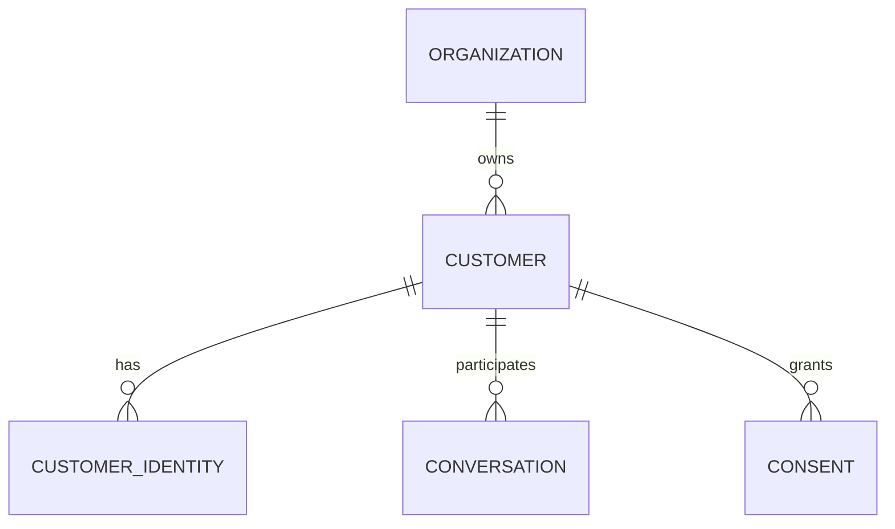

# Customer Domain

> Status: **Target / normative engineering design**. This contract defines the intended business model and implementation rules.

## Purpose

Maintain one canonical customer record per real customer within a tenant while preserving channel identities and provenance.

## Core Model

Customer owns CustomerIdentity records for WhatsApp, Instagram, Facebook, Telegram, SMS, widget, and future channels. Optional Consent, Tag, and Attribute records remain tenant-scoped.

## Invariants

- Customer records are tenant-scoped.
- Channel identities are unique within provider/account scope.
- Identity merge preserves the source identities and audit history.
- Ambiguous identities are not auto-merged.
- Sensitive attributes require explicit permission and retention policy.

## Operations

- Create/read/update operations are organization-scoped and permission-checked.
- Cross-domain behavior goes through explicit application services or events.
- External identifiers remain provider references and never become authorization keys.
- State changes are observable and auditable where they affect security, money, customer communication, or workflow control.

## Failure and Concurrency

- Validation fails before side effects.
- Concurrent state changes use constraints or explicit version checks.
- Retries are safe only where idempotency is defined.
- External failures produce explicit recoverable states.

## Mermaid Flow

## Change Rule

Changing an invariant or state transition requires updating the relevant requirements, acceptance criteria, tests, API/event contract, and this document.
